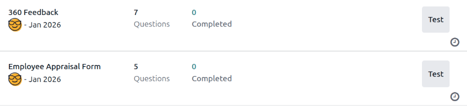
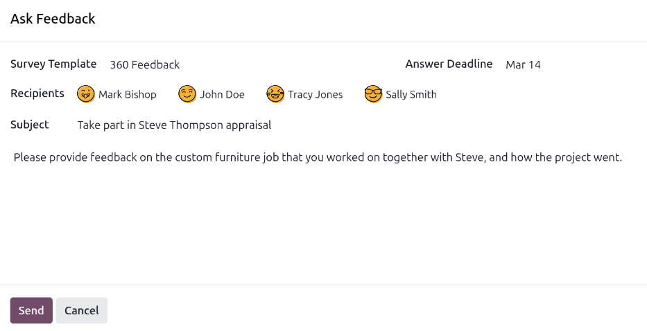
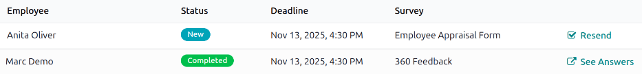

============
360 Feedback
============

Odoo's **Appraisals** app lets managers gather feedback on their direct reports from anyone in the
company. Input from colleagues gives managers a fuller view of each employee's strengths, growth
areas, and collaboration skills.

.. _appraisals/360-dashboard:

360 feedback dashboard
======================

The :guilabel:`360 Feedback` section displays information for all the surveys configured for the
**Appraisals** app. To view the surveys and their statistics, navigate to :menuselection:`Appraisals
app --> Configuration --> 360 Feedback`.

Each appraisal, or survey, is presented on its own line on the :guilabel:`360 Feedback` dashboard,
along with various information related to that particular appraisal.

Each appraisal includes the following information:

- :guilabel:`Survey Name`: The name of the specific survey.
- :guilabel:`Responsible`: The employee responsible for the survey, including the month and year
  they were given that designation.
- :guilabel:`Questions`: The number of questions in that particular survey.
- :guilabel:`Completed`: The number of people who have completed the survey.

To test the survey, click the :guilabel:`Test` button on the right side of the survey line. This
opens the appraisal in a new tab to preview the questions without submitting answers. Close the tab
to return to the list.

.. _appraisals/360-request-feedback:

Request feedback
================

To request feedback from a colleague, navigate to the **Appraisals** app, and click on the appraisal
card to open it.

Click the :guilabel:`Ask Feedback` button, and an *Ask Feedback* email pop-up window appears, using
the :guilabel:`Appraisal: Ask Feedback` email template.

.. note::
   Only confirmed appraisals display the :guilabel:`Ask Feedback` button.

First, using the drop-down menu, select the employees being asked to provide feedback in the
:guilabel:`Recipients` field. Multiple employees may be selected. The :guilabel:`Answer Deadline`
date is automatically set to the day the appraisal is due. Use the calendar selector to modify the
date, if desired.

The :guilabel:`Subject` is populated with `Take part in (Employee Name) appraisal`, but can be
modified if desired.

Type in any additional comments in the space provided, if desired. The email template copy is *not*
displayed in the pop-up window.

Click :guilabel:`Send`, and the feedback requests are sent to the specified employees.

.. _appraisals/360-view-results:

View results
============

To view the results, click the :icon:`fa-pencil-square-o` :guilabel:`Feedbacks` button on the survey
form. The *Feedback Surveys* dashboard loads, and presents a list of everyone requested to submit
feedback. Each line displays the following information:

- :guilabel:`Employee`: The name of the employee who was requested to submit feedback.
- :guilabel:`Status`: An icon indicating if the feedback was :ref:`completed
  <appraisals/completed-360>` or :ref:`new <appraisals/new-360>`.
- :guilabel:`Deadline`: The date and time the survey must be completed.
- :guilabel:`Survey`: The name of the survey, which is :guilabel:`Employee Opinion Form` by
  default.

.. note::
   Feedback requests that have been sent but have **not** been completed are referred to as *new*.

To view all responses, click the :guilabel:`See results` button, and a *Choose Survey* pop-up window
loads. Using the dropdown menu, select :guilabel:`360 Feedback` in the :guilabel:`Survey` field,
then click :guilabel:`See Results`. The combined feedback loads in a new tab.

.. _appraisals/completed-360:

Completed 360 feedback
----------------------

Feedback requests that have been completed display a green :guilabel:`Completed` status tag on the
*Feedback Surveys* dashboard.

To view the individual responses of a completed feedback form, click :icon:`fa-check-square-o`
:guilabel:`See Answers` at the end of the line, and the employee's individual responses load in a
new tab.

Close the tab when the review is complete.

.. _appraisals/new-360:

New 360 feedback
----------------

Feedback requests that were sent but have not been completed display a blue :guilabel:`New` status
tag on the *Feedback Surveys* dashboard.

If necessary, the request can be resent. Click :icon:`fa-check-square-o` :guilabel:`Resend` at the
end of the line, and an *Ask Feedback* pop-up window loads. Click :guilabel:`Send` to resend the
feedback request.
