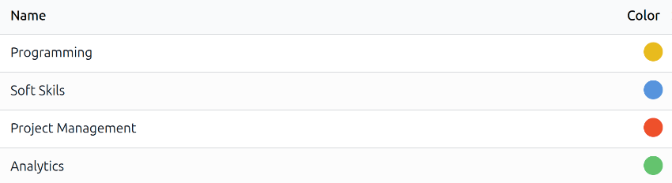
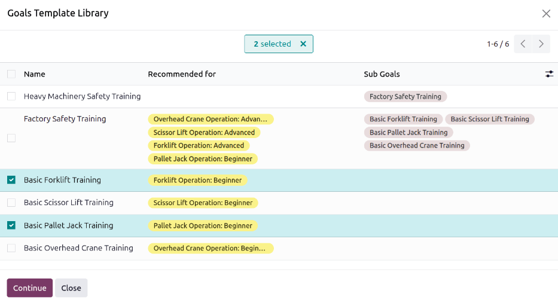
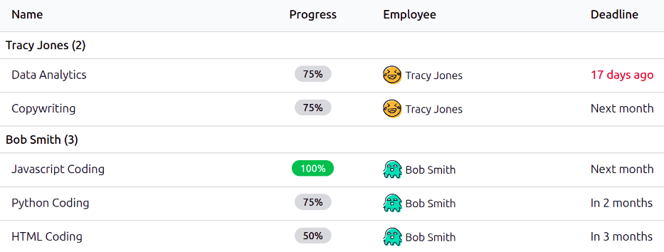
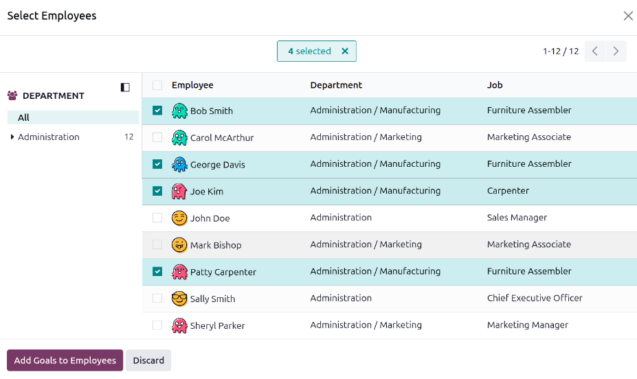
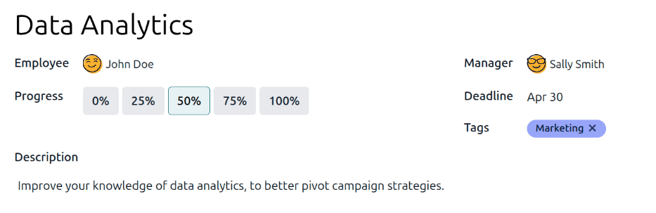
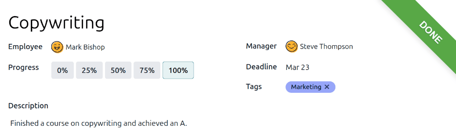

=====
Goals
=====

The Odoo **Appraisals** application allows managers to set and track clear goals for their
employees. Continuous progress towards goals gives employees a concrete target between reviews, and
gives managers reliable insights when evaluating performance.

.. note::
   No goals come preconfigured in the **Appraisals** app; all goals must be :ref:`added to the
   database <appraisals/add-goals>`.

Goals library
=============

The *Goals Library* houses all the goals configured in the database, and is where new goals are
added. To view all the currently configured goals, navigate to :menuselection:`Appraisals app -->
Configuration --> Library`, and the *Goals template* dashboard loads. All goals are displayed in a
default list view, and each goal displays the following information:

- :guilabel:`Name`: The name of the goal.
- :guilabel:`Recommended for`: The *skills* the goal works towards. If an employee wants to advance
  a skill listed in the :guilabel:`Recommended for` column, the goal is an effective way to attain
  those skills.
- :guilabel:`Sub Goals`: The various goals that must be achieved before attaining the specified
  goal. These can also be referred to as *prerequisites*.

.. _appraisals/add-goals:

Create new goals
----------------

To add a new goal to the goals library, navigate to :menuselection:`Appraisals app --> Configuration
--> Library`, click the :guilabel:`New` button, and a :guilabel:`Goals Template` form loads. Fill
out the following information on the form:

- :guilabel:`Name`: Enter a name for the goal in this field.
- :guilabel:`Parent Goal Template`: If the goal is a sub-goal under another goal, referred to as a
  *parent goal*, select it using the drop-down menu.
- :guilabel:`Expected Skills`: If the goal is a prerequisite for a skill, select it using the
  drop-down menu. When an employee is tasked to learn a skill, the corresponding goals associated
  with that skill are recommended for them.
- :guilabel:`Usual Timing`: Enter the typical amount of time, in months, the goal takes to achieve.
  When the goal is assigned to an employee, the due date is calculated based on this field.
- :guilabel:`Tags`: Add any relevant :ref:`tags <appraisals/add-tags>` using the drop-down menu.

.. example::
   A company wants to create a goal for employees to learn basic safety for all their heavy
   machinery. To set up this goal, the goal is named `Factory Safety Training`. The
   :guilabel:`Parent Goal Template` is `Heavy Machinery Safety Training`, which includes the
   advanced safety training for all the equipment. This means the goals of `Factory Safety Training`
   fall underneath the more comprehensive `Heavy Machinery Safety Training`.

   The :guilabel:`Expected Skills` are the various advanced safety training skills, such as
   `Forklift Operation: Advanced`. This means that when an employee wants to obtain the skill
   `Forklift Operator: Advanced`, they will be recommended the `Factory Safety Training` goal.

   The :guilabel:`Usual Timing` is set to one month, meaning that it is typical for an employee to
   take one month to achieve the goal.

   Last, the tags `Factory` and `Safety` are assigned to the goal.

   .. image:: goals/goals-top-half.png
      :alt: The top half of the goals form, populated for a factory safety training goal.

Description tab
~~~~~~~~~~~~~~~

Enter any relevant information in this tab to provide information, context, and assistance to the
employee.

This text is visible to the employee, and may include steps to take, any benefits from achieving the
goal, and how they can achieve it. Use the :doc:`rich text editor <../../essentials/html_editor>` to
customize the information provided.

.. example::
   A `Factory Safety Training` goal populates the *Description* tab with a short description of the
   goal, a checklist of safety training that must be completed to achieve the goal, as well as
   instructions for whom to contact to schedule the necessary training.

   .. image:: goals/goals-description.png
      :alt: The factory safety course with a list of the steps, and a contact for scheduling.

Sub-Goals tab
~~~~~~~~~~~~~

Certain goals can only be achieved after completing related goals, referred to as *sub-goals*. When
this applies, the necessary sub-goals must be added to the *Sub-goals* tab.

To add a sub-goal, click :guilabel:`Add a line`, and a *Create Sub Goal Template* pop-up window
loads. The form contains the same fields as the :ref:`goals template <appraisals/add-goals>`, except
the *Parent Goal Template* does not appear on this form. Fill out the pop-up window, then click
:guilabel:`Save & Close` if only one goal is needed, or :guilabel:`Save & New` to save the goal and
add another.

.. example::
   A `Factory Safety Training` has four sub-goals configured. Each sub-goal is for the basic
   training of a specific piece of heavy machinery, such as `Basic Forklift Training`. Each sub-goal
   has a :guilabel:`Recommended for` *skill* listed with it. The `Basic Forklift Training` is
   recommended for employees assigned the `Forklift Operator: Beginner` skill.

   .. image:: goals/sub-goals.png
      :alt: The various sub-goals for the factory safety training goal.

.. _appraisals/add-tags:

Tags
----

Adding tags to goals can help when viewing the goals report, to see how many goals with specific
tags are assigned to employees. They also can aid with keeping various goals organized, and see
which goals are related to one another.

To view all the current tags, and add new ones, navigate to :menuselection:`Appraisals app -->
Configuration --> Tags`. All tags appear in a list view. No tags come preconfigured, so all tags
must be added to the database.

To add a new tag, click the :guilabel:`New` button in the upper-left corner, and a new line appears
at the bottom of the list. Enter the tag name, then press return or click away from the field. Click
on a colored dot at the end of the line to select a color for the tag.

View employee goals
===================

To view all goals assigned to employees, navigate to :menuselection:`Appraisals app --> Goals`. This
presents all the goals for every employee, in a default list view, grouped by :guilabel:`Employee`.

Click on an employee to expand the listed goals. Each goal displays the following information:

- :guilabel:`Name`: The name of the goal.
- :guilabel:`Progress`: The percentage of progress the employee has achieved.
- :guilabel:`Employee`: The employee assigned to the goal.
- :guilabel:`Deadline`: The date the goal should be achieved.

The :guilabel:`Progress` percentages all appear in gray until a goal has been achieved. Once
achieved, the :guilabel:`Progress` displays `100%` and appears in green.

Any goals whose :guilabel:`Deadline` has passed appears in red text.

.. note::
   Only employees with goals assigned to them appear in the list.

.. _appraisals/goals/assign:

Assign goals to employees
=========================

Once goals have been configured in the database, the next step is to assign goals to employees.
Configured goals can be :ref:`assigned to employees, <appraisals/goals/existing>` and new goals can
be :ref:`created and assigned <appraisals/goals/new>`.

.. _appraisals/goals/existing:

Assign existing goals
---------------------

To assign goals to employees, first open to the main *Goals* dashboard by navigating to
:menuselection:`Appraisals app --> Goals`. Click the :guilabel:`Open Library` button and a *Goals
Template Library* pop-up window loads, displaying all the currently configured goals. Click the
checkbox next to each goal being assigned to employees.

Next, click the :guilabel:`Continue` button and a *Select Employees* pop-up window loads. Click the
checkbox next to each employee being assigned the selected goals, then click the :guilabel:`Add
Goals to Employees` button.

The pop-up window closes, and the selected goals are now assigned to the selected employees, and
appear on the *Goals* dashboard.

.. _appraisals/goals/new:

Assign new goals
----------------

If a goal does not exist, it can be created and assigned to an employee from the *Goals* dashboard.
To create new goals, navigate to :menuselection:`Appraisals app --> Goals`, and click
:guilabel:`New` in the top-left corner to open a blank *Goals* form. Add the following information
on the form:

- :guilabel:`Goal`: Type in a brief name for the goal in this field.
- :guilabel:`Employee`: Select the employee being assigned the goal using the drop-down menu. Once
  this field is populated, the employee's manager populates the :guilabel:`Manager` field.
- :guilabel:`Progress`: Click the current percentage of competency for the goal. The options are
  :guilabel:`0%`, :guilabel:`25%`, :guilabel:`50%`, :guilabel:`75%`, or :guilabel:`100%`.
- :guilabel:`Manager`: Select the employee's manager using the drop-down menu, if not already
  selected.
- :guilabel:`Deadline`: Enter the due date for the goal using the calendar selector.
- :guilabel:`Tags`: Add any relevant :ref:`tags <appraisals/add-tags>` to the goal using the
  drop-down menu.
- :guilabel:`Description`: Enter any details regarding the goal in this tab.

.. tip::
   Some goals can be broken down into steps, which may be input as a checklist. A checklist is a
   tool the employee may use to mark their progress.

Update employee goals
=====================

Typically, goals are updated during an employee appraisal, directly on the appraisal form. However,
in some cases, it is necessary to update goal progress outside of an appraisal. This could be from
an employee completing a course or certification, documenting their goal progress or completion.

To update a goal's progress percentage outside of an appraisal, navigate to
:menuselection:`Appraisals app --> Goals`. Expand the employee whose goals are being updated, and
click on an individual goal to open the goal record.

Click the new :guilabel:`Progress` box to set the new progress level. It is recommended to add notes
in the :guilabel:`Description` tab, as the employee progresses with the goal. The notes should
include dates the progress changed, and any supporting information regarding the change.

Completed employee goals
========================

When a goal has been met, it is important to update the record. Navigate to
:menuselection:`Appraisals app --> Goals`. Expand the employee whose goals are being evaluated, and
click on an individual goal to open the goal record.

Click the :guilabel:`Mark as Done` button in the upper-left corner. A green :guilabel:`Done` banner
appears in the top-right corner of the goal card, and the :guilabel:`Progress` changes to
:guilabel:`100%`.

.. note::
   On the :guilabel:`Goals` dashboard, completed goals are indicated with a green :guilabel:`100%`
   tag in the :guilabel:`Progress` column.

