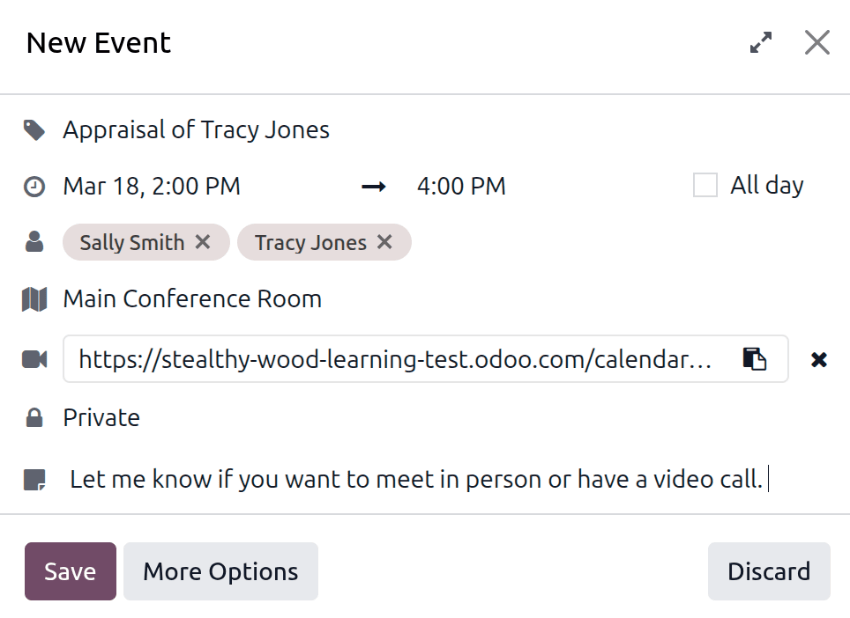

==================
Conduct appraisals
==================

This guide explains the end-to-end appraisal workflow in Odoo, from creation to final rating,
showing how managers and employees collaborate at each stage.

- :ref:`Employee self-assessment <appraisals/employee-feedback>`: The employee completes the
  *Employee's Feedback* template and updates their skills. Responses remain hidden until the
  employee sets the form to *Visible to Manager*.
- :ref:`Manager feedback <appraisals/manager-feedback>`: While the employee works on their section,
  the manager reviews goals, gathers peer input if needed, and fills out the *Manager's Feedback*
  template. Feedback can remain hidden until the appraisal meeting.
- :ref:`Appraisal review <appraisals/review>`: Manager and employee meet to discuss both feedback
  sections, validate skill changes, and agree on next steps. The meeting can be scheduled directly
  from the appraisal or the calendar.
- :ref:`Completion and rating <appraisals/complete>`: After the discussion, the manager assigns a
  final rating, adds any private notes, and marks the appraisal as done. The record then locks
  unless it is reopened for further edits.

Throughout the process, optional actions, such as requesting peer feedback or logging private
manager notes, enhance the appraisal's accuracy and relevance.

.. _appraisals/employee-feedback:

Employee self-assessment
========================

Once an appraisal is confirmed, the employee is required to fill out the self-assessment.

.. note::
   Only confirmed appraisals can be worked on. If an appraisal is *not* confirmed, the fields on the
   appraisal form cannot be edited, and feedback cannot be recorded.

After the employee receives a notification via email that an appraisal is confirmed and scheduled,
they are requested to fill out their half of the default appraisal template, and update any skills.

Employees can click on the link in the confirmation email to navigate to the appraisal, or they can
open their appraisal in the **Appraisals** app. To do this, open the **Appraisals** app, then click
on the appraisal card.

The :guilabel:`Employee's Feedback` half of the template includes the following sections:
:guilabel:`My work`, :guilabel:`My future`, and :guilabel:`My feelings`. Each of these sections
consists of several questions for the employee to answer, allowing the employee to perform a
self-assessment, and provide feedback on how they feel about the company and their role.

Complete the self-assessment
----------------------------

The employee feedback remains hidden from management while the employee is performing their
self-assessment. Once the employee has completed their half of the appraisal, and updated any
skills, they click the gray :guilabel:`Private` toggle. This changes the toggle text to
:guilabel:`Shared to Appraisers`, the color changes to green, and their responses are then visible
to the appraisers.

.. _appraisals/manager-feedback:

Manager feedback
================

While the employee is completing their :guilabel:`Employee's Feedback` section, the manager fills
out the :guilabel:`Manager's Feedback` section.

.. note::
   Multiple appraisers can be selected in the :guilabel:`Appraisers` field in the top half of the
   appraisal form. Anyone added as an appraiser is able to review the appraisal and populate the
   :guilabel:`Manager's Feedback` section.

   Typically, managers conduct appraisals with their employees, one on one. Some cases may require
   more than one appraiser, such as an annual review for an upper management position, or for an
   employee being promoted.

Before the manager fills out their portion of the appraisal, managers typically ask for
:ref:`additional feedback <appraisals/ask-feedback>` from the employee's coworkers, to better
understand all the achievements and challenges for the employee.

Once the manager has all the information they need to evaluate the employee, they fill out the
:guilabel:`Manager's Feedback` section of the appraisal form. The manager's half has the following
sections: :guilabel:`Feedback`, :guilabel:`Evaluation`, and :guilabel:`Improvements`.

The manager's appraisal focuses on the employee's accomplishments, as well as identifying areas of
improvements, with actionable steps to help the employee achieve their goals in both the long and
short term.

When the feedback section is completed, the manager clicks the :guilabel:`Private` toggle. This
changes the toggle text to :guilabel:`Shared to Employee`, the color changes to green, and their
responses are then visible to the employee.

.. note::
   Some managers prefer to keep their feedback hidden from the employee until they :ref:`meet with
   the employee <appraisals/review>` to discuss the appraisal.

.. _appraisals/ask-feedback:

Ask for feedback
----------------

As part of the appraisal process, the manager can :ref:`request feedback for an employee
<appraisals/360-request-feedback>`  from anyone in the company about an employee. In Odoo, this is
referred to as *360 Feedback*.

Feedback is requested from coworkers and anyone else who works with the employee. This is to get a
more well-rounded view of the employee, and aid in the manager's overall assessment.

.. important::
   To request feedback, the appraisal **must** be confirmed. Once confirmed, an :guilabel:`Ask
   Feedback` button appears in the upper-left corner of the form.

.. _appraisals/review:

Appraisal review
================

Once both portions of an appraisal are completed (the :ref:`employee <appraisals/employee-feedback>`
and :ref:`manager <appraisals/manager-feedback>` feedback sections), it is time for the employee and
manager to :ref:`meet and discuss the appraisal <appraisals/schedule>`.

During the appraisal meeting, the manager reviews both the :ref:`Employee's Feedback
<appraisals/employee-feedback>` section as well as their own :ref:`Manager feedback
<appraisals/manager-feedback>`.

Additionally, the employee's :ref:`skills <appraisals/skills>` and :doc:`goals <goals>` are reviewed
at this time, and updated as needed.

.. _appraisals/schedule:

Schedule appraisal review
-------------------------

Meetings to review appraisals are scheduled from the individual appraisal Kanban card.

To schedule an appraisal, navigate to :menuselection:`Appraisals app --> Appraisals`, and click on
the desired Kanban card.

Click the :guilabel:`Schedule Meeting` button, and the :guilabel:`Meetings` dashboard loads.
Navigate to the desired date using the calendar on the right side, then click on the desired time on
the calendar. This opens a *New Event* pop-up window.

The :icon:`fa-tag` :guilabel:`(Title)` field is populated with `Appraisal of (Employee Name)`, and
the date and time populate the :icon:`fa-clock-o` :guilabel:`(Dates)` fields. The employee and
appraisers populate the :icon:`fa-user` :guilabel:`(Participants)` field by default. Add anyone else
who should be in the meeting, if necessary.

Add a :icon:`fa-map` :guilabel:`(Location)` if desired. This can be more detailed, such as `Main
Conference Room`.

To make the meeting a video call, instead of an in-person meeting, click :icon:`fa-plus`
:guilabel:`Video`, and a :icon:`fa-video-camera` :guilabel:`(Videocall URL)` link appears.

Set the :icon:`fa-lock` :guilabel:`(Visibility)` using the drop-down menu. The options are either
:guilabel:`Private`, :guilabel:`Public`, or :guilabel:`Only internal users`.

Any notes or additional information can be added in the :icon:`fa-sticky-note` :guilabel:`(Notes)`
line.

Once all the desired changes are complete, click :guilabel:`Save`. The meeting now appears on the
calendar, and the invited parties are informed, via email.

.. _appraisals/skills:

Review employee skills
----------------------

Part of an appraisal is evaluating an employee's skills and tracking their progress over time. Once
an appraisal is confirmed, the *Skills* tab of the appraisal form auto-populates with the skills
from the :ref:`employee form <employees/skills>`. Additionally, if the :guilabel:`Target Job` field
is populated, the corresponding skills and expected levels also appear in the *Skills* tab. The
target level for each skill appears in red in the :guilabel:`Job Target` column.

Each skill is grouped with like skills, and the :guilabel:`Skill Level`, :guilabel:`Current`
progress, and :guilabel:`Justification` are displayed for each skill.

If a :guilabel:`Skill Level` has changed since the last appraisal, the level must be updated.

.. note::
   The *Skills* tab does not appear on the appraisal until the appraisal is confirmed.

Click on the :guilabel:`Skill Level` for the skill that has changed, revealing a dropdown of all
available levels. Click on the new level for the skill. Once selected, the :guilabel:`Current` field
updates accordingly. Next, click into the :guilabel:`Justification` field for the skill, and enter
any relevant details explaining the change, such as `took a fluency language test` or `received
Javascript certification`.

If necessary, :ref:`add any new skills <employees/skills>` for the employee.

After the appraisal is completed and the skills have been updated, the next time an appraisal is
confirmed, the updated skills populate the *Skills* tab.

.. note::
   The *Skills* tab can be modified at any time.

.. _appraisals/complete:

Complete an appraisal
=====================

After the appraisal has been filled out by both the employee and the manager, and both parties have
met and discussed the employee's performance, the manager then :ref:`logs any notes
<appraisals/notes>`, and :ref:`assigns a rating <appraisals/rate>`.

When completed, click the :guilabel:`Mark as Done` button in the upper-left corner of the appraisal
form.

Once the appraisal is marked as *Done*, the status changes from :guilabel:`Confirmed` to
:guilabel:`Done`, and the :guilabel:`Mark as Done` button changes to a :guilabel:`Reopen` button.

.. tip::
   When an appraisal is marked as done, it is locked and modifications are not possible. To make any
   changes to an appraisal with a status of :guilabel:`Done`, click the :guilabel:`Reopen` button,
   then make any needed modifications. Once all modifications are complete, click the
   :guilabel:`Mark as Done` button again.

.. _appraisals/notes:

Add a private note
------------------

Managers can log notes on an appraisal that are **only** visible to other managers. Enter any notes
in the *Private Note* tab. This can be done anytime during the appraisal process.

The employee being evaluated does **not** have access to this tab, and the tab does **not** appear
on their appraisal.

The tab is optional and does not affect the final rating.

.. _appraisals/rate:

Provide a final rating
----------------------

After both the manager and employee have met to discuss the employee's performance, the appraisal
must be given a :guilabel:`Final Rating`.

Using the drop-down menu, select the rating for the employee. The default options are:
:guilabel:`Needs improvement`, :guilabel:`Meets expectations`, :guilabel:`Exceeds expectations`, and
:guilabel:`Strongly Exceeds Expectations`.

To add a new rating, navigate to :menuselection:`Appraisals app --> Configuration --> Evaluation
Scale`. The default ratings are presented in a list view. To add a new rating, click the
:guilabel:`New` button in the upper-left corner, and a blank line appears at the bottom of the list.
Enter the new rating, then press the enter key, or click away from the line. Add as many new ratings
as needed.

Click :menuselection:`Appraisals` in the top menu to return to the :guilabel:`Appraisals` dashboard,
click on the appraisal, then select the desired :guilabel:`Final Rating`.

.. seealso::
   - :doc:`../appraisals/goals`
   - :doc:`../appraisals/appraisal_analysis`
   - :doc:`../appraisals/skills_evolution`
