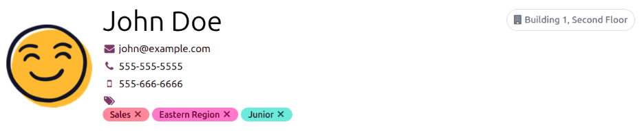
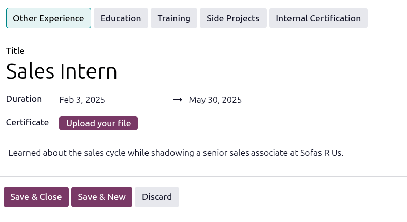
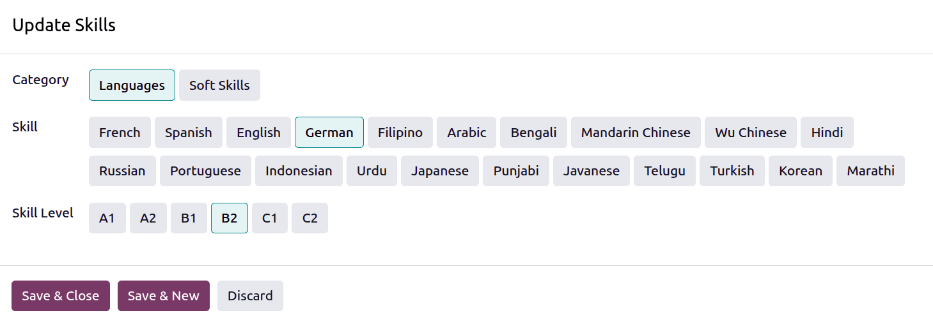
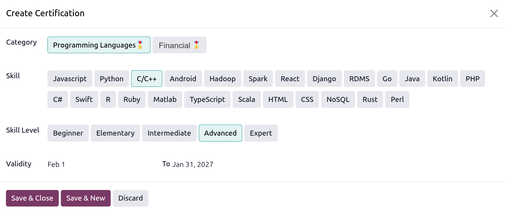
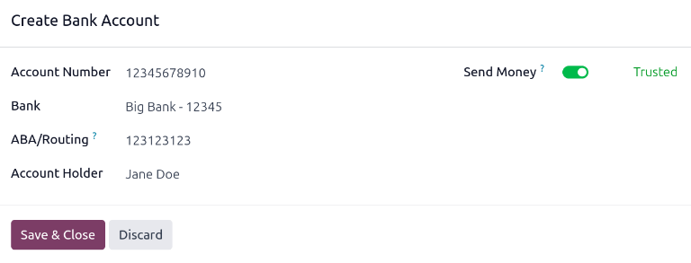
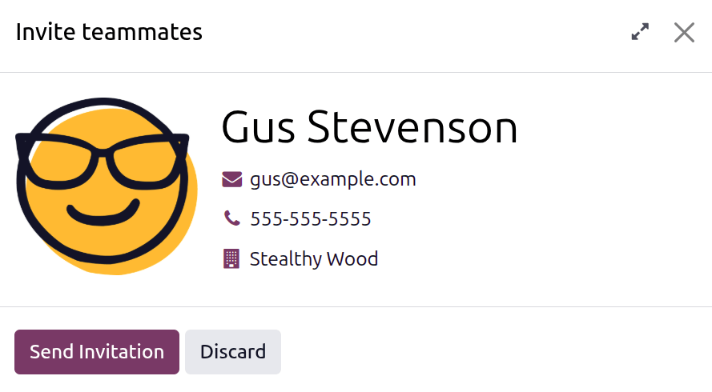

=============
New employees
=============

When a new employee is hired, the first step is to create a new employee record. This record is a
centralized place where all important information about the employee is stored, including
:ref:`general information <employees/general-info>`, :ref:`job history and skills
<employees/resume>`, :ref:`various work information <employees/work-info-tab>`, :ref:`personal
details <employees/private-info>`, :ref:`payroll-related information <employees/payroll>`, and
various :ref:`settings <employees/hr-settings>` that affect integrations with other apps in the
database.

To begin, open the :menuselection:`Employees` app, then click the :guilabel:`New` button in the
upper-left corner. Doing so reveals a blank employee form.

Proceed to fill out the required information, along with any additional details.

.. tip::
   The employee form automatically saves as data is entered. However, the form can be saved manually
   at any time by clicking the :icon:`fa-cloud-upload` :guilabel:`(Save manually)` icon.

.. _employees/general-info:

General information
===================

Fill out the following employee details in the top section of the employee form.

- :guilabel:`Employee's Name`: Enter the employee's name. This field is required.
- :icon:`fa-envelope` :guilabel:`(Work Email)`: Enter the employee's work email address.
- :icon:`fa-phone` :guilabel:`(Work Phone)`: Enter the employee's work phone number.
- :icon:`fa-mobile` :guilabel:`(Work Mobile)`: Enter the employee's work mobile number.
- :icon:`fa-tag` :guilabel:`(Tags)`: Select any tags from the drop-down menu to add relevant tags to
  the employee. Any tag can be created in this field by typing it in. Once created, the new tag is
  available for all employee records. There is no limit to the amount of tags that can be added on
  an employee form.
- :guilabel:`Photo`: Upload a photo of the employee in the photo placeholder.

.. _employees/work-info-tab:

Work tab
========

This tab is visible for all employees, and does not require any other apps to be installed.

Work
----

- :guilabel:`Company`: Select the company the new employee was hired by using the drop-down menu, or
  create a new company by typing the name in the field, and clicking :guilabel:`Create` or
  :guilabel:`Create and edit...` from the mini drop-down menu that appears. This field is required,
  but only appears when in a multi-company database.
- :guilabel:`Department`: Select the employee's department from the drop-down menu.
- :guilabel:`Job Position`: Select the employee's job position from the drop-down menu. If using the
  **Recruitment** app, this list reflects configured job positions.
- :guilabel:`Job Title`: This field is automatically populated with the selection made in the
  :guilabel:`Job Position` field. Adjust the text, if desired, to best reflect the employee's role.

  .. example::
     Specific details can be added in the :guilabel:`Job Title` field, if desired.

     For example, a sales representative position configured as :guilabel:`Sales Associate` in the
     **Recruitment** app can be selected for the :guilabel:`Job Position` field.

     The :guilabel:`Job Title` field can be more specific, such as `Sales Associate - Subscriptions`
     if the employee is focused solely on subscription sales.

     .. image:: new_employee/job-title-fields.png
        :alt: Both job position fields entered but with different information.

- :guilabel:`Manager`: Select the employee's manager using the drop-down menu.

Location
--------

- :guilabel:`Work Address`: Select the :guilabel:`Work Address` from the drop-down menu. The current
  company populates this field, by default. To modify the address, hover over the first line (if
  there are multiple lines) of the address to reveal an :icon:`oi-arrow-right` :guilabel:`(Internal
  Link)` arrow. Click the :icon:`oi-arrow-right` :guilabel:`(Internal Link)` arrow to open up the
  company form, and make any edits. Use the breadcrumb links to navigate back to the new employee
  form when done.

  If a new work address is needed, add the address by typing it in the field, then click
  :guilabel:`Create (new address)` to add the address, or :guilabel:`Create and edit...` to add the
  new address and edit the address form.
- :guilabel:`Work Location`: Select where the employee works using the drop-down menu. The default
  options are :guilabel:`Home`, :guilabel:`Office`, or :guilabel:`Other`.

  To add a new location, type in the location name, then click :guilabel:`Create (new location)` to
  add the location, or :guilabel:`Create and edit...` to add the location, assign a :guilabel:`Work
  Address`, and a :guilabel:`Cover Image`.

Usual work location
-------------------

This section states where the employee is expected to work on any given workday. Using the drop-down
menu for each day of the work week, select where the employee works that day. The selected location
is reflected on the employee's Kanban card, indicating their location that day.

Use the drop-down menu to select the default location the employee works, for each day of the week.
The default options are :guilabel:`Home`, :guilabel:`Office`, or :guilabel:`Other`.

A new location can be typed into the field, then click either :guilabel:`Create (new location)` to
add the location, or :guilabel:`Create and edit...` to add the new location and edit the form.

After edits are done, click :guilabel:`Save & Close`, and the new location is added, and populates
the field.

Leave the field blank (:guilabel:`Unspecified`) for non-working days, such as Saturday and Sunday.

.. note::
   It is also possible to add or modify work locations by navigating to :menuselection:`Employees
   app --> Configuration --> Work Locations`. To modify a location, click on an existing location,
   then make any changes on the form.

   Click :guilabel:`New` to create a new location, then enter the following information on the form.
   All fields are **required**.

   - :guilabel:`Work Location`: Enter the name for the location. This can be as general or specific
     as needed, such as `Home` or `Building 1, Second Floor`, respectively.
   - :guilabel:`Work Address`: Using the drop-down menu, select the address for the location.
   - :guilabel:`Cover Image`: Click on the icon to select it for the :guilabel:`Cover Image`.
     Options are a :icon:`fa-home` :guilabel:`(home)` icon, an :icon:`fa-building-o`
     :guilabel:`(building)` icon, and a :icon:`fa-map-marker` :guilabel:`(map marker)` icon.
   - :guilabel:`Company`: Using the drop-down menu, select the company the location applies to. The
     current company populates this field, by default. This field **only** appears in a
     multi-company database.

   .. image:: new_employee/location.png
      :alt: A new work location form with all fields filled out.

Note
----

Enter any relevant notes in this field.

Organization chart
------------------

The related departments appear in this section, illustrating where in the company the employee
works.

.. note::
   After a :guilabel:`Department` is selected, the department's configured manager automatically
   populates the :guilabel:`Manager` field.

.. tip::
   To make edits to the selected :guilabel:`Department`, :guilabel:`Manager`, or
   :guilabel:`Company`, click the :icon:`oi-arrow-right` :guilabel:`(Internal link)` arrow next to
   the respective selection. The :icon:`oi-arrow-right` :guilabel:`(Internal link)` arrow opens the
   selected form, allowing for modifications. Click :guilabel:`Save` after any edits are made.

.. _employees/resume:

Resumé tab
==========

Resumé
------

Enter the employee's work history in the :guilabel:`Resumé` tab. Each resumé line must be entered
individually. When creating an entry for the first time, click :guilabel:`Create Resume Lines`, and
a *Create Resumé Line* form appears. After an entry is added, the :guilabel:`Create Resume Lines`
button is replaced with an :guilabel:`ADD` button. Enter the following information for each entry:

- :guilabel:`Type`: Click the corresponding button to reflect the *type* of experience being added.
  The available options are :guilabel:`Other Experience`, :guilabel:`Education`,
  :guilabel:`Training`, or :guilabel:`Internal Certification`.
- :guilabel:`Title`: Type in the title from the previous work experience.
- :guilabel:`Duration`: Enter the start and end dates for the work experience using the calendar
  module.
- :guilabel:`Certificate`: If there is a relevant certificate to attach, click the :guilabel:`Upload
  your file` button, select the desired file, and click :guilabel:`Select`. The file name appears in
  the field, not an image of the certificate.
- :guilabel:`Description`: Enter any relevant details in this field.

Once all the information is entered, click the :guilabel:`Save & Close` button if there is only one
entry to add, or click the :guilabel:`Save & New` button to save the current entry and create
another resumé line.

.. note::
   After the new employee form is saved, the current position and company is automatically added to
   the :guilabel:`Resumé` tab, with the end date listed as `Current`.

.. _employees/skills:

Skills & certifications
-----------------------

An employee's skills and certifications can be entered in the :guilabel:`Resumé` tab in the same
manner that a resumé line is created.

To add a skill to an employee record, the skill type must first be configured. By default, Odoo
comes with two :guilabel:`Skill Types` preconfigured: *Languages* and *Soft Skills*.
:ref:`Configure the rest of the skill types <employees/skill-types>` before adding any skills to the
employee record.

When adding the first skill to an employee record, a :guilabel:`Pick a skill from the list` button
appears in the :guilabel:`Skills` section of the :guilabel:`Resumé` tab. Click the :guilabel:`Pick a
skill from the list` button, and a blank *Update Skills* pop-up window loads. Configure the
following information for each skill:

- :guilabel:`Category`: Select a :ref:`skill type <employees/skill-types>` by clicking it.
- :guilabel:`Skill`: After selecting the :guilabel:`Category`, all corresponding skills associated
  with that selected :guilabel:`Category` appear in individual buttons. For example, selecting
  :guilabel:`Language` as the :guilabel:`Skill Type` presents a variety of languages to select from
  in the :guilabel:`Skills` section. Click the appropriate preconfigured skill from the list.

  .. important::
     If the desired skill does not appear in the list, it is **not** possible to add the new skill
     from this window. New skills must be added from the :ref:`Skill Types <employees/skill-types>`
     dashboard.

- :guilabel:`Skill Level`: Pre-defined skill levels associated with the selected
  :guilabel:`Category` appear. Click on a :guilabel:`Skill Level` to select it. Skill levels can be
  created and modified from the :ref:`Skill Types <employees/skill-types>` dashboard.

Click the :guilabel:`Save & Close` button if there is only one skill to add, or click the
:guilabel:`Save & New` button to save the current entry and immediately add another skill.

At any point, a new line can be added by clicking the :guilabel:`ADD` button.

.. important::
   Only users with :guilabel:`Officer: Manage all employees` or :guilabel:`Administrator` rights for
   the **Employees** app can add or edit skills.

.. _employees/skill-types:

Skill types
~~~~~~~~~~~

To add a skill to an employee's form, the :guilabel:`Skill Types` must be configured. Navigate to
:menuselection:`Employees app --> Configuration --> Skill Types` to view the currently configured
skill types and create new skill types.

.. note::
   The default skill of :guilabel:`Languages` is preconfigured with twenty-one skills, and the
   default :guilabel:`Soft Skills` is preconfigured with fifteen skills.

Click the :guilabel:`New` button in the upper-left corner, and a new :guilabel:`Skill Type` form
loads. Fill out the following details for the new skill type. Repeat this for all the needed skill
types.

- :guilabel:`Skill Type`: Enter the name of the skill type. This acts as the parent category for
  more specific skills and should be generic.
- :guilabel:`Color`: Click on the existing color to view the available colors. Click the desired
  color to select it.
- :guilabel:`Certification`: Click the toggle to indicate the skill is a certification. The toggle
  turns green, indicating it is active and the skill can be added to the :ref:`certifications
  <employees/certifications>` tab.
- :guilabel:`Skills`: Click :guilabel:`Add a line` and enter the :guilabel:`Name` for the new skill,
  then repeat for all other needed skills.
- :guilabel:`Levels`: Click :guilabel:`Add a line`, and enter a :guilabel:`Name` and
  :guilabel:`Progress` percentage (`0`-`100`) for each level.

  Set a :guilabel:`Default Level` by clicking the toggle on the desired line (only one level can be
  selected). The toggle turns green to indicate the default level. Typically, the lowest level is
  chosen, but any level can be selected.

  .. example::
     To add math skills in yellow, enter `Math` in the :guilabel:`Skill Type` field, and click the
     colored circle next to :guilabel:`Color`, and select yellow. Then, in the :guilabel:`Skills`
     field, enter `Algebra`, `Calculus`, and `Trigonometry`. Next, in the :guilabel:`Levels` field,
     enter `Beginner`, `Intermediate`, and `Expert`, with the :guilabel:`Progress` listed as `25`,
     `50`, and `100`, respectively. Click :guilabel:`Set Default` on the `Beginner` line to set this
     as the default skill level.

     .. image:: new_employee/math-skills.png
        :alt: A skill form for a Math skill type, with all the information entered.

.. tip::
   Once the form is completely filled out, click the :icon:`fa-cloud-upload` :guilabel:`(Save
   manually)` icon at the top of the screen, and the :guilabel:`Levels` rearrange in descending
   order, with the highest level at the top, and the lowest at the bottom, regardless of the default
   level and the order they were entered.

.. _employees/certifications:

Certifications tab
==================

This tab houses all the employee's certifications, which can be important for employees who are
required to hold specific certifications to perform their job, such as a :abbr:`CPA (Certified
Public Accountant)` certification for accountants, or a :abbr:`CSM (Certified Safety Manager)`
certification for a construction manager.

The tab lists each :guilabel:`Certification` in a line, and displays the validity period in the
:guilabel:`From` and :guilabel:`To` fields.

.. note::
   This tab **only** appears if at least one :ref:`skill type <employees/skill-types>` is configured
   as *certification*. When adding certifications, **only** skill types marked as a certification
   can be selected.

To add a certification, click :guilabel:`Add a line` in the *Certifications* tab and a blank *Create
Certification* pop-up window loads. Enter the following information on the form:

- :guilabel:`Category`: Click on the type of certification being added.
- :guilabel:`Skill`: Click on the specific skill for the certification.
- :guilabel:`Skill Level`: Click on the level the certification is for.
- :guilabel:`Validity`: Click into the two fields, and select the start and end dates for the
  certification, using the calendar selector.

When the form is complete, click :guilabel:`Save & New` to add the certification and add another, or
:guilabel:`Save & Close` to add the certification and close the pop-up window.

.. _employees/private-info:

Personal tab
============

No information in the :guilabel:`Personal` tab is required to create an employee, however, some
information in this section may be necessary for the company's payroll department.

In order to properly process payslips and ensure all deductions are accounted for, it is recommended
to check with the accounting department and payroll department to ensure all required fields are
populated. For example, to pay employees with direct deposit, they **must** have a trusted account
listed in the :guilabel:`Bank Accounts` field.

Enter the various information in the following sections and fields of the :guilabel:`Personal` tab.
Fields are entered either using a drop-down menu, ticking a checkbox, or typing in the information.

 .. note::
    Depending on the localization setting, other fields may be present. For example, for the United
    States localization, a :guilabel:`SSN No` (Social Security Number) field is present.

.. _employees/private-contact:

Private contact
---------------

- :guilabel:`Email`: Enter the employee's personal email address.
- :guilabel:`Phone`: Enter the employee's personal phone number.
- :guilabel:`Bank Accounts`: Enter the bank account number using the drop-down menu. If the bank
  account does not exist, :ref:`create a new bank account <employees/add-bank>` and select it.

.. _employees/add-bank:

Add a bank account
~~~~~~~~~~~~~~~~~~

When an employee is added to the database, their bank account must also be added. To add a new bank
account, type the account number into the :guilabel:`Bank Accounts` field in the *Personal* tab of
the employee form, then click :guilabel:`Create and edit..`.

A *Create Bank Accounts* pop-up window loads with the bank account number populating the
:guilabel:`Account Number` field. Next, enter the :guilabel:`Clearing Number` (also referred to as a
*routing number*) in the corresponding field.

The employee's name populates the :guilabel:`Account Holder` and :guilabel:`Account Holder Name`
fields by default, but can be updated if needed.

Next, select the :guilabel:`Bank` using the drop-down menu. If the bank is not already configured,
click :guilabel:`Create and edit...` and a blank *Create Bank* pop-up window loads, with the bank
name populating the :guilabel:`Name` field. Next, enter the :guilabel:`Bank Identifier Code`, also
referred to as a BIC or SWIFT code. If applicable, select the :guilabel:`Intermediary Bank` using
the drop-down menu. This bank acts as a facilitator between banks for international wire transfers,
when needed. Enter the :guilabel:`Bank Address`, :guilabel:`Phone`, and :guilabel:`Email` in the
corresponding fields. Once the form is complete, click :guilabel:`Save`, and the new bank populates
the :guilabel:`Bank` field.

Click the :guilabel:`Send Money` toggle. This changes the toggle color to green, and the status
changes from :guilabel:`Untrusted` in gray text, to :guilabel:`Trusted` in green text.

The :guilabel:`Employee` field is populated with the employee's name, and cannot be modified.

Finally, add any relevant notes in the :guilabel:`Note` tab.

.. important::
   To ensure payments are processed and sent to the bank account, mark the bank account as
   :guilabel:`Trusted`. Having an :guilabel:`Untrusted` bank account for an employee causes an error
   in the **Payroll** application when processing direct deposits.

   If issuing paper checks or paying via cash, the :guilabel:`Bank` field does not need to be
   configured.

Emergency contact
-----------------

This section details the person to contact in the event of an emergency.

- :guilabel:`Contact`: Enter the emergency contact's name.
- :guilabel:`Phone`: Enter the emergency contact's phone number. It is recommended to enter a phone
  number that the person has the most access to, typically a mobile phone.

Citizenship
-----------

This section outlines all the information relating to the employee's citizenship. This section is
primarily for employees who are working in a different country than their citizenship. For employees
working outside of their home country, for example on a work visa, this information may be required.
Different fields may be visible, depending on the localization installed.

- :guilabel:`Nationality (Country)`: Select the country the employee is from using the drop-down
  menu.
- :guilabel:`Non-resident`: Click this checkbox if the employee lives in a foreign country.
- :guilabel:`Identification No`: Enter the employee's identification number in this field.
- :guilabel:`SSN No`: Enter the employee's social security number.
- :guilabel:`Passport No`: Enter the employee's passport number.

Family
------

This section is used for tax purposes, and affects the **Payroll** app. Enter the following
information in the fields.

- :guilabel:`Disabled`: Check this box if the employee is considered legally disabled.
- :guilabel:`Marital Status`: Select the marital status for the employee using the drop-down menu.
  The default options are :guilabel:`Single`, :guilabel:`Married`, :guilabel:`Legal Cohabitant`,
  :guilabel:`Widower`, and :guilabel:`Divorced`.

  If :guilabel:`Married` or :guilabel:`Legal Cohabitant` is selected, two additional fields appear:
  :guilabel:`Spouse Legal Name` and :guilabel:`Spouse Birthdate`. Enter these fields with the
  respective information.
- :guilabel:`Dependent Children`: Enter the number of dependent children. This number is the same
  number used for calculating tax deductions, and should follow all tax regulations regarding
  applicable dependents.

Documents
---------

This section allows for uploading any relevant documents on the employee form. Click the
:guilabel:`Upload your file` button next to the corresponding document name, navigate to the file,
then click :guilabel:`Select` to upload the file.

The documents that can be uploaded are:

- :guilabel:`ID Card Copy`: Upload any relevant ID's that may be required by the payroll or HR
  department.
- :guilabel:`Driving License`: Upload the employee's driver's license. This field may be necessary
  if the employee drives as part of their job, or is given a company car to use.
- :guilabel:`SIM Card Copy`: Upload a copy of the SIM card if the employee is using a work-issued
  mobile phone.
- :guilabel:`Internet Subscription Invoice`: If the employee is receiving benefits or compensation
  for their internet service, upload their invoice in this field.

  .. note::
     The :guilabel:`Internet Subscription Invoice` field is for documentation purposes only.
     Employees must use the **Expenses** app to request reimbursement for expenses, or define
     compensation in the *Payroll* tab.

Personal information
--------------------

This section houses information used for payroll and tax purposes.

- :guilabel:`Legal Name`: Enter the employee's legal name in this field. By default, the name
  entered in the :ref:`general information section <employees/general-info>` populates this field.
  This is the name that typically is used for filing taxes.
- :guilabel:`Birthday`: Select the birthday of the employee using the calendar selector.
- :guilabel:`Place of Birth`: Enter the city or town the employee was born in the first field, and
  select the country using the drop-down menu.
- :guilabel:`Gender`: Select the employee's gender from the drop-down menu. The default options are
  :guilabel:`Male`, :guilabel:`Female`, and :guilabel:`Other`.
- :guilabel:`Payslip Language`: Select the language used when printing the employee's payslips.
  Each language must be :doc:`added to the database <../../general/users/language>` to appear in the
  drop-down menu.

Visa & work permit
------------------

This section should be filled in if the employee is working on some type of work permit or visa.
This section may be left blank if they do not require any work permits or visas for employment.

- :guilabel:`Visa No`: Enter the employee's visa number. When entered, an :guilabel:`Expires on`
  field appears. Select the date the visa expires using the calendar.
- :guilabel:`Work Permit No`: Enter the employee's work permit number. When entered, an
  :guilabel:`Expires on` field appears. Select the date the work permit expires using the calendar.
- :guilabel:`Visa Expiration Date`: Select the date the employee's visa expires using the calendar.
- :guilabel:`Document`: Click :guilabel:`Upload your file`, then navigate to the work permit or visa
  file in the file explorer, and click :guilabel:`Select` to upload it.

  .. note::
     Typically, an employee needs either a visa *or* a work permit, not both. For this reason, only
     one document can be added to the :guilabel:`Document` field.

.. _employees/location:

Location
--------

This section is visible for all employees, and does not require any other apps to be installed for
this section to be visible. Enter the following information in this section:

- :guilabel:`Private Address`: Enter the employee's home address in this field.
- :guilabel:`Home-Work Distance`: Enter the number, in miles or kilometers, the employee commutes to
  work, in one direction. The unit of measure can be changed from kilometers (:guilabel:`km`) to
  miles (:guilabel:`mi`) using the drop-down menu. This field is only necessary if the employee is
  receiving any type of commuter benefits or tax deductions based on commute distances.

Education
---------

This section allows for only one entry, and should be populated with the highest degree the employee
has earned.

- :guilabel:`Certificate Level`: Select the highest degree the employee has earned using the
  drop-down menu. The default options are :guilabel:`Graduate`, :guilabel:`Bachelor`,
  :guilabel:`Master`, :guilabel:`Doctor`, and :guilabel:`Other`.
- :guilabel:`Field of Study`: Type in the subject the employee studied, such as `Business` or
  `Computer Science`.

.. _employees/payroll:

Payroll tab
===========

Depending on the installed :doc:`payroll localization <../payroll/payroll_localizations>`, the
sections and fields in this tab may vary considerably. Due to the specific nature of localizations
and the variety of information that may be requested in this tab, it is recommended to check with
the accounting department to fill out this section correctly.

The following fields are universal for all payroll localizations:

.. seealso::
   :doc:`Payroll localizations <../payroll/payroll_localizations>`

Contract overview
-----------------

This section details all the various details from the employee contract. Refer to the
:doc:`contracts <../payroll/contracts>` document for detailed information on creating and modifying
employee contracts.

Employer costs
--------------

This section details the various costs the employer incurs for the employee, including:

- :guilabel:`Yearly Cost`: This field is automatically updated based on the :guilabel:`Wage` entered
  in the *Contract Overview* section, but can be modified, if needed. If it is modified, the
  :guilabel:`Wage` field updates to reflect the new :guilabel:`Yearly Cost`.
- :guilabel:`Monthly Cost`: This field automatically displays the monthly cost according to the
  :guilabel:`Yearly Cost`. This field cannot be modified.
- :guilabel:`Wage on Signature`: Enter the employee's expected monthly wage according to the
  contract in this field.

.. _employees/schedule:

Schedule
--------

This section defines when the employee is expected to work. Configure the following fields:

- :guilabel:`Work Entry Source`: Determine how the employee's work entries are created in the
  **Payroll** app using the drop-down menu. :guilabel:`Working Schedules` is selected by default. If
  the **Attendances** or **Planning** apps are installed, their respective options are available.
- :guilabel:`Working Hours`: Select the hours the employee is expected to work, using the drop-down
  menu. By default, a :guilabel:`Standard 40 hours/week` working schedule is selected. If the
  **Timesheets** app is installed, an :guilabel:`Appointment Resource Default Calendar` option is
  also available.

  To view and modify the specific daily working hours, click the :icon:`oi-arrow-right`
  :guilabel:`(Internal link)` arrow at the end of the :guilabel:`Working Hours` line. Working hours
  can be modified or deleted here.

   .. note::
     :guilabel:`Working Hours` are related to a company's working schedules, and an employee
     **cannot** have working hours that are outside of a company's working schedule.

     Each individual working schedule is company-specific. For multi-company databases, each company
     **must** have its own working hours set.

     If an employee's working hours are not configured as a working schedule for the company, new
     working schedules can be added, or existing working schedules can be modified.

     Working hours can be modified in both the **Employees** and **Payroll** apps, where they are
     referred to as :guilabel:`Working Schedules`.

     For more information on how to create or modify :guilabel:`Working Schedules`, refer to the
     :doc:`working schedules <../payroll/working_schedules>` documentation.

     After the new working time is created, or an existing one is modified, the :guilabel:`Working
     Hours` can be selected on the employee form.

Salary adjustments tab
======================

This *Salary Adjustments* tab houses all salary adjustments in a list view. Salary adjustments are
wage garnishments or voluntary portions of an employee's payslip set aside each pay period.

Add each individual :ref:`salary adjustment <payroll/salary-adjustment/create>` to this tab.

.. _employees/hr-settings:

Settings tab
============

This tab provides various fields for different applications within the database. Depending on what
applications are installed, different fields may appear in this tab.

User
----

- :guilabel:`User`: Select a user in the database to link to this employee using the drop-down menu.

  .. important::
     Employees do **not** need to be users of the database, and do **not** count towards the Odoo
     subscription billing, while users **do** count towards billing. If the new employee should also
     be a user, the user **must** :ref:`be created <employees/new-user>`.
- :guilabel:`Timezone`: Select the timezone for the employee using the drop-down menu.

.. _employees/new-user:

Create a user
~~~~~~~~~~~~~

After the employee is created, click the :guilabel:`Create User` button on the upper-left corner of
the employee record, and a *Create User* pop-up window appears.

The employee name populates the :guilabel:`Name` field by default. If the :guilabel:`Email Address`,
:guilabel:`Phone`, :guilabel:`Company`, and :guilabel:`photo` fields are populated on the employee
form, the corresponding fields are auto-populated on the *Create User* form.

Once the form is completed, click the :guilabel:`Save` button. The user is created, and populates
the :guilabel:`Related User` field.

Alternatively, select the :icon:`fa-envelope-o` :guilabel:`Invite teammates via email` option that
appears in the :guilabel:`User` drop-down menu, and an *Invite teammates* pop-up window loads, with
the same fields as the *Create User* pop-up window. Fill out the form, then click :guilabel:`Send
Invitation`. An email invitation is sent to the user, informing them their account has been created.

Users can also be created manually. For more information on how to manually add a user, refer to the
:doc:`../../general/users/` document.

.. _employees/approvers:

Approvers
---------

To see this section, the user must have either :guilabel:`Administrator` or :guilabel:`Officer:
Manage all employees` rights set for the **Employees** application. For the category to appear, the
respective app must be installed. For example, if the **Time Off** app is not installed, the
:guilabel:`Time Off` approver field does not appear. Only one selection can be made for each field.

  .. important::
     The users that appear in the drop-down menu for the :guilabel:`Approvers` section **must** have
     *Administrator* rights set for the corresponding human resources role.

     To check who has these rights, go to the :menuselection:`Settings app` and click
     :icon:`oi-arrow-right` :guilabel:`Manage Users` in the *Users* section. Then, click on an
     employee and go to the :guilabel:`Access Rights` tab. Scroll to the *Human Resources* section
     and check the various settings.

     - In order for the user to appear as an approver for :guilabel:`Expenses`, they **must** have
       either :guilabel:`Team Approver`, :guilabel:`All Approver`, or :guilabel:`Administrator` set
       for the :guilabel:`Expenses` role.
     - In order for the user to appear as an approver for :guilabel:`Time Off`, they **must** have
       either :guilabel:`Officer:Manage all Requests` or :guilabel:`Administrator` set for the
       :guilabel:`Time Off` role.
     - In order for the user to appear as an approver for :guilabel:`Timesheets`, they **must**
       have either :guilabel:`Officer:Manage all contracts` or :guilabel:`Administrator` set for the
       :guilabel:`Payroll` role.
     - In order for the user to appear as an approver for :guilabel:`Attendances`, they **must**
       have :guilabel:`Administrator` set for the :guilabel:`Payroll` role.

- :guilabel:`HR Responsible`: Select the user responsible for validating the employee's contracts
  using the drop-down menu.
- :guilabel:`Expense`: Select the user responsible for approving all expenses for the employee using
  the drop-down menu.
- :guilabel:`Time Off`: Select the user responsible for approving all time off requests from this
  employee using the drop-down menu.
- :guilabel:`Timesheet`: Select the user responsible for approving all the employee's timesheet
  entries using the drop-down menu.
- :guilabel:`Attendance`: Select the user responsible for approving all attendance entries for the
  employee using the drop-down menu.

.. tip::
   If any approver field is left empty, the approval is done by an Administrator or Approver.

Application settings
--------------------

This section affects the **Fleet** and **Manufacturing** apps. Enter the following information in
this section.

- :guilabel:`Hourly Cost`: Enter the hourly cost for the employee, in a `##.##` format. This cost is
  factored in when the employee is working at a :doc:`work center
  <../../inventory_and_mrp/manufacturing/advanced_configuration/using_work_centers>`.

  .. note::
     Manufacturing costs are added to the costs for producing a product if the value of the
     manufactured product is **not** a fixed amount. This cost does **not** affect the **Payroll**
     application.

- :guilabel:`Fleet Mobility Card`: If applicable, enter the :guilabel:`Fleet Mobility Card` number.
  This is typically a credit card for gas purchases or other vehicle-related costs.

Appraisal
---------

This field is **only** visible if the **Appraisals** application is installed.

- :guilabel:`Next Appraisal Date`: The date automatically populates the date of the next appraisal
  which is computed according to the settings configured in the **Appraisals** application. This
  date can be modified using the calendar selector.

Planning
--------

This section is **only** visible if the **Planning** app is installed, as this section affects what
the employee can be assigned in the **Planning** app.

- :guilabel:`Roles`: Select all the roles the employee can perform using the drop-down menu. There
  are no preconfigured roles available, so all roles must be :ref:`configured in the Planning app
  <planning/roles>`. There is no limit to the number of roles assigned to an employee.
- :guilabel:`Default Role`: Select the default role the employee will typically perform using the
  drop-down menu. If the :guilabel:`Default Role` is selected before the :guilabel:`Roles` field is
  configured, the selected role is automatically added to the list of :guilabel:`Roles`.

.. _employees/hr-attn-pos:

Attendance/Point of Sale/Manufacturing
--------------------------------------

This section determines how employees sign in to the **Attendances**, **Point Of Sale**, and
**Manufacturing** apps and only appears if any of those apps are installed.

- :guilabel:`PIN Code`: Enter the employee's PIN code in this field. This code is used to sign in
  and out of **Attendances** app kiosks, the **Point Of Sale** app, and the **Manufacturing** app's
  *Shop Floor* companion module.
- :guilabel:`RFID/Badge Number`: Click :guilabel:`Generate` at the end of the :guilabel:`RFID/Badge
  Number` line to create a unique number. Once generated, the number populates the
  :guilabel:`RFID/Badge Number` field, and :guilabel:`Generate` changes to :guilabel:`Print Badge`.
  Click :guilabel:`Print Badge` to create a PDF file of the employee's badge. The badge can be
  printed and used to log into a :abbr:`POS (point of sale)` system or :ref:`check in
  <attendances/kiosk-mode-entry>` on an **Attendances** app kiosk.

  If the employee uses an RFID token or already has an ID badge issued with a barcode, click
  :guilabel:`Read a badge` and the system allows the barcode or RFID token to be read. Once read,
  the number populates the :guilabel:`RFID/Badge Number` field.
- :guilabel:`Overtime Ruleset`: Select the overtime rules to be used when calculating overtime for
  the employee using the drop-down menu.
