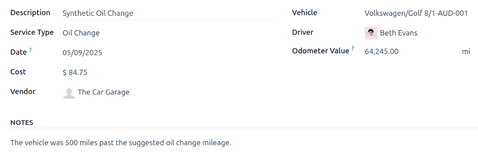
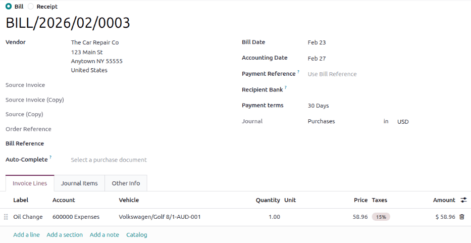
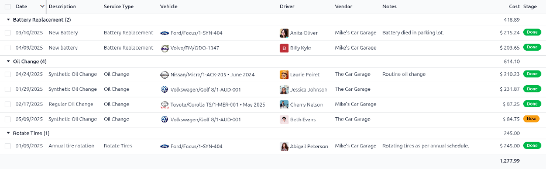

========
Services
========

To properly maintain a fleet of vehicles, regular maintenance as well as periodic repairs are
needed. Scheduling repairs and managing services for an entire fleet is necessary to ensure all
vehicles are in good working order when they are needed.

Services, such as regular maintenance, like oil changes or tire rotations, can be logged in advance.
Other repairs are logged as they occur.

Create service records
======================

Create a service record in one of two ways: :ref:`directly in the Fleet app <fleet/service-form>`,
or from a :ref:`vendor bill in the Accounting app <fleet/link-bills>`.

.. _fleet/service-form:

From the Fleet app
------------------

To log a service for a vehicle in the **Fleet** app, go to the main :guilabel:`Services` dashboard
by navigating to :menuselection:`Fleet app --> Fleet --> Services`. Open a new service form by
clicking the :guilabel:`New` button in the top-left corner.

Fill out the information on the form. The only two fields that are required to be populated are
:guilabel:`Service Type` and :guilabel:`Vehicle`.

The fields on the form are:

- :guilabel:`Description`: Enter a brief description of the service in this field.
- :guilabel:`Service Type`: Using the drop-down menu, select the type of service performed. If the
  desired service does not exist, enter a new type of service, and click either :guilabel:`Create
  "(service type)"` or :guilabel:`Create and edit...` to :ref:`add the service type and configure it
  <fleet/new-type>`.

  .. important::
     Only one :guilabel:`Service Type` comes preconfigured in Odoo: :guilabel:`Vendor Bill`.

- :guilabel:`Date`: Using the calendar selector, select the date the service was provided, or is
  scheduled to be performed. Navigate to the desired month using the :icon:`oi-chevron-left`
  :icon:`oi-chevron-right` :guilabel:`(arrow)` icons, then click on the date to select it.
- :guilabel:`Cost`: Enter the estimated cost of the service, if available. If the service is for a
  future repair, this field should be left blank. This field is updated as estimates are received,
  and again, when the final repair cost is known.
- :guilabel:`Vendor`: Using the drop-down menu, select the vendor who is performing the service. If
  the vendor has not already been entered in the system, :ref:`add and configure the vendor
  <fleet/new-vendor>`.
- :guilabel:`Vehicle`: Using the drop-down menu, select the vehicle that was serviced. When the
  vehicle is selected, the :guilabel:`Driver` field is populated, and the unit of measure for the
  :guilabel:`Odometer Value` field appears.
- :guilabel:`Driver`: The vehicle's current driver automatically populates this field when the
  :guilabel:`Vehicle` is selected. If the driver needs to be changed, another driver can be selected
  using the drop-down menu.
- :guilabel:`Odometer Value`: Enter the odometer reading from when the service was done. The units
  of measure are either in kilometers (:guilabel:`km`) or miles (:guilabel:`mi`), depending on how
  the selected vehicle was configured.

  .. tip::
     To change from kilometers to miles, or vice versa, click the :icon:`oi-arrow-right`
     :guilabel:`(Internal Link)` icon to the right of the vehicle selected in the :guilabel:`Vehicle`
     field.

     Change the unit of measure, then navigate back to the service form, via the breadcrumb links.
     The unit of measure is then updated in the :guilabel:`Odometer Value` field.

- :guilabel:`NOTES`: Enter any notes for the repair at the bottom of the service form. For example,
  this can include estimate details or parts being replaced.

.. _fleet/link-bills:

From the Accounting app
-----------------------

Sometimes repairs are performed and billed *before* service records are created. This is a common
situation when repairs are unexpected, such as towing broken down vehicles or performing emergency
repairs on the side of the road. In these circumstances, service records can be created directly
from a :doc:`vendor bill <../../finance/accounting/vendor_bills>` in the **Accounting** app.

To link a vendor bill to a service and create a service record, first open the **Accounting** app
and click :guilabel:`Purchases` on the dashboard. Click the vendor bill for the repair to open the
bill details.

In the *Invoice Lines* tab, click the :icon:`oi-settings-adjust` :guilabel:`(additional options)`
icon to reveal a drop-down menu. Click the checkbox next to :guilabel:`Vehicle`, then click away to
close the drop-down menu.

Click into the :guilabel:`Vehicle` field and select the vehicle the service was done on.

.. important::
   To add a vehicle to a bill, the :guilabel:`Status` of the bill on the accounting dashboard must
   be :guilabel:`Draft`. If the bill has been confirmed, click the :guilabel:`Reset to Draft` button
   on the bill, then add the vehicle.

Once the :guilabel:`Vehicle` field is populated, open the *Services* dashboard by navigating to
:menuselection:`Fleet app --> Fleet --> Services`. The :guilabel:`Service Type` is listed as
:guilabel:`Vendor Bill`, by default. The record must be updated to keep accurate service records.

Click on the new :guilabel:`Vendor Bill` record to view the service details. Click the
:guilabel:`Service Type` field to reveal a drop-down menu of all available service types, and select
the correct type of service. If necessary, :ref:`create a new service type <fleet/new-type>`.

On the service record, a :icon:`fa-pencil-square-o` :guilabel:`Service's Bill` smart button appears
at the top. Click the :icon:`fa-pencil-square-o` :guilabel:`Service's Bill` smart button to view the
corresponding vendor bill.

.. tip::
   The text color in the :icon:`fa-pencil-square-o` :guilabel:`Service's Bill` smart button
   indicates the *status* of the bill. Green text indicates the bill is confirmed or paid, orange
   text indicates it is still a draft.

.. _fleet/new-type:

Create service type
===================

The **only** method to create service types is from a :ref:`service form <fleet/service-form>`.

On the :ref:`service form <fleet/service-form>`, type in the name of the new :guilabel:`Service
Type` in the corresponding field. Then, click :guilabel:`Create and edit...`, and a
:guilabel:`Create Service Type` pop-up form appears.

The service type entered on the service form automatically populates the :guilabel:`Name` field,
which can be modified, if desired.

Then, select the :guilabel:`Category` for the new service type from the drop-down menu in that
field. The two default options to choose from are :guilabel:`Contract` or :guilabel:`Service`.
Additional categories **cannot** be created.

If the service applies to **only** contracts or services, select the corresponding
:guilabel:`Category`. If the service applies to **both** contracts *and* services, leave this field
blank.

When done, click :guilabel:`Save & Close`.

.. _fleet/new-vendor:

Create vendor
=============

When a service is performed for the first time, typically, the vendor's record has not yet been
added to the database. It is best practice to add the full details for a vendor in the database, so
that any necessary information can be retrieved.

Vendors are added with the **Contacts** app. Refer to the :doc:`documentation
<../../essentials/contacts>` for more details.

.. note::
   Different tabs or fields may be visible on the :guilabel:`Create Vendor` form, depending on what
   other applications are installed.

.. _fleet/view-services:

View services
=============

To view all services logged in the database, including old and new requests, navigate to
:menuselection:`Fleet app --> Fleet --> Services`. All services appear in a list view, including all
the details for each service.

The service records are grouped by :ref:`service type <fleet/new-type>`. The number of repairs for
each service type appears in parentheses after the name of the service type.

Each service listed displays the following information:

- :guilabel:`Date`: The date that the service, or repair, was performed (or requested to be
  performed).
- :guilabel:`Description`: A short description of the specific type of service, or repair, performed
  to clarify the specific service.
- :guilabel:`Service Type`: The type of service, or repair, performed. This is selected from a list
  of services that :ref:`must be configured <fleet/new-type>`.
- :guilabel:`Vehicle`: The specific vehicle the service was performed on.
- :guilabel:`Driver`: The current driver for the vehicle.
- :guilabel:`Vendor`: The specific vendor who performed the service, or repair.
- :guilabel:`Notes`: Any information associated with the service, or repair, that is documented to
  add clarification.
- :guilabel:`Cost`: The total cost of the service, or repair.
- :guilabel:`Stage`: The status of the service, or repair. Options are :guilabel:`New`,
  :guilabel:`Running`, :guilabel:`Done`, or :guilabel:`Cancelled`.

At the bottom of the :guilabel:`Cost` column, the total cost of all services and repairs are listed.

