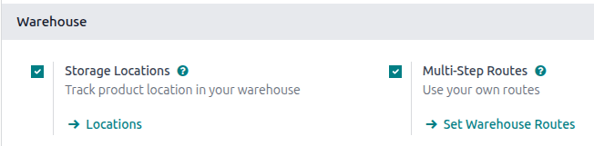

==================
Storage categories
==================

A *storage category* is used with :doc:`putaway rules <putaway>` to assign a storage location to
incoming products while accounting for the capacity of that location. Assigning categories to
storage locations tells Odoo these locations meet specific requirements, such as temperature or
accessibility. Odoo then evaluates these locations, based on defined capacity, and recommends the
best one on the warehouse transfer form.

Follow these steps to complete the setup:

#. :ref:`Enable features in the settings <inventory/routes/enable-storage-categories>`
#. :ref:`Define capacity limitations <inventory/routes/define-storage>`
#. Assign a :ref:`category to storage locations <inventory/routes/assign-location>`
#. Add the storage category as an attribute to a :ref:`putaway rule
   <inventory/routes/set-putaway-attribute>`

.. seealso::
   :doc:`putaway`

.. _inventory/routes/enable-storage-categories:

Enable storage categories
=========================

To enable storage categories, go to :menuselection:`Inventory app --> Configuration --> Settings`.
Then, in the *Warehouse* section, ensure the :guilabel:`Storage Locations` and
:guilabel:`Multi-Step Routes` features are enabled.

To set capacities by :ref:`package type <inventory/routes/set-capacity-package>`, also
make sure :guilabel:`Packages` is enabled in the *Operations* section. Click :guilabel:`Save`.

Storage location setup
======================

Set up storage locations to work with the storage category. A parent location must be set up, with
child locations (or *sublocations*) assigned to it. This is because the putaway rule's :ref:`Store
to <inventory/routes/set-putaway-attribute>` location will be set to the parent location, and the
:ref:`storage category <inventory/routes/assign-location>` will be set to the child location.

Go to :menuselection:`Inventory app --> Configuration --> Locations`.

First, set up a parent location. This can be as simple as the default `WH/Stock` location.
Alternatively, create a new parent location by clicking the :guilabel:`New` button on the
:guilabel:`Locations` page. On this parent location form, specify a :guilabel:`Location Name` and
:guilabel:`Parent Location`. Select :guilabel:`Internal` as the :guilabel:`Location Type`.

Then, create *sublocations* of this parent location by clicking the :guilabel:`New` button. On the
location form, specify a :guilabel:`Location Name`, and set the :guilabel:`Parent Location` to the
parent location that was just created.

.. example::
   A beverage company stores all of its cans of lemonade on pallets in one section of its warehouse.

   First, they create a location named `Pallets` in the `WH/Stock` location. Then, they create two
   sublocations, named `PAL1` and `PAL2`. Both have `WH/Stock/Pallets` set as the parent location.

   .. image:: storage_category/new-child-location.png
      :alt: Create a sublocation.

.. _inventory/routes/define-storage:

Define storage category limitations
===================================

Before a storage category is applied to locations, it must be configured with specific limitations
in order to decide the optimal storage location. Capacity can be limited by weight, product, and
package type.

To create a storage category, go to :menuselection:`Inventory app --> Configuration --> Storage
Categories`, and click :guilabel:`New`.

On the storage category form, type a name for the category in the :guilabel:`Storage Category`
field.

.. note::
   Weight limits can be combined with capacity by package or product (e.g. a maximum of one hundred
   products with a total weight of two hundred kilograms).

   While it is possible to limit capacity by product and package type at the same location, it may
   be more practical to store items in different amounts across various locations, as shown in the
   :ref:`limit capacity by package <inventory/routes/set-capacity-package>` example.

The :guilabel:`Allow New Product` field defines when the location is considered available to store a
product:

- :guilabel:`If location is empty`: a product can be added there only if the location is empty.
- :guilabel:`If products are the same`: a product can be added there only if the same product is
  already there.
- :guilabel:`Allow mixed products`: several different products can be stored in this location at the
  same time.

.. important::
   Odoo does **not** automatically split quantities across multiple storage locations. If an
   incoming receipt contains several units or packages and the first recommended location exceeds
   its capacity, Odoo still routes all items to that same location instead of selecting another one
   with available space.

   *(Example: If a location can hold 10 units and 12 units arrive, all 12 are still assigned to that
   location.)*

Limit capacity by weight
------------------------

A maximum product weight can be set in the :guilabel:`Max Weight` field. This limit applies
to each location assigned this storage category. If a product weight is defined, the value must be
set to greater than `0`.

Limit capacity by product
-------------------------

In the :guilabel:`Capacity by Product` tab, click :guilabel:`Add a Line` to enter a product, and set
the maximum capacity that should be stored at each location in the :guilabel:`Quantity` field.

.. example::
   To ensure only a maximum of five `Large Cabinets` and two `Corner Desk Right Sit` are stored at a
   single storage location, specify those amounts in the :guilabel:`Capacity by Product` tab.

   .. image:: storage_category/capacity-by-product.png
      :alt: Show storage category limiting by product count.

.. _inventory/routes/set-capacity-package:

Limit capacity by package type
------------------------------

Limiting capacity by :doc:`package <../../product_management/configure/package>` makes it
possible to enforce real-time storage capacity checks based on package type (e.g., crates, bins,
boxes, etc.).

Click :guilabel:`Add a line` to add a :ref:`package type
<inventory/warehouses_storage/package-type>` to the storage category. Alternatively, create a
new package type on the :guilabel:`Inventory` tab of the product form (in the :guilabel:`Packaging`
section), or from the :guilabel:`Product Packagings` page.

.. example::
   To help create putaway rules for pallet-stored items, create the `High frequency pallets` storage
   category.

   In the :guilabel:`Capacity by Package` tab, specify the number of packages for the designated
   :guilabel:`Package Type`, and set a maximum of `2.00` `Pallets` for a specific location.

   .. image:: storage_category/storage-category.png
      :alt: Create a storage category.

.. important::
   Odoo does **not** automatically split quantities across multiple storage locations. If an
   incoming receipt contains several units or packages and the first recommended location exceeds
   its capacity, Odoo still routes all items to that same location instead of selecting another one
   with available space.

   *(Example: If a location can hold 10 units and 12 units arrive, all 12 are still assigned to that
   location.)*

.. _inventory/routes/assign-location:

Assign storage locations
========================

After the storage category is created, it can be assigned to the sublocations. Go to
:menuselection:`Inventory app --> Configuration --> Locations`, and open the desired sublocation.
Then, select the created category in the :guilabel:`Storage Category` field.

.. example::
   Assign the `High frequency pallets` storage category (which limits pallets stored at any location
   to two pallets) to the `WH/Stock/Pallets/PAL1` sublocation.

   .. image:: storage_category/location-storage-category.png
      :alt: When a Storage Category is created, it can be linked to a warehouse location.

Repeat this step for all sublocations to which the storage category should apply.

.. tip::
   On the storage category form, the :icon:`oi-arrows-v` :guilabel:`Locations` smart button shows
   which storage locations the category has been assigned to.

.. _inventory/routes/set-putaway-attribute:

Create a putaway rule
=====================

With the :ref:`storage category <inventory/routes/define-storage>` and :ref:`locations
<inventory/routes/assign-location>` set up, create the :doc:`putaway rule <putaway>` by navigating
to :menuselection:`Inventory app --> Configuration --> Putaway Rules`.

Click the :guilabel:`New` button to create the putaway rule. Specify a location in the
:guilabel:`Store to` field.

Use the :guilabel:`Sublocation` field to specify that you want to use a storage category on the
sublocations of the :guilabel:`Store to` field:

- :guilabel:`Last Used`: The last location that had a move associated with it for that product or
  product category is used. If there is no last location used, the destination is whatever is
  specified in the :guilabel:`Store to` field.
- :guilabel:`Closest Location`: The locations specified as part of the storage category are used. A
  storage category is mandatory in the :guilabel:`Having Category` field. The locations in the
  storage category must be sublocations of the location in the :guilabel:`Store to` field. If the
  closest locations in the storage category are full, the :guilabel:`Store to` location is used.

.. example::
   Continuing the example from above, the `High frequency pallets` storage category is assigned to
   the putaway rule directing pallets of lemonade to locations with the `High frequency pallets`
   storage category :ref:`assigned to them <inventory/routes/assign-location>`.

   .. image:: storage_category/smart-putaways.png
      :alt: Storage Categories used in putaway rules.

.. note::
   If products are not routing to secondary locations for a storage category and a product weight is
   defined, verify that the storage category's :guilabel:`Max Weight` value is set to a number
   greater than `0`.

Use case: limit capacity by package
===================================

To limit the capacity of a storage location by a specific number of packages, :ref:`create a storage
category with a Capacity By Package <inventory/routes/set-capacity-package>`.

Continuing the examples from above, the `High frequency pallets` storage category is assigned to the
`PAL1` and `PAL2` locations.

Then, :ref:`putaway rules <inventory/routes/putaway-rule>` are set, so that any pallets received in
the warehouse are directed to be stored in `PAL1` and `PAL2` locations.

Depending on the number of pallets on-hand at each of the storage locations, when two pallets of
lemonade cans is received, the following scenarios happen:

- If `PAL1` and `PAL2` are empty, the pallet is redirected to `WH/Stock/Pallets/PAL1`.
- If `PAL1` is full, the pallet is redirected to `WH/Stock/Pallets/PAL2`.
- If `PAL1` and `PAL2` are full, the pallet is redirected to `WH/Stock/Pallets`.
- If `PAL1` is partially full (for example, with one pallet), Odoo treats more than one received
  pallet as a single pallet on the receipt. You must manually separate the two pallets into separate
  storage locations. Click the :guilabel:`Details` link to the right of the :guilabel:`Units` field,
  and then in the :guilabel:`Detailed Operations` box, click :guilabel:`Add a line`. Finally, split
  the receipt by quantity into separate locations, then click :guilabel:`Save`.

     .. image:: storage_category/package-stock-move.png
        :alt: Update the Detailed Operations box to route pallets to the correct locations.
