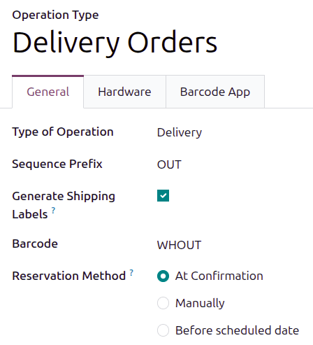
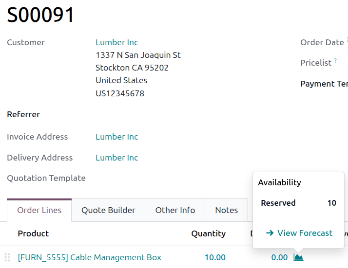
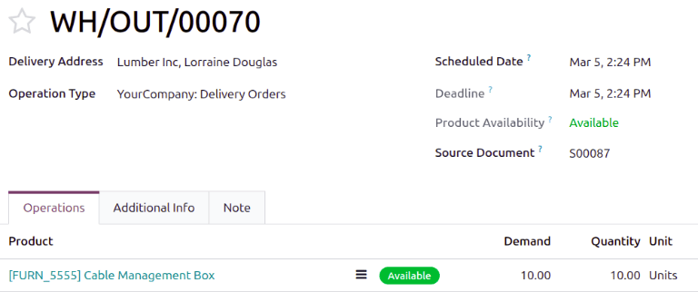

===========================
At confirmation reservation
===========================

.. _inventory/reservation_methods/at-confirmation:

.. |SO| replace:: :abbr:`SO (Sales Order)`

The *at confirmation* reservation method reserves products **only** when a sales order (SO) is
confirmed, **and** enough product stock is available.

.. seealso::
   :doc:`About reservation methods <../reservation_methods>`

Configuration
=============

To set the reservation method to *at confirmation*, navigate to the :menuselection:`Inventory app
--> Configuration --> Operations Types`. Then, select the desired :guilabel:`Operation Type` to
configure, or create a new one by clicking :guilabel:`New`.

In the *General* tab on the operation type form, locate the :guilabel:`Reservation Method` field
and select :guilabel:`At Confirmation`.

Workflow
========

To see the *at confirmation* reservation method in action, create a new |SO| by navigating to the
:menuselection:`Sales app`. On the *Quotations* page, click :guilabel:`New`.

On the quotation, add a customer in the :guilabel:`Customer` field. Then, in the *Order Lines* tab,
click :guilabel:`Add a product` and select a product to add to the quotation from the drop-down
menu. Finally, in the :guilabel:`Quantity` column, adjust the desired quantity of the product to
sell.

Once ready, click :guilabel:`Confirm` to create the sales order.

Click the :icon:`fa-area-chart` :guilabel:`(area chart)` icon on the product line to reveal the
product's :guilabel:`Availability` tooltip, which shows the :guilabel:`Reserved` quantity for this
order.

.. note::
   If there is **not** sufficient quantity of stock for the product included in the |SO|, the
   :icon:`fa-area-chart` :guilabel:`(area chart)` icon is red instead of green.

   Instead of showing the reserved number of units for the order, the :guilabel:`Availability`
   tooltip reads :guilabel:`Reserved` and shows the reserved number of units (e.g., `0 Units`).

.. admonition:: Forecasted Report

   To see all the factors that affect product reservation, click the :icon:`oi-arrow-right`
   :guilabel:`View Forecast` internal link arrow to view the :guilabel:`Forecasted Report`
   dashboard.

   The :guilabel:`Forecasted Report` displays forecast information for the products included in the
   sales order, namely any live receipts of the product and any active sales orders, which are
   listed in the :guilabel:`Used By` column. See how each order is fulfilled in the
   :guilabel:`Replenishment` column.

   Additionally, the :guilabel:`Forecasted` quantity is calculated at the top of the page by adding
   the :guilabel:`On Hand` and :guilabel:`Incoming` quantity and subtracting the
   :guilabel:`Outgoing` quantity, as shown below:

   .. image:: at_confirmation/at-confirmation-forecasted-equation.png
      :alt: Forecasted quantity equation from the Forecasted Report page.

   If one order should be prioritized over another order, click the :guilabel:`Unreserve` button on
   the corresponding order line in the :guilabel:`Replenishment` column.

To deliver the products, click the :icon:`fa-truck` :guilabel:`Delivery` smart button at the top of
the sales order form. To confirm that the reservation worked properly, ensure that the
:guilabel:`Product Availability` field reads `Available` (in green text), and that the numbers in
the :guilabel:`Demand` and :guilabel:`Quantity` columns match (in this case, both should read
`10.00`).

Once ready, click :guilabel:`Validate`.

.. note::
   Delivery orders can be starred, or favorited. Unlike :guilabel:`Before scheduled date`
   reservations, adding a delivery order to favorites via the :guilabel:`At Confirmation`
   reservation does not prioritize it. The delivery order is only prioritized in the **Inventory**
   app's display of delivery orders.

.. seealso::
   - :doc:`Manual reservation <manually>`
   - :doc:`Before scheduled date reservation <before_scheduled_date>`
