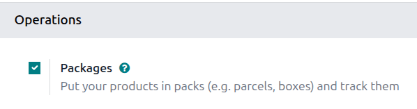
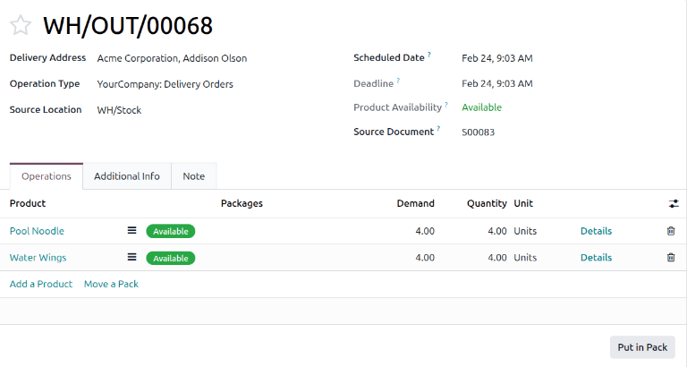
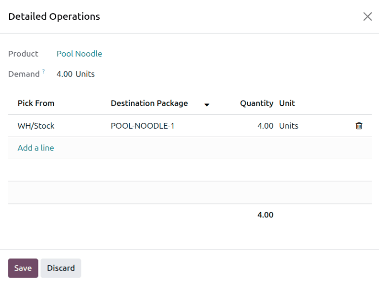
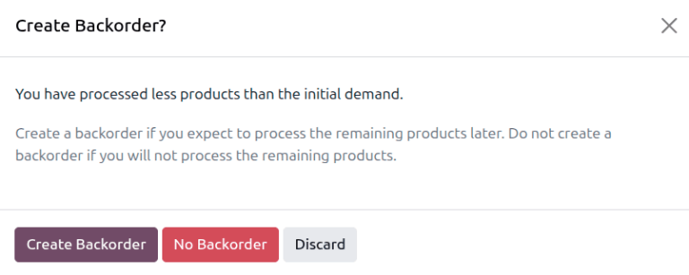
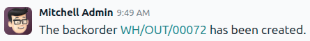
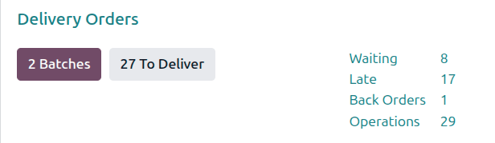

=======================
Multi-package shipments
=======================

In some cases, a delivery order with multiple items may need to be shipped in more than one package.
This may be necessary if the items are too large to ship in a single package, or if certain items
cannot be packaged together. Shipping a single delivery order in multiple packages provides
flexibility for how each item is packaged, without the need to create multiple delivery orders.

Configuration
=============

To split a delivery order across multiple packages, the *Packages* setting must be enabled. To do
so, navigate to :menuselection:`Inventory --> Configuration --> Settings`, then in the *Operations*
section, select the :guilabel:`Packages` checkbox. Click :guilabel:`Save` to confirm the change.

.. _inventory/shipping/multiple-packages:

Ship items in multiple packages
===============================

To split items in the same delivery order across multiple packages, begin by navigating to the
:menuselection:`Inventory` app. On the *Inventory Overview* page, click the :guilabel:`# to Deliver`
button on the *Delivery Orders* card. Finally, select a delivery order that has multiple items,
multiple quantities of the same item, or both.

On the *Operations* tab, select the :guilabel:`Details` link for the product that will be shipped in
the first package.

This opens the *Detailed Operations* pop-up window. In the table of the pop-up window, the
:guilabel:`Quantity` column shows the total quantity of the product included in the delivery order.

If the full quantity will be shipped in the first package, enter the :guilabel:`Demand` quantity in
the :guilabel:`Quantity` column. If less than the full quantity will be shipped in the first
package, enter a smaller value than the :guilabel:`Demand` quantity. Then specify a
:guilabel:`Destination Package` for the product.

If the product is to be split into multiple packages, click the :guilabel:`Add a line` link and
split the :guilabel:`Quantity` between the different :guilabel:`Destination Package` options that
are created.

Click :guilabel:`Save` to confirm the packages and close the pop-up.

If packaging multiple products into the same package, repeat the same steps for every product in the
package. Be sure to specify the same :guilabel:`Destination Package` in the *Detailed Operations*
window.

For the next package, follow the same steps outlined above, marking the :guilabel:`Quantity` and
:guilabel:`Destination Package` for each item to be included. Continue doing so until the full
quantity of all products has been added to packages.

Finally, after all packages have been shipped, click :guilabel:`Validate` to confirm that the
delivery order is complete.

.. tip::
   After one or more packages are created, a :icon:`fa-cubes` :guilabel:`Packages` smart button
   appears above the delivery order. Click the :icon:`fa-cubes` :guilabel:`Packages` smart button to
   open the *Packages* page for the delivery order, where each package can be selected to view all
   its items.

   .. image:: multipack/packages-smart-button.png
      :alt: The Packages smart button on a delivery order.

.. _inventory/shipping/backorders:

Create a backorder for items to be shipped later
================================================

If some items will be shipped at a later date than others, there is no need to put them in a package
until they are ready to ship. Instead, create a backorder for the items being shipped later.

Begin by shipping the items that will be shipped immediately. If they will be shipped in multiple
packages, follow the steps in :ref:`inventory/shipping/multiple-packages` to package them as
required. If they will be shipped in a single package, mark the :guilabel:`Quantity` and
:guilabel:`Destination Package` for all of the products in that shipment.

After all quantities being shipped immediately are packaged, return to the delivery order form.
Change the :guilabel:`Quantity` for the backordered items to `0` or the partial quantity that is
being shipped. Then, click the :guilabel:`Validate` button, and a *Create Backorder?* pop-up window
appears. Click the :guilabel:`Create Backorder` button. Doing so immediately confirms the items
being shipped and creates a new delivery order for the items that will be shipped later.

The backorder delivery order will be listed in the chatter of the original delivery order in a
message that reads :guilabel:`The backorder WH/OUT/XXXXX has been created`. Click on
:guilabel:`WH/OUT/XXXXX` in the message to view the backorder delivery order.

The backorder delivery order can also be accessed by navigating to :menuselection:`Inventory`,
clicking the :guilabel:`Back Orders #` link on the *Delivery Orders* card, and selecting the
delivery order.

When the remaining items are ready to be shipped, navigate to the backorder delivery order. The
items can be shipped in a single package by clicking :guilabel:`Validate`, or shipped in multiple
packages by following the steps detailed in the section above.

It is also possible to ship some of the items while creating a new backorder for the rest. To do so,
follow the same steps used to create the first backorder.
