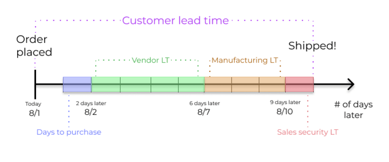
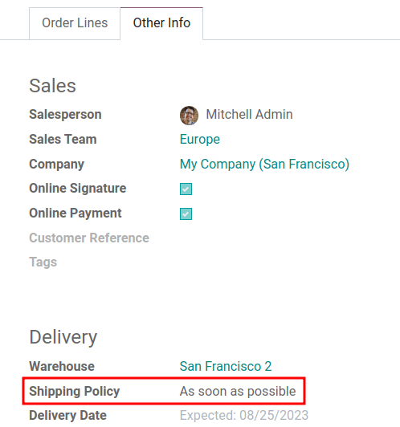
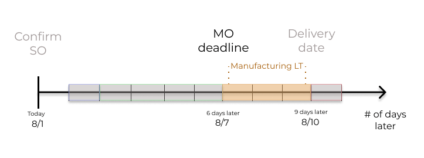
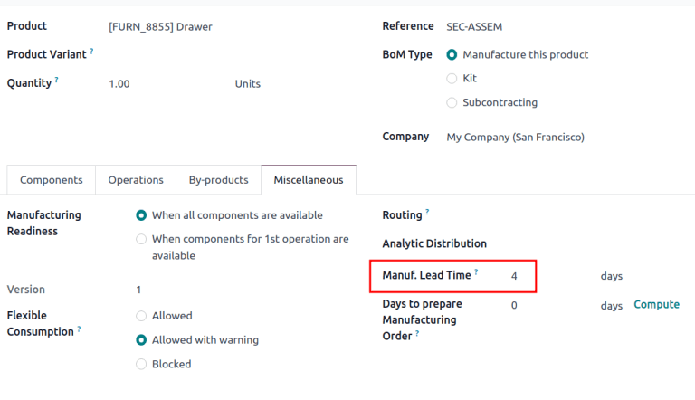
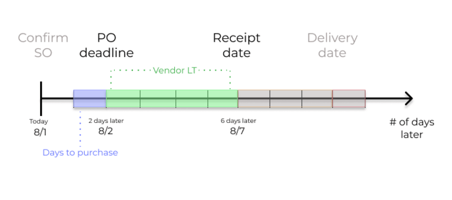
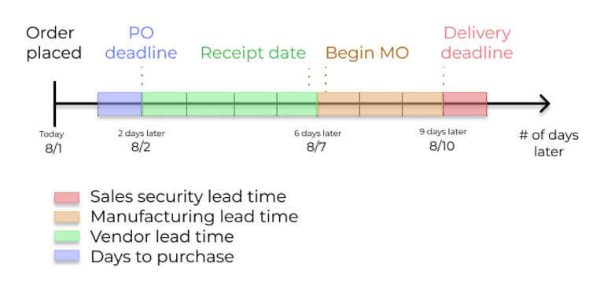

==========
Lead times
==========

.. |MO| replace:: :abbr:`MO (manufacturing order)`
.. |MOs| replace:: :abbr:`MOs (manufacturing orders)`
.. |BoM| replace:: :abbr:`BoM (Bill of Materials)`
.. |BoMs| replace:: :abbr:`BoMs (Bills of Materials)`
.. |RFQ| replace:: :abbr:`RFQ (request for quotation)`
.. |PO| replace:: :abbr:`PO (purchase order)`
.. |POs| replace:: :abbr:`POs (purchase orders)`

Accurate delivery date forecasting is essential for customer satisfaction. The **Inventory** app
provides comprehensive lead time configuration settings to improve the coordination and planning of
manufacturing orders, deliveries, and receipts.

Types of lead times
===================

Different lead times for different operations can impact various stages of the order fulfillment
process. The following lead times can be configured in Odoo:

- :ref:`Customer lead time <inventory/warehouses_storage/sales-customer-lt>`: The number of days
  from the sales order (SO) confirmation date and the date the order is shipped from the warehouse.
  This is the expected time frame for customer order fulfillment, also known as *delivery lead
  time*.

- :ref:`Sales security lead time <inventory/warehouses_storage/sales-security-lt>`: Moves the
  *scheduled delivery date* forward by a specified number of days. This serves as a buffer to
  account for potential delays in the fulfillment process and ensures ample time to prepare the
  outgoing shipment.

- :ref:`Shipping policy lead time <inventory/warehouses_storage/sales-shipping-policy-lt>`: The
  shipping policy lead time determines how the scheduled delivery date is set for orders with
  multiple products, based on the lead times of the products in the order. This provides flexibility
  to choose between multiple shipments delivered as soon as products are ready, or one consolidated
  shipment when all products are ready.

- :ref:`Manufacturing lead time <inventory/warehouses_storage/manufacturing-lt>`: The number of days
  needed to complete a manufacturing order (MO) from the date of confirmation, including weekends
  (non-working hours in Odoo). This is used to forecast an approximate production date for a
  finished good.

- :ref:`Days to prepare manufacturing order <inventory/warehouses_storage/days-to-prepare-mo-lt>`:
  The number of days needed to replenish components, or manufacture sub-assemblies of the product.
  Either set one directly on the bill of materials (BoM), or click *Compute* to sum up purchase and
  manufacturing lead times of components in the |BoM|.

- :ref:`Vendor lead time <inventory/warehouses_storage/purchase-vendor-lt>`: The number of days from
  the confirmation of a purchase order (PO) to the receipt of products. This provides insight on the
  time it takes for products to arrive at the warehouse, facilitating effective scheduling and
  planning of supplier deliveries.

- :ref:`Days to purchase <inventory/warehouses_storage/days-to-purchase-lt>`: The number of days
  needed for the vendor to receive a request for quotation (RFQ) and confirm it. This advances the
  deadline to schedule a |RFQ| by a specified number of days.

.. seealso::
   Lead times are calculated in the order provided above, working backward from the delivery
   deadline using :doc:`just-in-time (JIT) logic <just_in_time>`.

   The manual replenishment timeline can be further extended by increasing the forecasted date on
   the replenishment report. See :ref:`horizon days <inventory/warehouses_storage/horizon-days>` to
   learn more.

.. _inventory/warehouses_storage/sales:

Sales lead times
================

*Customer lead times* and *sales security lead times* can be configured to automatically compute an
*expected delivery date* on a :abbr:`SO (Sales Order)`. The expected delivery date ensures a
realistic *delivery dates* setting for shipments from the warehouse.

Odoo issues a warning message if the set delivery date is earlier than the expected date, as it may
not be feasible to fulfill the order by that time, which would impact other warehouse operations.

.. example::
   A :abbr:`SO (sales order)` containing a `Coconut-scented candle` is confirmed on March 4. The
   product has a customer lead time of 14 days, and the business uses a sales security lead time of
   1 day. Based on the lead time inputs, Odoo suggests a delivery date in 15 days, on March 19.

   .. image:: lead_times/scheduled-date.png
      :alt: Set Delivery Date in a sales order. Enables delivery lead times feature.

.. _inventory/warehouses_storage/sales-customer-lt:

Customer lead time
------------------

The *customer lead time* is manually assigned for each individual product. To set the customer lead
time for a product, navigate to :menuselection:`Sales app --> Products --> Products`. Select the
desired product, and switch to the :guilabel:`Inventory` tab. In the :guilabel:`Customer Lead Time`
field, enter the number of calendar days required to fulfill the delivery order from start to
finish.

.. example::
   Set a 14-day customer lead time for the `Coconut-scented candle` by navigating to its product
   form. Then, in the :guilabel:`Inventory` tab, type `14.00` days into the :guilabel:`Customer Lead
   Time` field.

   .. image:: lead_times/customer.png
      :alt: Assign a Customer Lead Time in the product form.

.. _inventory/warehouses_storage/sales-security-lt:

Sales security lead time
------------------------

The *sales security lead time* applies to all sales orders for the company. To set the sales
security lead time, navigate to :menuselection:`Inventory app --> Configuration --> Settings`, and
scroll down to the :guilabel:`Advanced Scheduling` section near the end of the page. Check the box
for :guilabel:`Security Lead Time for Sales` to enable the feature.

Next, enter the desired number of calendar days. This security lead time is a buffer notifying the
team to prepare for outgoing shipments earlier than the scheduled date.

.. example::
   Setting the :guilabel:`Security Lead Time for Sales` to `1.00` day, pushes the
   :guilabel:`Scheduled Date` of a delivery order (DO) forward by one day. In that case, if a
   product is initially scheduled for delivery on April 6th, but with a one-day security lead time,
   the new scheduled date for the delivery order would be April 5th.

   .. image:: lead_times/sales-security.png
      :alt: View of the security lead time for sales configuration from the sales settings.

.. _inventory/warehouses_storage/sales-shipping-policy-lt:

Shipping policy
---------------

For orders that include multiple products with different lead times, the lead times can be
configured directly from the quotation itself. On a quotation, click the :guilabel:`Other Info` tab
and set the :guilabel:`Shipping Policy` field.

#. :guilabel:`As soon as possible`: Deliver products as soon as they are ready. The
   :guilabel:`Scheduled Date` of the :abbr:`DO (Delivery Order)` is determined by adding today's
   date to the shortest lead time among the products in the order.

#. :guilabel:`When all products are ready` to wait to fulfill the entire order at once. The
   :guilabel:`Scheduled Date` of the :abbr:`DO (Delivery Order)` is determined by adding today's
   date to the longest lead time among the products in the order.

.. example::
   In a quotation containing 2 products, `Yoga mat` and `Resistance band,` the products have a lead
   time of 8 days and 5 days, respectively. Today's date is April 2nd.

   When the :guilabel:`Shipping Policy` is set to :guilabel:`As soon as possible`, the scheduled
   delivery date is 5 days from today: April 7th. On the other hand, selecting :guilabel:`When all
   products are ready` configures the scheduled date to be 8 days from today: April 10th.

.. _inventory/warehouses_storage/manufacturing:

Manufacturing lead times
========================

Lead times can help simplify the procurement process for consumable materials and components used in
manufactured products with bills of materials (BoMs).

The |MO| deadline, which is the deadline to begin the manufacturing process to complete the product
by the scheduled delivery date, can be determined by configuring the manufacturing lead times and
manufacturing security lead times.

.. _inventory/warehouses_storage/manufacturing-lt:

Manufacturing lead time
-----------------------

Manufacturing lead times for products are configured from a product's bill of materials (BoM) form.

To add a lead time to a |BoM|, navigate to :menuselection:`Manufacturing app --> Products --> Bills
of Materials`, and select the desired |BoM| to edit.

On the |BoM| form, click the :guilabel:`Miscellaneous` tab. Change the value (in days) in the
:guilabel:`Manuf. Lead Time` field to specify the calendar days needed to manufacture the product.

.. note::
   If the selected |BoM| is a multi-level |BoM|, the manufacturing lead times of the components are
   added.

   If the |BoM| product is subcontracted, the :guilabel:`Manuf. Lead Time` can be used to determine
   the date at which components should be sent to the subcontractor.

Establish a |MO| deadline, based on the *expected delivery date*, indicated in the
:guilabel:`Scheduled Date` field of the :abbr:`DO (Delivery Order)`.

The |MO| deadline, which is the :guilabel:`Scheduled Date` field on the |MO|, is calculated as the
*expected delivery date* subtracted by the manufacturing lead time.

This ensures the manufacturing process begins on time, in order to meet the delivery date.

However, it is important to note that lead times are based on calendar days. Lead times do **not**
consider weekends, holidays, or *work center capacity* (:dfn:`the number of operations that can be
performed at the work center simultaneously`).

.. seealso::
   - :doc:`Manufacturing planning <../../../manufacturing/workflows/use_mps>`
   - :doc:`Schedule MOs with reordering rules <reordering_rules>`

.. example::
   A product's scheduled shipment date on the :abbr:`DO (Delivery Order)` is August 15th. The
   product requires 14 days to manufacture. So, the latest date to start the :abbr:`MO
   (Manufacturing Order)` to meet the commitment date is August 1st.

.. _inventory/warehouses_storage/days-to-prepare-mo-lt:

Days to prepare manufacturing order
-----------------------------------

Configuring the days required to gather the components for a manufactured product ensures there is
enough time to either replenish components or manufacture semi-finished products. This can be used
as an extra figure to cross-check and confirm that the order can be completed within the customer
lead time.

Go to :menuselection:`Manufacturing app --> Products --> Bills of Materials` and select the desired
|BoM|. In the :guilabel:`Miscellaneous` tab of the |BoM|, specify the calendar days needed to obtain
components of the product in the :guilabel:`Days to prepare Manufacturing Order` field, or click
:guilabel:`Compute` next to the :guilabel:`Days to prepare Manufacturing Order` field to
automatically fill in the longest lead time among all the components listed on the |BoM|.

.. example::
   A |BoM| has two components: one has a manufacturing lead time of two days, and the other has a
   purchase lead time of four days. The :guilabel:`Days to prepare Manufacturing Order` is four
   days.

.. _inventory/warehouses_storage/purchase:

Purchase lead times
===================

Automatically scheduling supplier orders streamlines procurement by showing users exactly when to
confirm a request for quotation (RFQ) and when to expect the goods.

.. list-table:: Key dates on an RFQ / PO
   :header-rows: 1
   :stub-columns: 1

   * - Field
     - Description
   * - Order Deadline
     - Last calendar day to confirm the |RFQ| and convert it to a |PO|
   * - Expected Arrival
     - Arrival date of the products. Calculated by *Order Deadline* + *Vendor Lead Time*

.. tip::
   A |PO| is marked late if the *Expected Arrival* date has passed. Late |POs| appear in the *Late*
   box on the **Purchase** app's dashboard.

In addition, Odoo has purchase lead times, which act as buffers to widen the :doc:`just-in-time
<just_in_time>` (JIT) forecast window. These lead times affect replenishment methods that use
:doc:`pull rules <../../shipping_receiving/daily_operations/use_routes>`—for example
:doc:`reordering rules <reordering_rules>` or :doc:`make to order (MTO) <mto>`.

.. list-table:: Purchase lead times
   :header-rows: 1
   :stub-columns: 1

   * - Buffer
     - Purpose
     - Impact on dates
   * - :ref:`Days to purchase <inventory/warehouses_storage/days-to-purchase-lt>`
     - Days the vendor needs to review an |RFQ| after it is sent.
     - No effect on the |RFQ|/|PO|; adds buffer days in the :ref:`JIT forecast window
       <inventory/warehouses_storage/forecasted-date>`.
   * - :ref:`Vendor lead time <inventory/warehouses_storage/purchase-vendor-lt>`
     - Days from the confirmation of a purchase order (PO) to the receipt of products.
     - Affects the |RFQ|/|PO|, adds buffer days in the :ref:`JIT forecast window
       <inventory/warehouses_storage/forecasted-date>`.

.. example::
   To tie the purchase dates and lead times together, consider this:

   - *Today's date*: April 21
   - :guilabel:`Vendor Lead Time`: 1 day
   - :guilabel:`Days to Purchase`: 2 days

   Days from today = 1 + 2 = 3

   Forecasted date = April 24

   If an |RFQ| is created today, the following fields show:

   - :guilabel:`Order Deadline`: April 23 (:math:`\text{Today} + 2`)
   - :guilabel:`Expected Arrival`: April 24 (:math:`\text{Order Deadline} + 1`)

.. _inventory/warehouses_storage/purchase-vendor-lt:

Vendor lead time
----------------

To set a vendor lead time for orders arriving in the warehouse from a vendor location, navigate to
:menuselection:`Purchase app --> Products --> Products`. Select the desired product, and switch to
the :guilabel:`Purchase` tab. In the editable vendor :guilabel:`Purchase` tab to add a pricelist.
Click the :guilabel:`Add a line` button to add vendor details, such as the :guilabel:`Vendor` name,
:guilabel:`Unit Price` offered for the product, and lastly, the :guilabel:`Lead Time`.

.. note::
   Multiple vendors and lead times can be added to the vendor pricelist. The default vendor and lead
   time selected is the entry at the top of the list.

.. example::
   On the vendor pricelist of the product form, the :guilabel:`Lead Time` for the selected vendor is
   set to `10 days.`

   .. image:: lead_times/set-vendor.png
      :alt: Add lead times in the Purchase tab of a product form.

.. _inventory/warehouses_storage/days-to-purchase-lt:

Days to purchase
----------------

*Days to purchase* affects **only** replenishment methods that use :doc:`pull rules
<../../shipping_receiving/daily_operations/use_routes>`—for example :doc:`reordering rules
<reordering_rules>` or :doc:`make to order (MTO) <mto>`. It does not change the interval between
*Order Deadline* and *Expected Arrival*.

To set it up, go to :menuselection:`Inventory app --> Configuration --> Settings`. Under the
:guilabel:`Advanced Scheduling` section, in the :guilabel:`Days to Purchase` field, specify the
number of days required for the vendor to confirm a |RFQ| after receiving it from the company.

.. _inventory/warehouses_storage/global-example:

Global example
==============

See the following example to understand how all the lead times work together to ensure timely order
fulfillment:

- **Sales security lead time**: 1 day
- **Manufacturing lead time**: 3 days
- **Vendor lead time**: 4 days
- **Days to purchase**: 1 day

The customer places an order for a manufactured product on August 1, and the scheduled delivery date
from the warehouse is on August 11. Odoo uses lead times and automated reordering rules to schedule
the necessary operations, based on the outgoing shipment delivery date of August 11:

- **August 1**: Sales order created, confirmed by salesperson.

- **August 2**: Deadline to order components to ensure they arrive in time when manufacturing begins
  (4-day supplier lead time).

- **August 7**: Scheduled date of receipt for components.

- **August 7**: Deadline to begin manufacturing. Calculated by subtracting the manufacturing lead
  time of 3 days from the expected delivery date of August 10.

- **August 10**: :guilabel:`Scheduled Date` on the delivery order form indicates the updated
  expected delivery date. Originally set as August 11, but the sales security lead time pushes the
  date forward by a day.

Odoo's replenishment planning maps a business' order fulfillment process, setting pre-determined
deadlines and raw material order dates, including buffer days for potential delays. This ensures
products are delivered on time.
