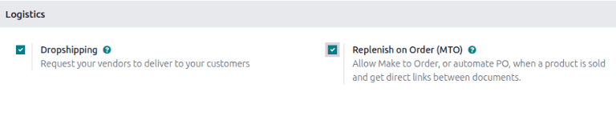
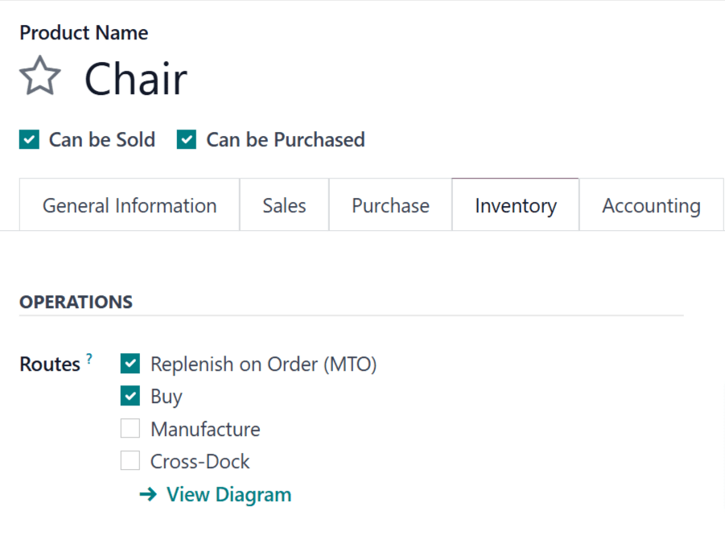

========================
Replenish on order (MTO)
========================

.. |SO| replace:: :abbr:`SO (sales order)`
.. |SOs| replace:: :abbr:`SOs (sales orders)`
.. |MO| replace:: :abbr:`MO (manufacturing order)`
.. |PO| replace:: :abbr:`PO (purchase order)`
.. |MTO| replace:: :abbr:`MTO (make to order)`
.. |RFQ| replace:: :abbr:`RFQ (request for quotation)`
.. |BOM| replace:: :abbr:`BoM (bill of materials)`

*Replenish on order*, also known as *MTO* (make to order), is a replenishment strategy that creates
a draft order every time a product is needed to fulfill a sales order (SO) or as a component in a
manufacturing order (MO).

- For :doc:`purchased products <../../../purchase/manage_deals/rfq>`, Odoo creates an |RFQ|.
- For :doc:`manufactured products
  <../../../manufacturing/basic_setup/configure_manufacturing_product>`, it creates an |MO|.

If stock is available, no |RFQ| or |MO| is generated and the sale proceeds normally. Otherwise, the
|RFQ| or |MO| is generated and directly linked to the originating |SO| through a smart button.

This approach offers clear traceability, since each |RFQ| or |MO| is tied back to its demand.

.. important::
   The |RFQ| or |MO| generated by |MTO| is designed to fulfill the originating |SO|. These documents
   should normally be confirmed or adjusted rather than canceled. If the demand changes, update the
   document instead of canceling it.

.. note::
   If an |RFQ| or |MO| is canceled, Odoo does not automatically generate a replacement. A new
   replenishment document must be created manually, but it **cannot** be linked back to the original
   |SO| through the smart button.

   Finally, click :guilabel:`Save` to save the change.

.. _inventory/mto/configuration:

Configuration
=============

.. _inventory/mto/enable-mto:

Enable the MTO route
--------------------

In order to use the |MTO| route, the :guilabel:`Replenish on order (MTO)` setting must be enabled.
To do so, navigate to :menuselection:`Inventory app --> Configuration --> Settings`. Go to the
:guilabel:`Warehouse` section at the end of the page, and select the checkbox next to
:guilabel:`Replenish on order (MTO)`. Click :guilabel:`Save` to confirm the setting.

.. _inventory/mto/configure-mto-product:

Configure a product for MTO
---------------------------

With the |MTO| route enabled, products can now be configured to use replenish on order. To do so,
begin by going to :menuselection:`Inventory app --> Products --> Products`, then select an existing
product, or click :guilabel:`New` to configure a new product.

In the product form, go to the :guilabel:`Inventory` tab. Under the *Operations* section, select the
checkbox next to the :guilabel:`Replenish on Order (MTO)` option in the :guilabel:`Routes` field.

.. important::
   The :guilabel:`Replenish on Order (MTO)` route does not work if the :guilabel:`Purchase` route is
   enabled. To ensure the product is configured for manufacturing, make sure the checkbox next to
   the :guilabel:`Purchase` route is not selected.

If the product is purchased from a vendor to fulfill |SOs|, enable the :guilabel:`Can be Purchased`
checkbox under the product name. Doing so makes the :guilabel:`Purchase` tab appear alongside the
other tabs below.

Click the :guilabel:`Purchase` tab and specify a :guilabel:`Vendor` and the :guilabel:`Price` they
sell the product for.

.. important::
   Specifying a vendor is essential for this workflow, because Odoo cannot generate an |RFQ| without
   knowing who the product is purchased from.

If the product is manufactured, make sure it has a bill of materials (BOM) configured for it. To do
so, click the :guilabel:`Bill of Materials` smart button at the top of the screen, then click
:guilabel:`New` on the :guilabel:`Bill of Materials` page to configure a new |BOM| for the product.

.. seealso::
   For a full overview of |BOM| creation, see the documentation on :doc:`bills of materials
   <../../../manufacturing/basic_setup/bill_configuration>`.

.. _inventory/mto/replenish-mto-product:

Replenish using MTO
===================

After configuring a product to use the |MTO| route, a replenishment order is created for it every
time an |SO| or |MO| including the product is confirmed. The type of order created depends on the
second route selected in addition to |MTO|.

For example, if *Buy* was the second route selected, then a |PO| is created upon confirmation of an
|SO|.

.. important::
   When the |MTO| route is enabled for a product, a replenishment order is always created upon
   confirmation of an |SO| or |MO|. This is the case, even if there is enough stock of the product
   on-hand to fulfill the |SO|, without buying or manufacturing additional units of it.

While the |MTO| route can be used in unison with the *Buy* or *Manufacture* routes, the *Buy* route
is used as the example for this workflow. Begin by navigating to the :menuselection:`Sales` app,
then click :guilabel:`New`, which opens a blank quotation form.

On the blank quotation form, add a :guilabel:`Customer`. Then, click :guilabel:`Add a product` under
the :guilabel:`Order Lines` tab, and enter a product configured to use the *MTO* and *Buy* routes.
Click :guilabel:`Confirm`, and the quotation is turned into an |SO|.

A :guilabel:`Purchase` smart button now appears at the top of the page. Clicking it opens the |RFQ|
associated with the |SO|.

After receiving approval from the vendor that they can meet the demand by the :guilabel:`Expected
Arrival` date, click :guilabel:`Confirm Order` to turn it into a |PO|. A purple :guilabel:`Receive
Products` button now appears above the |PO|. Once the products are received, click
:guilabel:`Receive Products` to open the receipt order, and click :guilabel:`Validate` to enter the
products into inventory.

Return to the |SO| by clicking the :guilabel:`SO` breadcrumb, or by navigating to
:menuselection:`Sales app --> Orders --> Orders`, and selecting the |SO|.

Finally, click the :guilabel:`Delivery` smart button at the top of the order to open the delivery
order. Once the products have been shipped to the customer, click :guilabel:`Validate` to confirm
the delivery.

.. _inventory/mto/cancel-mto-sales-order:

Cancel an MTO sales order
=========================

When a |SO| that had created an |RFQ| or |MO| is canceled, the related delivery order is canceled
automatically. However, the |RFQ| or |MO| themselves are **not** canceled. Instead, a warning
appears in their chatter noting the |SO| cancellation. These documents remain active, so the user
can either cancel them manually or repurpose the replenishment for another order.

.. seealso::
   For information on workflows that include the |MTO| route, see the following documentation:

   - :doc:`resupply_warehouses`
   - :doc:`../../../manufacturing/subcontracting/subcontracting_basic`
   - :doc:`../../../manufacturing/advanced_configuration/sub_assemblies`
