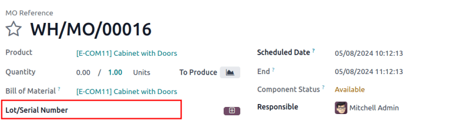
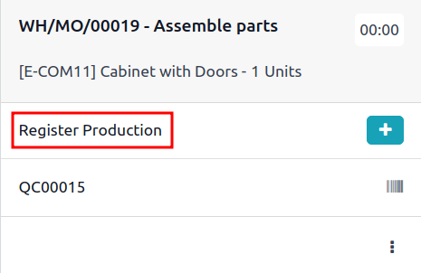
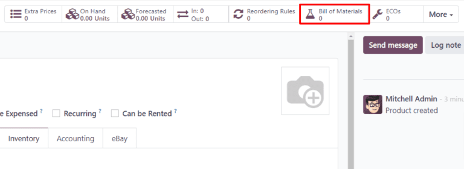
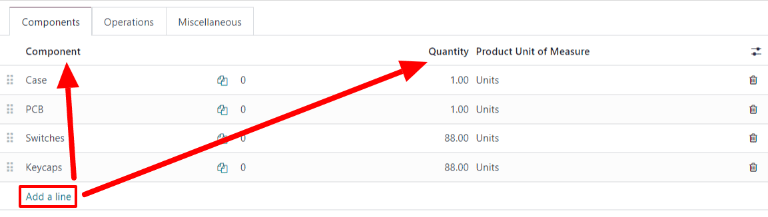
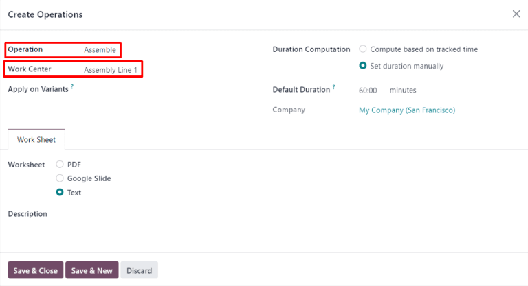

.. |BOM| replace:: :abbr:`BoM (Bill of Materials)`

===================================
Manufacturing product configuration
===================================

Manufacturing products can be configured with lots or serial numbers for :doc:`tracking
<../../inventory/product_management/product_tracking>`, and a bill of materials (BoM) for
:doc:`replenishment <../../inventory/warehouses_storage/replenishment/mto>`.

.. _manufacturing/basic-setup/lot-serial-tracking:

Lot/serial number tracking
==========================

To optionally :doc:`assign lots or serial numbers
<../../inventory/product_management/product_tracking>` to newly manufactured products, go to
:menuselection:`Manufacturing --> Products --> Products`. Then, select an existing product, or
create a new one by clicking :guilabel:`New`. Go to the :guilabel:`Inventory` tab, and open the
:guilabel:`General Information` tab. In the :guilabel:`Track Inventory` field, select :guilabel:`By
Unique Serial Number` or :guilabel:`By Lots`.

Doing so enables the :guilabel:`Lot/Serial Number` field on a manufacturing order, or the
:guilabel:`Register Production` instruction on a work order card in the **Shop Floor** app.

   **Lot/Serial Number** field on the MO.

   **Register Production** option to generate lot/serial number on a work order card.

.. _manufacturing/basic-setup/configure-bom:

Configure a bill of materials (BoM)
===================================

Next, a |BOM| must be configured for the product so Odoo knows how it is manufactured. A |BOM| is a
list of the components and operations required to manufacture a product.

To create a |BOM| for a specific product, navigate to :menuselection:`Manufacturing --> Products -->
Products`, then select the product. On the product page, click the :guilabel:`Bill of Materials`
smart button at the top of the page, then select :guilabel:`New` to configure a new |BOM|.

On the |BOM|, the :guilabel:`Product` field auto-populates with the product. In the
:guilabel:`Quantity` field, specify the number of units that the BoM produces.

Add a component to the |BOM| by selecting the :guilabel:`Components` tab and clicking :guilabel:`Add
a line`. Select a component from the :guilabel:`Component` drop-down menu, then enter the quantity
in the :guilabel:`Quantity` field. Continue adding components on new lines until all components have
been added.

Next, select the :guilabel:`Operations` tab. Click :guilabel:`Add a line` and a :guilabel:`Create
Operations` pop-up window appears. In the :guilabel:`Operation` field, specify the name of the
operation being added (e.g. Assemble, Cut, etc.). Select the work center where the operation will be
carried out from the :guilabel:`Work Center` drop-down menu. Finally, click :guilabel:`Save & Close`
to finish adding operations, or :guilabel:`Save & New` to add more.

.. important::
   The :guilabel:`Operations` tab only appears if the :guilabel:`Work Orders` setting is enabled. To
   do so, navigate to :menuselection:`Manufacturing --> Configuration --> Settings`, then enable the
   :guilabel:`Work Orders` checkbox.

.. seealso::
   :doc:`bill_configuration`.
