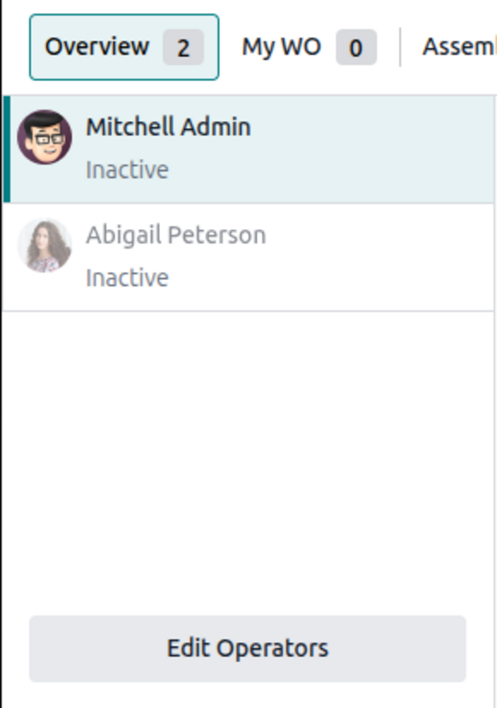
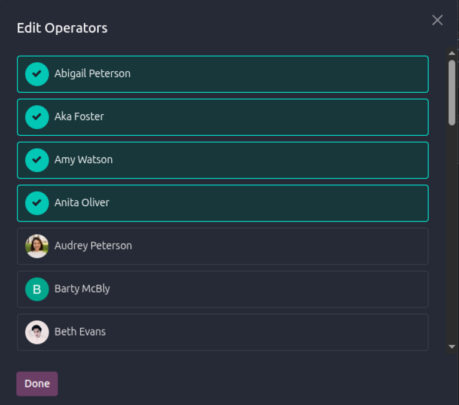
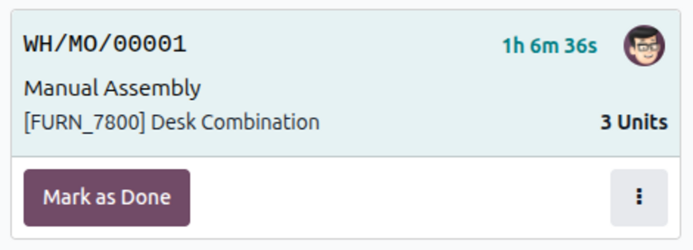
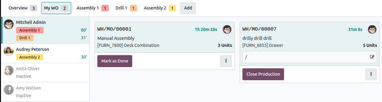

========================
Shop Floor time tracking
========================

.. |MO| replace:: :abbr:`MO (Manufacturing Order)`
.. |MOs| replace:: :abbr:`MOs (Manufacturing Orders)`
.. |PIN| replace:: :abbr:`PIN (Personal Identification Number)`

By signing in to the Odoo *Shop Floor* module as *operators*, employees are able to track the amount
of time they spend working on each work order. Odoo tracks the time it takes to complete each work
order as well as the time each operator spends on each work order.

.. _manufacturing/shop_floor/manage-operators:

Manage operators
================

When the *Shop Floor* module is first opened, the employee profile that is signed in to the database
is automatically signed in as an operator.

All operators for the current session are listed in the operator panel on the left side of the
screen. While the panel can list multiple employee profiles, only one employee can be active at
once. The active profile highlighted in the operator panel is used for :ref:`time tracking
<manufacturing/shop_floor/track-work-order-duration>`.

Add an operator
---------------

To add employees to the operator panel, click the :guilabel:`Edit Operators` button at the bottom of
the panel. In the *Edit Operators* pop-up window, select the employees that should be added as
operators for the current session, then click :guilabel:`Done`.

Switch profiles
---------------

To sign in to *Shop Floor* as a different employee, click their name in the operator panel to sign
in using their profile. If a |PIN| has not been set for the employee, the profile is signed in
automatically. If a |PIN| has been set for the employee, an :guilabel:`Enter your pin` pop-up window
appears. Enter the code using the number pad or keyboard, then click :guilabel:`Confirm` to sign in
to the *Shop Floor* module.

.. seealso::
   Each employee can be assigned a PIN, which must be entered when signing in to the *Shop Floor*
   module. Badges can also be generated and printed for checking in and out with *Kiosk Mode* in the
   **Attendances** app. See the :ref:`employee settings section <employees/hr-attn-pos>` to learn
   more.

Remove an operator
------------------

To remove employees from the operator panel, click the :guilabel:`Edit Operators` button, and click
the profiles that should be removed from the panel. Confirm that the profiles have been unchecked,
then click :guilabel:`Done`.

.. _manufacturing/shop_floor/track-work-order-duration:

Track work order duration
=========================

To track the time spent on a work order, select the work center where the work order is scheduled to
be carried out. This can be done by selecting the work center from the top of the page in the *Shop
Floor* module or by clicking the name of the work center in the form for the manufacturing order
(MO) that the work order is a part of.

When work begins, click the :guilabel:`Start` button on the work order card to start tracking the
duration. The :guilabel:`Start` button is replaced by a timer which displays the total duration that
all operators have spent on the work order.

View active profile work orders
-------------------------------

The operator panel displays the work center location and individual time spent for each work order
an operator is working on. This timer only reflects work done during the current session, even if
the operator has previously worked on the work order.

Operators can work on multiple work orders simultaneously and track their time for each. Click
:guilabel:`My WO` at the top of the page to see all of the work orders the active profile is working
on.

Pause and stop timer
--------------------

To pause the timer on a work order, click the work order card a second time.

Once a work order is complete, click the :guilabel:`Mark as Done` button at the bottom of the work
order card, and it disappears from the work center page.

.. note::
   If there are no additional work orders for the |MO|, the button says :guilabel:`Close Production`
   instead. Clicking :guilabel:`Close Production` marks the entire |MO| as *Done* and removes it
   from the *Shop Floor* module.

   The :guilabel:`Close Production` button is always visible on the manufacturing order card in the
   :guilabel:`Overview` tab.

.. _manufacturing/shop_floor/view-work-order-duration:

View work order duration
========================

By individual work order
------------------------

To view the duration of a work order, navigate to :menuselection:`Manufacturing app --> Operations
--> Work Orders`.

By default, the search bar has a filter applied to display incomplete work orders only. To view work
orders that have been completed and marked as *Done*, remove the filter from the search bar by
clicking on the :icon:`oi-close` :guilabel:`(Remove)` button on the right side of the filter.

The actual time it took to complete each work order is displayed in the :guilabel:`Real Duration`
column. This value represents the total time spent on the work order by all operators who worked on
it. It includes time tracked in the *Shop Floor* module as well as time tracked in the work order
form or the :guilabel:`Work Orders` tab of the |MO|.

To view detailed time tracking information, select a work order. In the work order form, go to the
:guilabel:`Time Tracking` tab to see a detailed list of all operators who have worked on the work
order and the amount of time they spent on it.

By manufacturing order
----------------------

To view the duration of all work orders in a specific |MO|, navigate to
:menuselection:`Manufacturing app --> Operations --> Manufacturing Orders`.

By default, the search bar has a filter applied to display incomplete |MOs| only. To view |MOs| that
have been completed and marked as *Done*, remove the filter from the search bar by clicking on the
:icon:`oi-close` :guilabel:`(Remove)` button on the right side of the filter.

Select an |MO|. In the |MO| form, go to the :guilabel:`Work Orders` tab to see a list of all work
orders included in the |MO|. To view details for a specific work order, click anywhere on the entry
line and the work order form opens.
