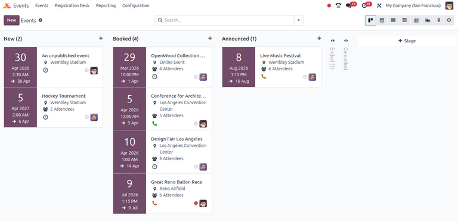
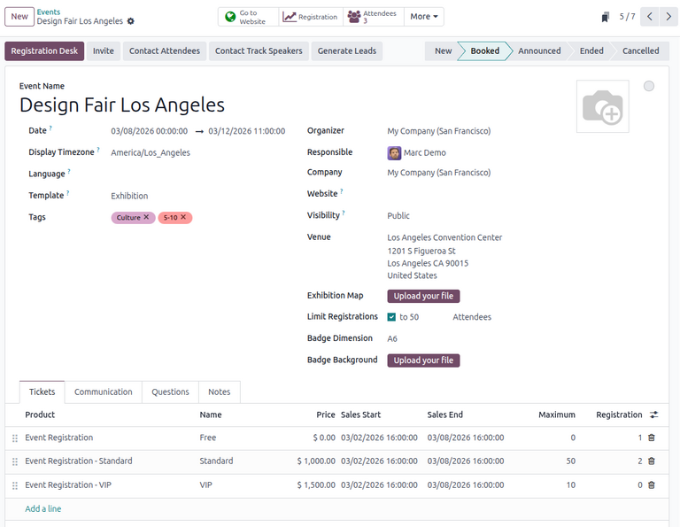
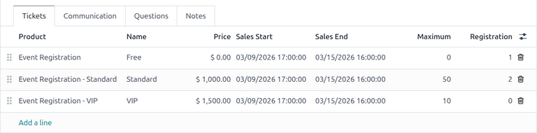
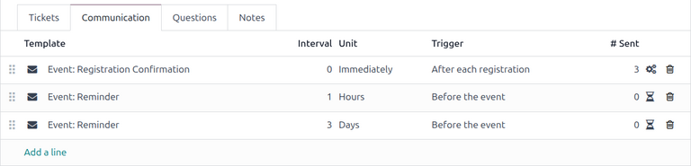
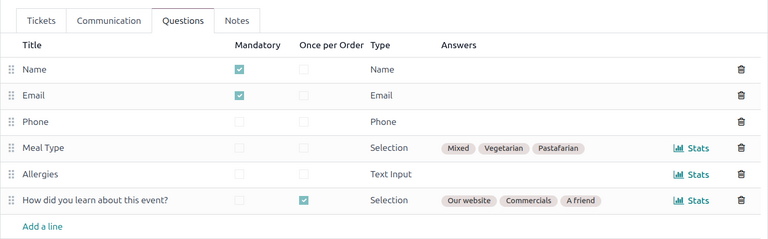
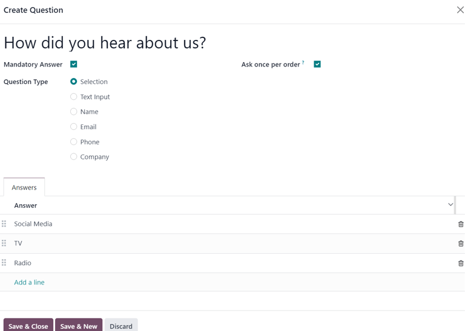
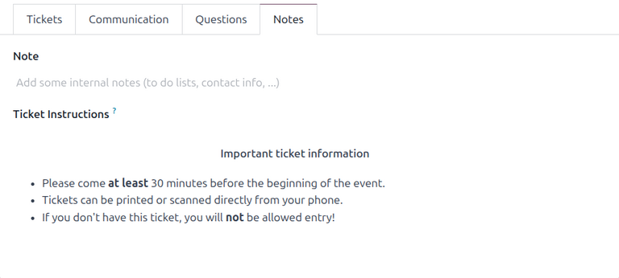

=============
Create events
=============

With the **Events** application, organizers can create and configure in-person or online events in
Odoo. Each new event contains a number of options to customize specific logistics such as ticket
sales, registration desk, booths, tracks, sponsors, rooms, and more.

Events can be manually created from scratch or built from preconfigured templates. Once launched,
the **Events** app integrates with other apps for enhanced functionalities, including promoting
events, selling registration tickets to attendees, and generating leads using customizable rules.

.. _events/new-event:

Dashboard
=========

To create an event, navigate to the :guilabel:`Events app` to land on the dashboard. By default, the
:guilabel:`Events` dashboard uses the :icon:`oi-view-kanban` :guilabel:`(Kanban)` view, which
showcases all events in the database in their respective pipeline stages. Other views can be set
using the buttons in the upper-right corner.

Each event card displays the name of the event, its scheduled date, location, number of expected
:guilabel:`Attendees`, any scheduled activities related to the event, and the responsible event
manager.

The default stages in the :guilabel:`Kanban` view are :guilabel:`New`, :guilabel:`Booked`,
:guilabel:`Announced`, :guilabel:`Ended`, and :guilabel:`Cancelled`. The cards can be
dragged-and-dropped into any stage in the pipeline.

.. note::
   The :guilabel:`Ended` and :guilabel:`Cancelled` stages are folded by default and located to the
   right of the other stages.

To add a new stage, click the :icon:`fa-plus` :guilabel:`Add Stage` button on the right, enter a
name for the stage, then click :guilabel:`Add`.

.. _events/event-form:

Add a new event
===============

Events can be created by going to the :menuselection:`Events` app, on the :icon:`oi-view-kanban`
:guilabel:`(Kanban)`, :icon:`oi-view-list` :guilabel:`(List)`, or :icon:`fa-tasks`
:guilabel:`(Gantt)` views. Then, click the :guilabel:`New` button in the upper-left corner of the
dashboard to open up a new event form.

At the top of the event form are a series of smart buttons related to various event metrics. These
auto-populate with data once attendees begin to register, when booths and sponsors sign on for the
event, when the event takes place, and so on. These smart buttons can be clicked to navigate to the
event's related pages to modify any details and/or perform any desired actions.

Beneath the smart buttons is the event form, which contains various fields and clickable tabs to
configure the necessary details of the event.

To start, enter some basic information about the event in the following fields:

- :guilabel:`Event Name`: The title of the event. This field is **required**.
- :guilabel:`Date`: The scheduled date or date range of the event (expressed in the local timezone).
  This field is auto-populated but modifiable and is **required**.
- :guilabel:`Display Timezone`: The timezone in which the event date is displayed on the website.
  This field is auto-populated but modifiable and is **required**.
- :guilabel:`Language`: The chosen language for all event communications.

.. note::
   To the right of the entered :guilabel:`Event Name`, there is a language tooltip, represented by
   an abbreviated language indicator (e.g., `EN`). When clicked, a :guilabel:`Translate name`
   pop-up window appears, displaying various preconfigured language translation options available in
   the database.

Alternatively, to populate the event form from an event template, select an option in the
:guilabel:`Template` drop-down menu. To learn more, see the :doc:`event_templates` documentation.

Additionally, add any corresponding tags (e.g., `Online`, `Conference`) for the event in the
:guilabel:`Tags` field. Multiple tags can be added per event.

.. tip::
   Tags can be displayed on events that are listed on the website by enabling the :guilabel:`Show on
   Website` checkbox from :menuselection:`Events app --> Configuration --> Event Tag Categories`.

Continue by entering information such as points of contact and venue location in the following
fields:

- :guilabel:`Organizer`: The organizer of the event (a company, contact, or employee).
- :guilabel:`Responsible`: The specific user responsible for managing the event in the database.
- :guilabel:`Company`: The specific company in the database to which the event is related. This
  field **only** appears if working in a multi-company environment. This field is auto-populated but
  modifiable. It is **required**.
- :guilabel:`Website`: The specific website in the database on which the event is published. If this
  field is left blank, the event can be published on **all** websites in the database. To learn
  more, refer to the :doc:`Multiple websites
  <../../../websites/website/configuration/multi_website>` documentation.
- :guilabel:`Venue`: The event venue location. This field pulls information from the **Contacts**
  application. Alternatively, the information can be entered manually.
- :guilabel:`Exhibition Map`: The image of the event venue map. Click the :guilabel:`Upload your
  file` button to upload an image of the event venue map.

To limit the number of registrations for the event, check the :guilabel:`Limit Registrations` and
enter the maximum number of attendees allowed in the resulting field.

Optionally, to create event badges for attendees, fill in the following fields:

- :guilabel:`Badge Dimension`: The desired paper format dimension for the badges. The options are
  :guilabel:`A4 foldable`, :guilabel:`A6`, or :guilabel:`4 per sheet`.
- :guilabel:`Badge Background`: The custom background image for the badges. Click the
  :guilabel:`Upload your file` button to upload an image.

Additional event configurations
===============================

After filling out the fields on the event form, move on to the four tabs at the bottom for further
customization.

.. _events/event-tickets:

Tickets tab
-----------

In the :guilabel:`Tickets` tab of the event form, create custom registration tickets and ticket
tiers for events.

To create a ticket, click :guilabel:`Add a line` in the :guilabel:`Tickets` tab. In the
:guilabel:`Product` field, either select the preconfigured :guilabel:`Event Registration` product,
or create a new one by typing in the name of the new event registration product and then selecting
either :guilabel:`Create` or :guilabel:`Create and edit...` from the resulting drop-down menu. Then,
enter a name for the ticket (e.g. `Basic Ticket` or `VIP`) in the :guilabel:`Name` field.

.. important::
   In order for an event registration product to be selectable in the :guilabel:`Tickets` tab, the
   event registration :guilabel:`Product Type` **must** be set to :guilabel:`Service` and the
   :guilabel:`Create on Order` field **must** be set to :guilabel:`Event Registration`.

.. tip::
   Existing event registration products can be modified directly from this field as well by clicking
   the :icon:`oi-arrow-right` :guilabel:`(right arrow)` icon located beside the event registration
   product. Doing so reveals that product's form. If the **Inventory** application is installed,
   additional choices are available to customize for the product.

Next, set the registration cost of the ticket in the :guilabel:`Price` field.

.. note::
   The :guilabel:`Sales Price` defined on the event registration product's product form sets the
   default cost of a ticket. Modifying the :guilabel:`Price` of a ticket in the :guilabel:`Tickets`
   tab sets a new registration cost of the ticket for that event.

Next, enter the :guilabel:`Sales Start` and :guilabel:`Sales End` dates in their respective fields.
To do that, click into the blank field to reveal a calendar pop-over. From there, select the desired
date and time, then click :icon:`fa-check` :guilabel:`Apply`.

Then, if desired, designate a :guilabel:`Maximum` amount of that specific ticket that can be sold.

The :guilabel:`Registration` column populates with the number of tickets that are sold.

To delete any tickets from the :guilabel:`Tickets` tab, click the :icon:`fa-trash-o`
:guilabel:`(trash can)` icon at the right in the corresponding line for the ticket that should be
deleted.

.. tip::
   To add an optional :guilabel:`Description` column to the :guilabel:`Tickets` tab, click the
   :icon:`oi-settings-adjust` :guilabel:`(additional options)` drop-down menu, located to the
   far-right of the column titles.

   Then, tick the checkbox beside :guilabel:`Description` from the resulting drop-down menu.

   When added, the option to add brief descriptions for each event ticket appears, which can be used
   to inform attendees of any perks or amenities that may coincide with specific ticket purchases.

.. _events/event-communication:

Communication tab
-----------------

In the :guilabel:`Communication` tab of an event form, create various marketing communications that
can be scheduled to be sent at specific intervals leading up to and following the event.

.. note::
   By default, Odoo provides three separate preconfigured communications on every new event form.
   One is an email sent after each registration to confirm the purchase with the attendee. The other
   two are email event reminders that are scheduled to be sent at different time intervals leading
   up to the event to remind the recipient of the upcoming event.

To add a communication in the :guilabel:`Communication` tab, click :guilabel:`Add a line`. Then,
select the desired type of communication from the first drop-down menu on the :guilabel:`Template`
field. The options are: :guilabel:`Mail`, :guilabel:`SMS`, :guilabel:`Social Post`, or
:guilabel:`WhatsApp`.

.. important::
   The :guilabel:`Social Post` option only appears if the **Social Marketing** application is
   installed. The :guilabel:`WhatsApp` option only appears if the **WhatsApp** module is installed.

   :doc:`WhatsApp <../../../productivity/whatsapp>` templates **cannot** be edited during active
   configuration. A separate approval from *Meta* is required.

Then, select an existing email template from the second drop-down menu on the :guilabel:`Template`
field.

Next, define the :guilabel:`Interval` and :guilabel:`Unit` from their respective drop-down fields,
letting Odoo know when the communication should be sent. The :guilabel:`Unit` options are:
:guilabel:`Immediately`, :guilabel:`Hours`, :guilabel:`Days`, :guilabel:`Weeks`, and
:guilabel:`Months`.

Then, select an option from the :guilabel:`Trigger` drop-down menu. The options are:
:guilabel:`After each registration`, :guilabel:`Before the event`, and :guilabel:`After the event`.

The :guilabel:`Sent` column populates with the number of sent communications. Next to the number are
different icons that appear, depending on the status of that particular communication. The *Running*
status is represented by a :icon:`fa-cogs` :guilabel:`(three gears)` icon. The *Sent* status is
represented by a :icon:`fa-check` :guilabel:`(checkmark)` icon. And, the *Scheduled* status is
represented by an :icon:`fa-hourglass-half` :guilabel:`(hourglass)` icon.

Any number of communications can be added in the :guilabel:`Communication` tab of an event form.

.. example::
   To send a confirmation email an hour after an attendee registers for an event, configure the
   following communication:

   - :guilabel:`Interval`: `1`
   - :guilabel:`Unit`: :guilabel:`Hours`
   - :guilabel:`Trigger`: :guilabel:`After each registration`

.. note::
   Existing email templates can be modified directly from the :guilabel:`Template` drop-down menu,
   if necessary, by clicking the :icon:`oi-arrow-right` :guilabel:`(Internal link)` icon next to the
   template name. Doing so reveals a separate page where users can edit the :guilabel:`Content`,
   :guilabel:`Email Configuration`, and :guilabel:`Settings` of that particular email template.

   To view and manage all email templates, activate :ref:`developer-mode` and navigate to
   :menuselection:`Settings --> Technical --> Email: Email Templates`. Modify with caution as email
   templates effect all communications where the template is used.

.. _events/event-questions:

Questions tab
-------------

In the :guilabel:`Questions` tab of an event form, users can create brief questionnaires for
registrants to interact with, and respond to, after they register for the event.

These questions can be focused on gathering basic information about the attendee, learning about
their preferences, expectations, and other things of that nature. This information can also be used
to create more detailed reporting metrics, in addition to being utilized to create specific lead
generation rules.

.. note::
   By default, Odoo provides three questions in the :guilabel:`Questions` tab for every event form.
   The default questions require one or more registrants to provide their :guilabel:`Name`,
   :guilabel:`Email`, and an optional :guilabel:`Phone` number as well.

   The information gathered from the :guilabel:`Questions` tab can be found on the
   :guilabel:`Attendees` dashboard, accessible via the :icon:`fa-users` :guilabel:`Attendees` smart
   button. Odoo populates individual records that contain basic information about the registrants,
   as well as their preferences.

To add a question in the :guilabel:`Questions` tab, click :guilabel:`Add a line`. Doing so reveals a
:guilabel:`Create Question` pop-up window. From here, users can create and configure their question.

First, enter the question in the field at the top of the form. Then, decide if the question should
require a :guilabel:`Mandatory Answer` and/or if Odoo should :guilabel:`Ask once per order`, by
ticking their respective boxes, if desired.

If the :guilabel:`Ask once per order` checkbox is ticked, the question will only be asked once, and
its value is applied to every attendee in the order (if multiple tickets are purchased at once). If
the checkbox is **not** ticked for this setting, Odoo presents the question for every attendee that
is connected to that registration.

Next, select a :guilabel:`Question Type` option:

- :guilabel:`Selection`: Provide answer options to the question for registrants to choose from.
  Selectable answer options can be managed in the :guilabel:`Answers` column at the bottom of the
  pop-up window.
- :guilabel:`Text Input`: Lets the users enter a custom response to the question in a text field.
- :guilabel:`Name`: Provides registrants with a field for them to enter their name.
- :guilabel:`Email`: Provides registrants with a field for them to enter their email address.
- :guilabel:`Phone`: Provides registrants with a field for them to enter their phone number.
- :guilabel:`Company`: Provides registrants with a field for them to enter a company they are
  associated with.

Once all the desired configurations have been entered, either click :guilabel:`Save & Close` to save
the question, and return to the :guilabel:`Questions` tab on the event form, or click
:guilabel:`Save & New` to save the question and immediately create a new question on a new
:guilabel:`Create Question` pop-up window.

As questions are added to the :guilabel:`Questions` tab, the informative columns showcase the
configurations of each question.

The informative columns are the following:

- :guilabel:`Title`
- :guilabel:`Mandatory`
- :guilabel:`Once per Order`
- :guilabel:`Type`
- :guilabel:`Answers` (if applicable)

For :guilabel:`Selection` and :guilabel:`Text Input` types, a :icon:`fa-bar-chart` :guilabel:`Stats`
button appears on the right side of the question line. When clicked, Odoo reveals a separate page,
showcasing the response metrics to that specific question.

To delete any question from the :guilabel:`Questions` tab, click the :icon:`fa-trash-o`
:guilabel:`(trash can)` icon on the corresponding question line.

Any number of questions can be added in the :guilabel:`Questions` tab of an event form.

.. _events/event-notes:

Notes tab
---------

In the :guilabel:`Notes` tab of an event form, users can leave detailed internal notes and/or
event-related instructions/information for attendees.

In the :guilabel:`Note` field of the :guilabel:`Notes` tab, users can leave internal notes for other
event employees, like "to-do" lists, contact information, instructions, and so on.

In the :guilabel:`Ticket Instructions` field of the :guilabel:`Notes` tab, users can leave specific
instructions for people attending the event that appear on the attendees ticket.

Publish events
==============

Once all configurations and modifications are complete on the event form, it is time to publish the
event on the website. Doing so makes the event visible to website visitors, and makes it possible
for people to register for the event.

To publish an event after all the customizations are complete, click the :icon:`fa-globe`
:guilabel:`Go to Website` smart button at the top of the event form. Doing so reveals the event's
web page, which can be customized like any other web page on the site, via the :guilabel:`Edit`
button.

To learn more about website design functionality and options, consult the :doc:`Building block
<../../../websites/website/web_design/building_blocks>` documentation.

Once the event website is ready to be shared, click the red :guilabel:`Unpublished` toggle switch in
the header menu, changing it to a green :guilabel:`Published` switch. At this point, the event web
page is published and viewable/accessible by all website visitors.

Send event invites
==================

To send event invites to potential attendees, navigate to the desired event form, via
:menuselection:`Events app --> Events`, and click into the desired event. Following this, click the
:guilabel:`Invite` button in the upper-left corner of the event form.

Doing so reveals a blank email form to fill out, as desired. To learn more about how to create and
customize emails like this, refer to the :ref:`Create an email <email_marketing/create_email>`
documentation.

Proceed to create and customize an email message to send as an invite to potential attendees.
Remember to include a link to the registration page on the event website, allowing interested
recipients to register.

.. tip::
   Sending emails from Odoo is subject to a daily limit, which, by default, is 200. To learn more
   about daily limits, visit the :ref:`email-issues-outgoing-delivery-failure-messages-limit`
   documentation.

.. seealso::
   :doc:`../attendee_experience/track_manage_talks`
