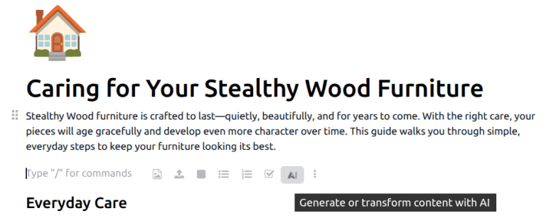

==============================
Write and improve text with AI
==============================

.. |AI| replace:: :abbr:`AI (artificial intelligence)`

Odoo |AI| can assist with writing and refining text across the database. This makes it easier to
draft emails, improve existing content, and quickly extract key information from discussions or
notes.

|AI| writing features are available in most rich-text environments in Odoo, including:

- *Description* and *Notes* fields on records
- Email composers and email templates
- **Knowledge** articles

These features are accessible through the text editor and the :ref:`powerbox
<essentials/html_editor/commands>`, depending on the context.

Writing with AI
===============

|AI| can generate new text based on a short prompt or partial input. This is useful for drafting
content such as emails, task descriptions, or internal notes.

To generate text, either click the |AI| icon, or type `/` to open the powerbox, and select
:guilabel:`AI` from the drop-down menu. Both options open a conversation window. Enter a short
prompt describing the desired content, then click the :icon:`fa-paper-plane-o` :guilabel:`(paper
plane)` icon. After the text is generated, hover over the response and click :guilabel:`Use this` to
add the content to the desired field or document. Alternatively, click the :icon:`fa-copy`
:guilabel:`(copy)` icon to copy the text to the clipboard.

.. image:: improve_text/conversation-window.png
   :alt: A conversation window with an AI agent generating content.

If unsatisfied with the content, send a follow-up message to the agent with an expanded prompt or
suggested changes.

Improving existing text
=======================

|AI| can also be used to rewrite or improve existing text. This includes:

- Making text clearer or more concise
- Adjusting tone or structure
- Correcting grammar or phrasing

Select the text to improve, then click the |AI| icon to open a conversation window. Click the
:guilabel:`Rewrite selected` prompt. After the text is generated, hover over the response and click
:guilabel:`Use this` to add the content to the desired field or document. Alternatively, click the
:icon:`fa-copy` :guilabel:`(copy)` icon to copy the text to the clipboard.

.. image:: improve_text/rewrite-prompt.png
   :alt: The rewrite selected text in a conversation window.

.. tip::
   To add custom instructions to the prompt, such as suggestions on tone or content, write the
   prompt directly in the conversation window. For example, `Rewrite the selected text in a more
   professional tone`.

Best practices for AI-assisted writing
======================================

For best results when using |AI| to write or improve text:

- Provide clear and specific context in prompts
- Review AI-generated content before saving or sending
- Adjust wording to match the company's tone and communication standards

|AI|-assisted writing is designed to support productivity, while final review and validation remain
essential.
