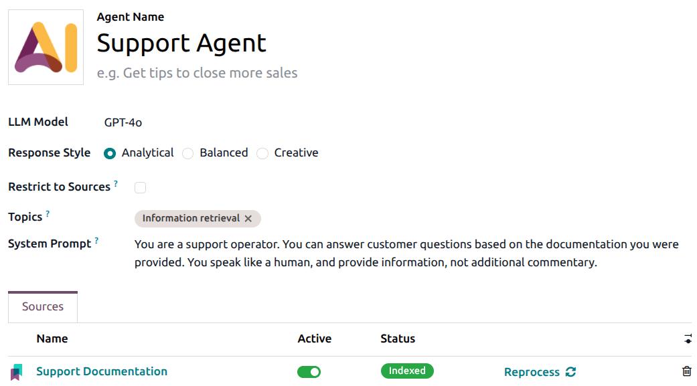
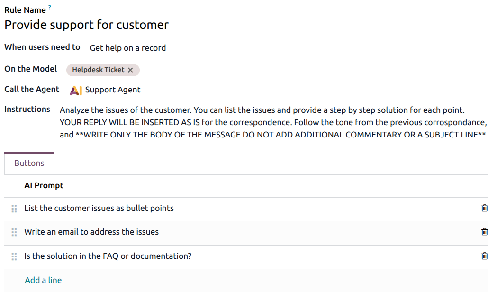

=======================
AI in support workflows
=======================

.. |AI| replace:: :abbr:`AI (artificial intelligence)`

Utilizing Odoo's |AI| features in the **Helpdesk** app assists support agents with their tasks,
rather than replacing existing workflows. The goal is to reduce repetitive tasks, accelerate ticket
handling, and improve consistency by allowing |AI| to analyze ticket content and suggest or execute
actions automatically.

Instead of manually categorizing, prioritizing, and responding to every request, support teams can
rely on |AI| to interpret incoming information and perform preliminary processing. Agents remain in
control of decisions and customer communication, while |AI| handles repetitive analysis and
drafting.

How AI works in Helpdesk
========================

|AI| capabilities in **Helpdesk** are built around three core ideas:

- |AI| agents that interact with users or agents and generate responses based on knowledge sources.
- |AI| automations that update tickets automatically when records are created or modified.
- |AI| enabled fields that generate structured information, such as summaries, from unstructured
  text.

AI agents
---------

An |AI| agent is a configurable assistant that operates using prompts and contextual knowledge. The
agent itself does not contain business logic; instead, it follows instructions defined by users and
relies on provided documentation.

When an agent receives a request, it combines its system :ref:`prompt <ai/agents/prompts-in-odoo>`,
the current record context (such as a ticket), and its knowledge :ref:`sources <ai/sources>`.

This allows the agent to provide responses grounded in internal documentation rather than generic
language model output.

Agents can be restricted to specific sources or granted permissions to perform actions using topics.
This ensures that support assistants behave predictably and remain aligned with organizational
rules.

AI automations
--------------

Automation rules allow |AI| to act during record lifecycle events. Instead of waiting for an agent
to categorize or prioritize tickets, |AI| can perform these tasks automatically as soon as a ticket
is created.

The key principle is that |AI| does not understand Odoo models directly. It receives text extracted
from fields and produces an output based on prompt instructions. Users guide |AI| behavior through
clear prompting and carefully selected input fields.

AI fields
---------

|AI| enabled fields extend standard Odoo fields by allowing their values to be generated
automatically through prompts.

These fields are useful when large amounts of text need to be condensed into actionable information.
For example, a long customer message can automatically be summarized into a short list of key
points, allowing agents to understand issues quickly without reading full descriptions.

Configuration
=============

Configuring an AI agent for support
-----------------------------------

|AI| :doc:`agents <agents>` are configured in the **AI** application. To configure an existing
agent, navigate to :menuselection:`AI app` and click the :icon:`fa-ellipsis-v` :guilabel:`(vertical
ellipsis)` icon, then click :guilabel:`Configuration` on the drop-down menu.

Configuring begins by selecting a language model and defining a system prompt describing how the
agent should behave. The prompt determines tone, scope, and responsibility. A support-focused agent
might be instructed to analyze issues and provide concise technical responses.

The next step is defining the agent's *sources*. These :ref:`sources <ai/sources>` form the agent's
memory and should contain trusted documentation such as product guides or FAQs. The quality of these
sources directly impacts the quality of AI responses.

.. tip::
   Select :guilabel:`Restrict to Sources` to require the agent to **only** base their responses on
   the supplied resources.

Users may also define *topics*, which grant the agent permission to perform specific actions.
:ref:`Topics <ai/topics>` allow advanced scenarios such as record creation or automation triggers.

Once an agent exists, *default prompts* can be used to initiate a conversation.

A default prompt defines where and when the |AI| appears inside Odoo. In the **Helpdesk** app, this
typically means allowing the |AI| button to appear on ticket records. The default prompt specifies
the model where it is available, which agent is called, and additional contextual instructions.

These instructions act as a second layer on top of the agent prompt, adapting the agent's behavior
to **Helpdesk** scenarios.

Configuring AI automations
--------------------------

|AI| :doc:`server actions <server-actions>` are configured using standard automated actions, with
|AI| used as the update mechanism.

When defining a server action, users specify when the action should run, such as when a new ticket
is created. The |AI| prompt then explains how the ticket should be interpreted and which field
should be updated.

This approach keeps automation predictable while allowing |AI| to make contextual decisions.

Configuring AI fields
---------------------

|AI| :doc:`fields <fields>` are configured by enabling the |AI| option on a custom or property field
and providing a prompt describing the expected result. Once configured, the field updates
automatically when the record changes, giving agents instant access to structured information.

.. warning::
   |AI| fields can be added to a record through the **Studio** app or property field.
   :ref:`Installing Studio <general/install>` may impact the current pricing plan for a database.

   For more information, refer to `Odoo's pricing page <https://www.odoo.com/pricing-plan>`_ or
   contact your account manager.

.. seealso::
   - :doc:`AI Fields <fields>`
   - :doc:`AI Agents <agents>`
   - :doc:`AI Server Actions <server-actions>`
