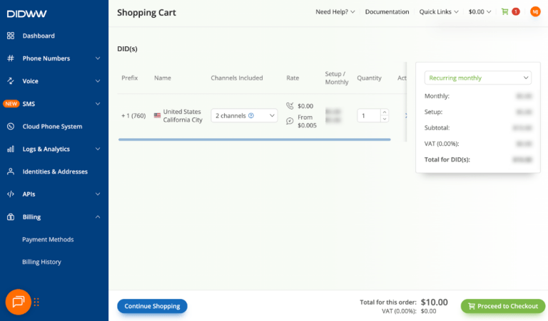
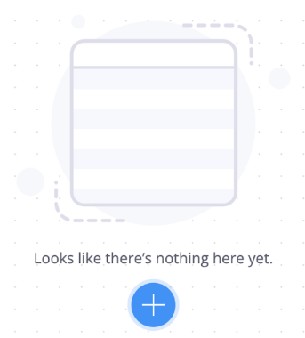
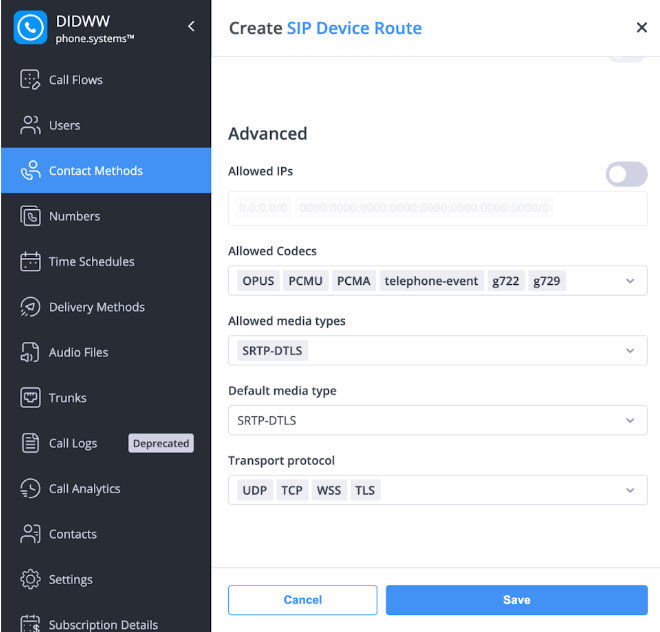
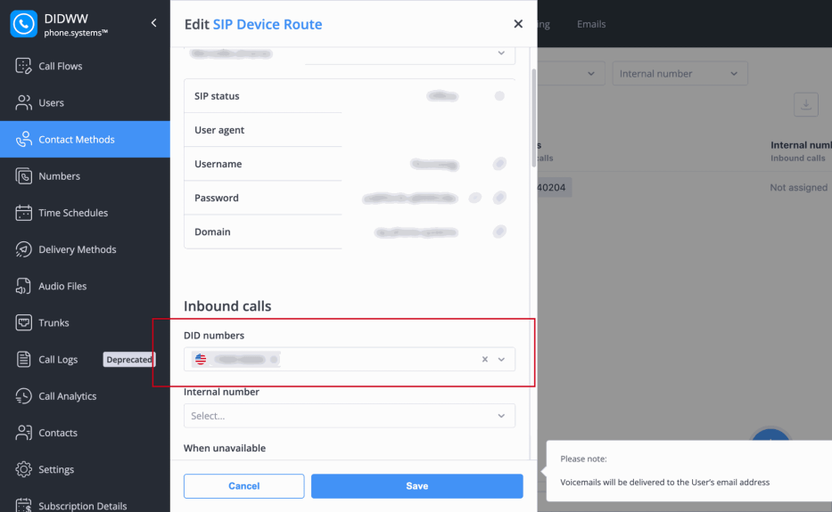
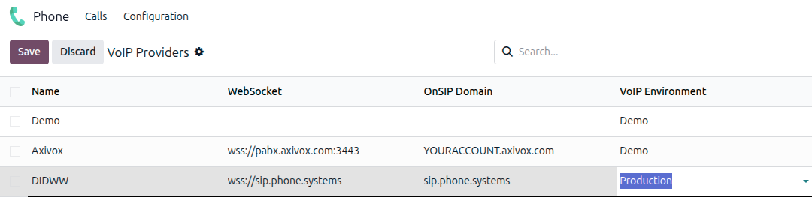

.. |VOIP| replace:: :abbr:`VoIP (Voice over Internet Protocol)`
.. |SIP| replace:: :abbr:`SIP (Session Initiation Protocol)`

=====================
Odoo Phone with DIDWW
=====================

`DIDWW <https://www.didww.com/>`_ is a global |VoIP| and |SIP| trunking provider that can be set up
to work with Odoo **Phone**. A DIDWW account is required to use this service.

.. important::
   Before setting up an account with DIDWW, verify the following requirements:

   - The business phone numbers are portable to DIDWW. Some providers may be unable to release the
     phone number due to local or regional guidelines.
   - The locations of the company and its call recipients are covered by DIDWW services.

Configure credentials in DIDWW
==============================

Navigate to the `DIDWW Dashboard <https://my.didww.com/#/dashboard>`_.

To transfer existing numbers from an existing telephone network service provider, follow the steps
outlined on the `DIDWW website <https://doc.didww.com/phone-numbers/number-porting/index.html>`_.

Purchase new numbers
--------------------

To puchase new phone numbers, click :guilabel:`Buy Numbers` in the dashboard, then follow the
instructions to complete the purchase.

When buying a new number, it **must** support both inbound calls and Local CLI.

Enable phone.systems
--------------------

Next, click :guilabel:`Cloud Phone System` in the dashboard sidebar. Then, click :guilabel:`Launch
admin UI`.

.. important::
   The *phone.systems PBX* feature is an extra paid service in DIDWW, and may require additional
   fees.

To create a new user, click :guilabel:`Users`, click the plus sign, then enter the necessary
information.

Click :guilabel:`Contact Methods`, then click the plus sign to add a new *SIP Device Route*.

Configure or add the following parameters:

- :guilabel:`Allowed Codecs`: `OPUS`, `PCMU`, `PCMA`, `telephone-event`, `g722`, `g729`.
- :guilabel:`Allowed media types`: `SRTP-DTLS`
- :guilabel:`Default media type`: `SRTP-DTLS`
- :guilabel:`Transport protocol`: `UDP`, `TCP`, `WSS`, `TLS`

.. important::
   The SRTP media encryption and TLS |SIP| transport are disabled by default in DIDWW. Contact the
   DIDWW sales team sales@didww.com to allow traffic encryption for your account.

.. tip::
   If no phone number available from drop-down selection in *Inbound and Outbound DID/Caller ID*
   selection, the :guilabel:`Inbound voice trunk` needs to be modified. Navigate to the dashboard,
   then click :guilabel:`My Numbers`. Scroll to :guilabel:`Configuration`. In the :guilabel:`Inbound
   voice trunk` field, select :guilabel:`phone.systems`.

Lastly, verify that the DID number is selected in the *Inbound Calls* section of the |SIP| Device
Route settings.

Configure DIDWW in Odoo
=======================

Add DIDWW credentials
---------------------

To set up DIDWW as a |VOIP| provider in Odoo, navigate to :menuselection:`Phone app -->
Configuration --> Providers`. Locate the *DIDWW* provider entry, and verify the following settings:

- :guilabel:`OnSIP Domain`: should already be set to `sip.phone.systems`.
- :guilabel:`WebSocket`: should already be set to `wss://sip.phone.systems`.
- :guilabel:`VoIP Environment`: select :guilabel:`Production`.

Configure user settings
-----------------------

Next, each user's OnSIP credentials must be configured in Odoo. Navigate to :menuselection:`Settings
app --> Users & Companies --> Users` select the user, and click the **VoIP** tab.

Add the following credentials for the user:

- :guilabel:`Username`: the user's DIDWW username.
- :guilabel:`Secret`: the user's password.

Once the DIDWW credentials have been saved, the user can make calls with Odoo **Phone** by clicking
the :icon:`oi-voip` :guilabel:`(Show Softphone)` icon in the top-right corner of Odoo.

.. seealso::
   For additional setup and troubleshooting steps, see `DIDWW's documentation
   <https://doc.didww.com/>`_.
