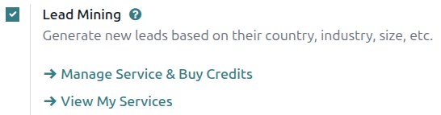
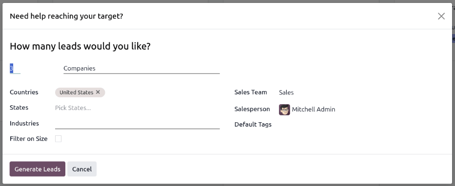
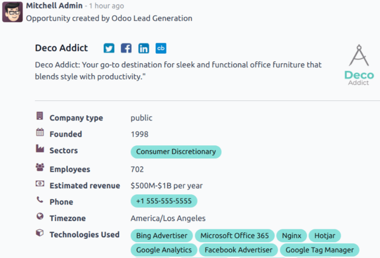
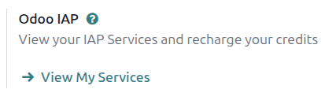

===========
Lead mining
===========

.. |IAP| replace:: :abbr:`IAP (In-App Purchase)`
.. |CC| replace:: :guilabel:`Companies and their Contacts`

*Lead mining* is a feature that allows *CRM* users to generate new leads directly within their Odoo
database. To ensure lead qualification, lead mining output is determined by a variety of filtering
criteria, such as the country, the company size, and the industry.

Configuration
=============

To get started, go to :menuselection:`CRM app --> Configuration --> Settings`, and select the
:guilabel:`Lead Mining` checkbox to activate the feature. Then, click :guilabel:`Save`.

Generate leads
==============

.. note::
   If the :doc:`Leads </applications/sales/crm/acquire_leads/convert>` feature is not enabled, then
   lead generation creates opportunities instead.

With the *Lead Mining* setting activated, the *Generate Leads* button is added to the upper-left
corner of the *CRM* *Pipeline* (:menuselection:`CRM app --> Sales --> My Pipeline`). Lead mining
requests are also available through :menuselection:`CRM app --> Configuration --> Lead Mining
Requests` and through :menuselection:`CRM app --> Leads`, where the :guilabel:`Generate Leads`
button is also available.

From any of these locations, click the :guilabel:`Generate Leads` button, and a pop-up window
appears.

Leads can be generated for :guilabel:`Companies` to get company information only, or for |CC| to get
both company information and contact information for individual employees.

Filtering options for generating leads include the following:

- :guilabel:`Countries`: Filter leads based on the country (or countries) they are located in.
- :guilabel:`States`: Filter leads even further based on the state in which they are located, if
  applicable.
- :guilabel:`Industries`: Filter leads based on the specific industry they work in.
- :guilabel:`Filter on Size`: Generates a field labeled :guilabel:`Size`. Fill in the blanks to
  create a range for the desired company size based on its number of employees.

.. note::
   When using |CC|, generated contacts can also be filtered based on their :guilabel:`Role` or
   :guilabel:`Seniority`.

Additionally, there are options for sales team assignment and internal tracking:

- :guilabel:`Sales Team`: Set which Sales Team the leads will be assigned to.
- :guilabel:`Salesperson`: Set which member of the Sales Team the leads will be assigned to.
- :guilabel:`Default Tags`: Set which tags are applied directly to the leads once found.

.. important::
   If applicable, make sure to be aware of the latest EU regulations when receiving contact
   information. Learn more about the General Data Protection Regulation on `Odoo GDPR
   <http://odoo.com/gdpr>`_.

View leads
----------

After leads are generated, they are assigned to the designated salesperson and team. To view
additional information regarding the lead, select one from the list and click to open it.

Additional information for the lead is provided in its chatter. This can include the number of
employees that work for the lead, the technology it uses, its timezone, and any direct contact
information.

Pricing
=======

Lead mining is an *In-App Purchase* service, and each generated lead costs one :ref:`credit
<in_app_purchase/credits>`. When using the |CC| option to generate leads, one additional credit is
used for each contact generated. See here for complete pricing information: `Lead Generation by Odoo
IAP <https://iap.odoo.com/iap/in-app-services/167?>`_. Enterprise Odoo users with a valid
subscription get free credits to test |IAP| features before purchasing more credits for the
database. This includes demo/training databases, educational databases, and one-app-free databases.

To buy credits, navigate to :menuselection:`CRM app --> Configuration --> Settings`. In the
:guilabel:`Lead Generation` section, under the :guilabel:`Lead Mining` feature, click
:guilabel:`Manage Service & Buy Credits` to go to the Lead Generation Settings page. Click
:guilabel:`Buy Credit` to go to the *Odoo IAP* page where you'll be able to buy packs of Lead
Generation credits.

Credits may also be purchased by navigating directly to the `Odoo IAP <https://iap.odoo.com/>`_ page
and clicking the :guilabel:`Lead Generation` button.

.. important::
   Credits are **not** interchangeable between IAP services. *Lead Generation* credits may not be
   spent on other IAP services, and no other IAP credits can be spent on *Lead Generation*.

.. seealso::
   :doc:`/applications/essentials/in_app_purchase`
