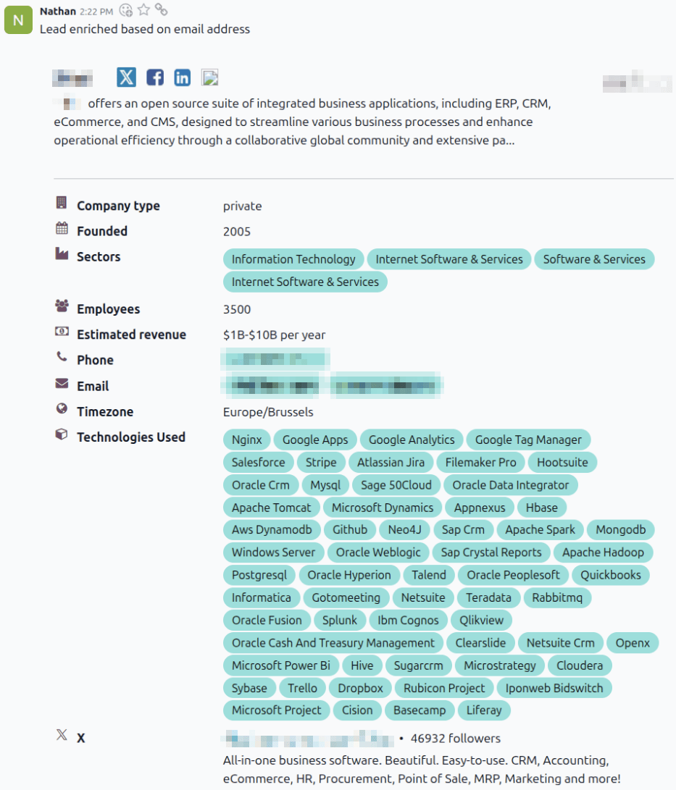
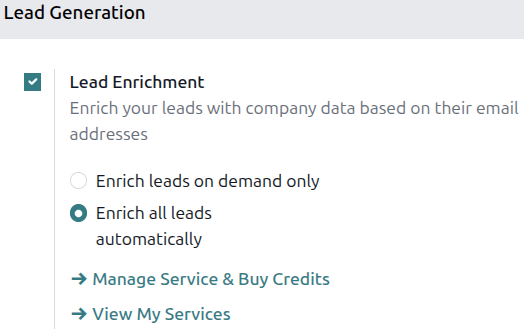
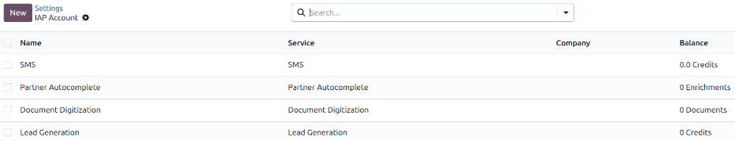

===============
Lead enrichment
===============

*Lead enrichment* is an In-App Purchase (IAP) service that provides business information for a
contact attached to a lead. Using lead enrichment requires credits and is available for existing
leads in an Odoo database. Enterprise Odoo users with a valid subscription receive free credits to
test :abbr:`IAP (In-App Purchase)`. This applies to demo/training, educational, and one-app-free
databases.

The information provided by lead enrichment can include general information about the business
(including full business name and logo) and its size, revenue, social media accounts, known
technology use, and more.

The *Leads* feature :ref:`must be configured <crm/configure-leads>` in the **CRM** app's settings
page in order to use lead enrichment.

.. important::
   When collecting a company's contact information, be aware of the latest EU regulations. For more
   information about the General Data Protection Regulation, refer to the `Odoo GDPR
   <http://odoo.com/gdpr>`__.

Lead enrichment set up
======================

To set up lead enrichment in the **CRM** app, navigate to :menuselection:`CRM app --> Configuration
--> Settings`. Under the :guilabel:`Lead Generation` section, select the checkbox next to
:guilabel:`Lead Enrichment`, and select either :guilabel:`Enrich leads on demand only` or
:guilabel:`Enrich all leads automatically`. Click the :guilabel:`Save` button to activate the
changes.

         enrich leads on demand only chosen.

Automatic and manual enrichment
===============================

Lead enrichment is based on the customer's email domain set on the lead. There are two different
ways that a lead can be enriched: *automatically* or *manually*.

Automatically enrich leads
--------------------------

On the *Settings* page, if *Enrich all leads automatically* was selected, no user action is required
to enrich the lead. Once every 60 minutes, a scheduled action contacts a remote database and
enriches any unenriched leads.

To change the behind-the-scenes rules for automatic lead enrichment, activate :ref:`developer mode
<developer-mode>`. With developer mode active, type "scheduled actions" in the main Odoo dashboard
to bring up the :icon:`fa-search` :guilabel:`(Search for a menu)` screen. Click :guilabel:`Settings
/ Technical / Automation / Scheduled Actions` to navigate to the Scheduled Actions page. In the
search bar, type "enrich leads" and click the :guilabel:`CRM\: enrich leads IAP` action. From this
page, automatic lead enrichment can be changed, including the execution interval, priority, and
more. The minimum value for the :guilabel:`Execute Every` field is 5 minutes.

Manually enrich leads
---------------------

If *Lead Enrichment* is set to :guilabel:`Enrich leads on demand only`, leads must be manually
enriched. This is done by clicking the :guilabel:`Enrich` button in the lead's page top menu. This
retrieves the same information as automatic enrichment at the same cost (one credit per enrichment).
This method of enrichment is useful when not every lead needs to be enriched or when cost is an
issue.

Multiple leads can be manually enriched in a single step using the *list* view. First, navigate to
the :menuselection:`CRM app --> Leads`, then click the :icon:`fa-align-justify` :guilabel:`(List)`
button. Click the checkboxes for the leads that need manual enrichment. Finally, click the
:icon:`fa-cog` :guilabel:`(Actions)` icon, then select :guilabel:`Enrich` from the resulting
drop-down menu. Multiple leads can also be enriched at once from the *My Pipeline* and *Pipeline*
pages. To do so, open the **CRM** app. On the *My Pipeline* page, click the :icon:`fa-close`
:guilabel:`(Remove)` icon in the search bar to show the entire pipeline, if desired. Then click the
:icon:`fa-align-justify` :guilabel:`(List)` button to switch to the list view and select the leads
to enrich.

Pricing
=======

Lead enrichment is an In-App Purchase (IAP) feature, and each enriched lead costs one credit. If the
database has no available credits, only the lead's website and logo are provided during enrichment.
Pricing information for credits can be found on the `Lead Generation
<https://iap.odoo.com/iap/in-app-services/167>`_ page.

To buy credits, navigate to :menuselection:`CRM app --> Configuration --> Settings`. In the
:guilabel:`Lead Generation` section, under the :guilabel:`Lead Enrichment` feature, click on
:guilabel:`Manage Service & Buy Credits`.

.. note::
   Because credits are not interchangeable between IAP services, clicking the :guilabel:`Manage
   Service & Buy Credits` link under the :guilabel:`Lead Mining` sub-header does **not** lead to a
   web page where *Lead Enrichment* credits can be purchased.

Credits may also be purchased by navigating to the :guilabel:`Settings` app and scrolling to the
:guilabel:`Contacts` section. Under the :guilabel:`Odoo IAP` feature, click :guilabel:`View My
Services`. From there, every active IAP service in the database can be viewed and credits can be
purchased by selecting one and clicking the :guilabel:`Buy Credit` link.

.. seealso::
   :doc:`../../../essentials/in_app_purchase`
