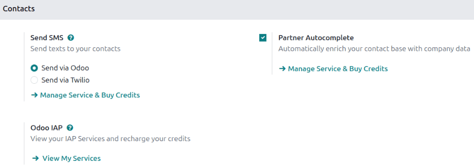
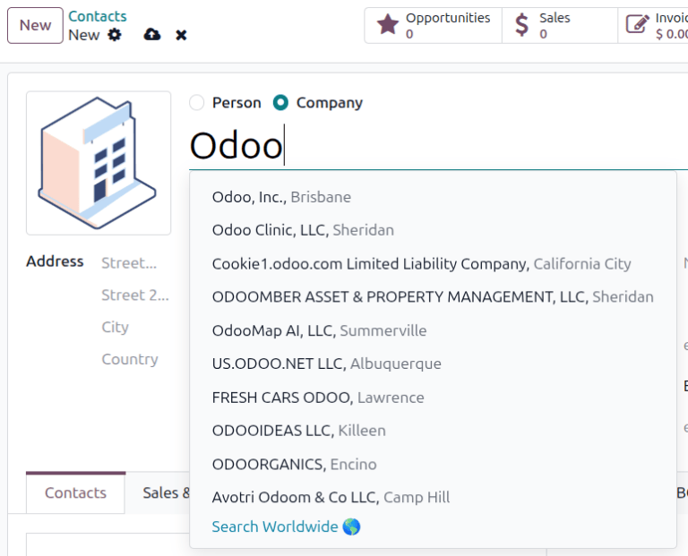

====================
Partner autocomplete
====================

.. |IAP| replace:: :abbr:`IAP (In-App Purchase)`

*Partner autocomplete* is an In-App Purchase (|IAP|) service that enriches business contacts with
information and data about that business. In any app or module where a *Contacts* form is
encountered, a business's name can be entered into the :guilabel:`Customer` field (`partner_id`
technical field) and a suggested company can be chosen from the drop-down menu. With *partner
autocomplete*, valuable information and hard-to-find data about companies of all sizes is just a
click away.

The information provided by partner autocomplete can include general information about the business
(including full business name and logo), :guilabel:`Phone` number, :guilabel:`Email`, :guilabel:`Tax
ID`, address, and UNSPSC activities as :guilabel:`Tags`.

When getting a company's contact information make sure to be aware of the latest EU regulations. For
more information about General Data Protection Regulation refer to: `Odoo GDPR
<http://odoo.com/gdpr>`_.

.. important::
   Partner autocomplete only works for newly created company Contacts. Businesses that already exist
   in the **Contacts** app cannot be enriched, nor can contacts for people.

Configuration
=============

Go to :menuselection:`Settings app --> Contacts section`. If the :guilabel:`Partner Autocomplete`
feature isn't active, tick the checkbox beside it and click :guilabel:`Save` to activate it.

Enrich contacts with corporate data
===================================

When *partner autocomplete* is enabled, Odoo displays a drop-down menu of potential match
suggestions based on the name entered in the new contact form. If one of the suggestions is
selected, the contact is populated with relevant data.

         businesses.

Pricing
=======

As an :abbr:`IAP (In-App Purchase)` service, *Partner Autocomplete* requires prepaid credits for
each use. Each completed autocomplete request consumes one credit. Enterprise Odoo users with a
valid subscription receive complimentary credits to try out |IAP| features for free before purchase.
This includes demo and training databases, educational databases, and one-app-free databases.

To buy credits, confirm that :guilabel:`Partner Autocomplete` is enabled as above, then navigate to
the **Settings** app and go to the :guilabel:`Contacts` section. Then, click :icon:`oi-arrow-right`
:guilabel:`Manage Service & Buy Credits` under :guilabel:`Partner Autocomplete`. On the
:guilabel:`Partner Autocomplete` page, click :icon:`oi-arrow-right` :guilabel:`Buy Credit` and the
|IAP| page loads. Choose a package and click :guilabel:`Buy` to begin the payment process.

.. note::
   If the database runs out of credits, the only information populated when clicking on the
   suggested company will be the website link and the logo.

   Learn about our `Privacy Policy <https://iap.odoo.com/privacy>`_.

.. seealso::
   :doc:`../../../essentials/in_app_purchase`
