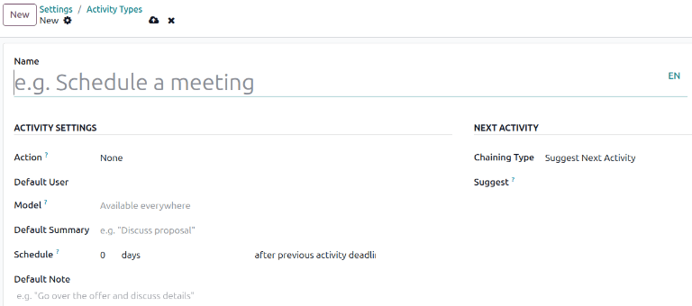
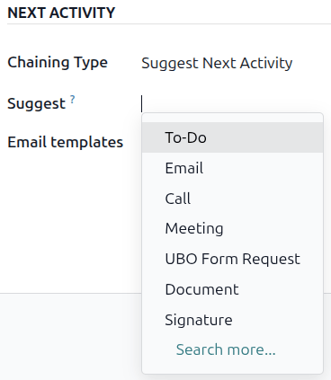
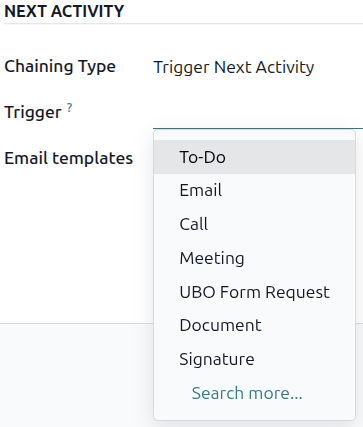
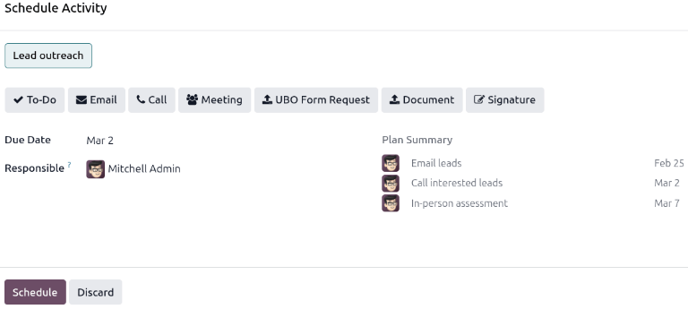
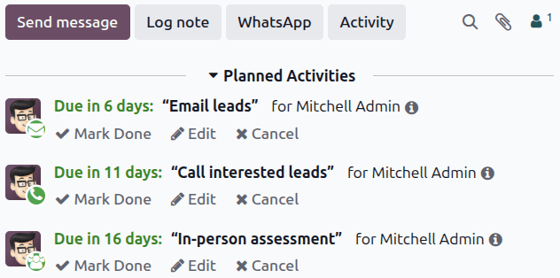

=================================
CRM activities and activity plans
=================================

Within the *CRM* app, *activities* are follow-up tasks tied to *leads* and *opportunities* that are
visible in the chatter. A set of preconfigured activity types is available in the *CRM* app, but
custom activity types may also be created to suit business needs. To view the list of available
activity types in the *CRM* app, open the app and navigate to :menuselection:`Configuration -->
Activity Types`. This page shows both Odoo-created activities and any custom activities.

.. note::
   Different applications support different activity types. To see the complete list of activity
   types, go to the :menuselection:`Settings app`, then scroll to the :guilabel:`Discuss` section,
   and click the :guilabel:`Activity Types` link.

Default and custom activity types
=================================

The preconfigured activity types for the *CRM* app are:

 - :guilabel:`Email`: Adds a reminder to the chatter prompting the salesperson to send an email.
 - :guilabel:`Call`: Opens a calendar link where the salesperson can schedule a phone call.
 - :guilabel:`Meeting`: Opens a calendar link where the salesperson can schedule a meeting.
 - :guilabel:`To Do`: Adds a general reminder task to the chatter.
 - :guilabel:`Upload Document`: Adds a link on the activity where an external document can be
   uploaded. Note that the *Documents* app is **not** required to utilize this activity type.

.. note::
   If other Odoo applications are installed, such as *Sales* or *Accounting*, additional activity
   types may appear in the *CRM* app's *Activity Types* page.

.. _crm/create-new-activity-type:

Create a custom activity type
-----------------------------

To create a custom activity type, navigate to the *Activity Types* page and click :guilabel:`New` at
the top-left of the page to open a blank form. Start by entering a :guilabel:`Name` for the new
activity type.

Activity settings
~~~~~~~~~~~~~~~~~

Action
******

The *Action* field specifies what action the activity prompts from the salesperson assigned to the
opportunity. Some actions trigger specific behaviors after an activity is scheduled instead of when
the activity is added to an opportunity.

- If :guilabel:`Upload Document` is selected, a link to upload a document is added directly to the
  planned activity in the chatter.
- If either :guilabel:`Phonecall` or :guilabel:`Meeting` are selected, users have the option to open
  their calendar to schedule a time for this activity.
- If :guilabel:`Request Signature` is selected, a link is added to the planned activity in the
  chatter that opens a signature request pop-up window.

.. note::
   The actions available for an activity type may vary depending on the applications currently
   installed in the database.

Default user
************

To automatically assign this activity to a specific user when this activity type is scheduled,
choose a name from the :guilabel:`Default User` drop-down menu. If this field is left blank, the
activity is assigned to the user who creates the activity.

Default summary
***************

The :guilabel:`Default Summary` serves as the title for activities when choosing them on
opportunities and leads. These will be visible to users such as salespeople and managers, whereas
the :guilabel:`Name` at the top of an :guilabel:`Activity Type` form is how the activity appears
within the *CRM* app's configuration.

Schedule
********

Set a default deadline for the custom activity in the :guilabel:`Schedule` field. To do so,
configure the desired number of :guilabel:`days`, :guilabel:`weeks`, or :guilabel:`months`. Then,
decide if the deadline should occur :guilabel:`after previous activity completion date` or
:guilabel:`after previous activity deadline`.

.. note::
   The default setting of :guilabel:`after previous activity deadline` means the date the deadline
   is set for, regardless of whether or not the deadline was actually met. To ensure that an
   activity is scheduled only when the preceding activity is complete, use the :guilabel:`after
   previous activity completion date` option.

Default Note
************

To include notes whenever this activity type is created, enter them into the :guilabel:`Default
Note` field. This can be used to include instructions for another user, as in the sample text in
this field.

.. note::
   The information in all of the preceding fields is automatically included when an activity is
   created within an opportunity. However, the info can still be altered before the activity is
   scheduled or saved.

Next activity
~~~~~~~~~~~~~

To automatically suggest or trigger a new activity after an activity has been marked complete, the
:guilabel:`Chaining Type` must be set.

Suggest the next activity
*************************

If an activity has the :guilabel:`Chaining Type` set to :guilabel:`Suggest Next Activity`, and has
activities listed in the :guilabel:`Suggest` field, users are presented with recommendations for
activities as next steps.

In the :guilabel:`Chaining Type` field, select :guilabel:`Suggest Next Activity`. Upon doing so, the
field underneath changes to: :guilabel:`Suggest`. Click the :guilabel:`Suggest` field drop-down menu
to select any activities to recommend as follow-up tasks to this activity type.

Trigger the next activity
*************************

When an activity has the :guilabel:`Chaining Type` set to :guilabel:`Trigger Next Activity`, marking
the activity as *Done* immediately launches the next activity listed in the :guilabel:`Trigger`
field.

Setting the :guilabel:`Chaining Type` to :guilabel:`Trigger Next Activity` immediately launches the
next activity once the previous one is completed.

If :guilabel:`Trigger Next Activity` is selected in the :guilabel:`Chaining Type` field, the field
beneath changes to: :guilabel:`Trigger`. From the :guilabel:`Trigger` field drop-down menu, select
the activity that should be launched once this activity is completed.

Email templates
***************

Select or create an email template to be suggested when the activity is added to an opportunity. The
template will appear alongside the activity in the chatter and can be sent as-is or edited by a
user.

Activity tracking
=================

To keep the pipeline up to date with the most accurate view of the status of activities, as soon as
a lead is interacted with, the associated activity should be marked as *Done*. This ensures the next
activity can be scheduled as needed. It also prevents the pipeline from becoming cluttered with
past-due activities.

The pipeline is most effective when it is kept up-to-date and accurate to the interactions it is
tracking.

.. _crm/activity-plans:

Activity plans
==============

*Activity plans* are preconfigured sequences of activities. When an activity plan is launched, every
activity in the sequence and any activities set to trigger off of activities within the sequence are
scheduled automatically.

To create a new plan, navigate to :menuselection:`CRM app --> Configuration --> Activity Plans`.
Click :guilabel:`New` at the top-left of the page to open a blank :guilabel:`Lead Activity Plans`
form.

Enter a name for the new plan in the :guilabel:`Plan Name` field. On the :guilabel:`Activities To
Create` tab, click :guilabel:`Add a line` to add a new activity.

Select an :guilabel:`Activity Type` from the drop-down menu. Click :guilabel:`Search More` to see a
complete list of available activity types, or to create a :ref:`new one
<crm/create-new-activity-type>`.

Next, in the :guilabel:`Summary` field, either leave this blank to use activity's *Default Summary*
or enter a new summary of what the activity entails. Entering a new summary does not overwrite an
existing Default Summary. The contents of this field are included with the scheduled activity, and
can be edited later.

In the :guilabel:`Assignment` field, select one of the following options:

 - :guilabel:`Ask at launch`: Activities are assigned to a user when the plan is scheduled. By
   default, they will be assigned to the user creating the activity, even if they're not the user
   responsible for the opportunity the activity is being created on.
 - :guilabel:`Default user`: Activities are always assigned to a specific user.

If :guilabel:`Default user` is selected in the :guilabel:`Assignment` field, choose a user in the
:guilabel:`Assigned to` field.

.. tip::
   Activity plans can feature activities that are assigned to default users and users assigned at
   the plan launch.

  .. image:: utilize_activities/create-activity-plan.png
     :alt: A blank Lead Activity Plan form.

Next, configure the timeline for the activity. Activities can be scheduled to occur either before
the plan date or after. Scheduling activities before the plan date can be useful for activities
scheduled in the future that require some preparation beforehand. Use the :guilabel:`Interval` and
:guilabel:`Units` fields to set the deadline for this activity. Lastly, in the :guilabel:`Trigger`
field, select whether the activity should occur before or after the plan date.

.. example::
   An activity plan is created to handle high priority leads. Specifically, these leads should be
   contacted quickly, with a meeting scheduled within two days of the initial contact. The plan is
   configured with the following activities:

   - Email two days **before** plan date
   - Meeting zero days **before** plan date
   - Make quote three days **after** plan date
   - Upload document three days **after** plan date
   - Follow-up five days **after** plan date

   This sets the *plan date* as the meeting deadline, which is the objective of the plan. Before
   that date, there is lead time to contact the customer and prepare for the meeting. After that
   date, the salesperson has time to create a quote, upload the document, and follow-up.

Repeat these steps for each activity included in the plan.

Use an activity plan
--------------------

To use an activity plan with a *CRM* opportunity, navigate to :menuselection:`CRM app` and click on
the Kanban card of an opportunity to open it.

Above the opportunity's chatter, click :guilabel:`Activity` to open the :guilabel:`Schedule
Activity` pop-up window.

In the :guilabel:`Plan` field, select the desired activity plan to launch from the section above the
individual activities. This generates a :guilabel:`Plan Summary`, listing out the activities
included in the plan. Select a :guilabel:`Due Date` using the calendar popover. This automatically
updates the :guilabel:`Plan summary` with deadlines based on the intervals configured in the
:ref:`activity plan <crm/activity-plans>`.

Select a user in the :guilabel:`Responsible` field. This user is assigned to any of the activities
on the plan that were configured with :guilabel:`Ask at launch` in the :guilabel:`Assignment` field.

Click :guilabel:`Schedule`. The details of the plan are added to the :guilabel:`Planned Activities`
section of the chatter, in addition to each of the activities that make up the plan.

.. seealso::
 - :doc:`Activities </applications/essentials/activities>`
 - :doc:`Email templates </applications/general/companies/email_template>`
