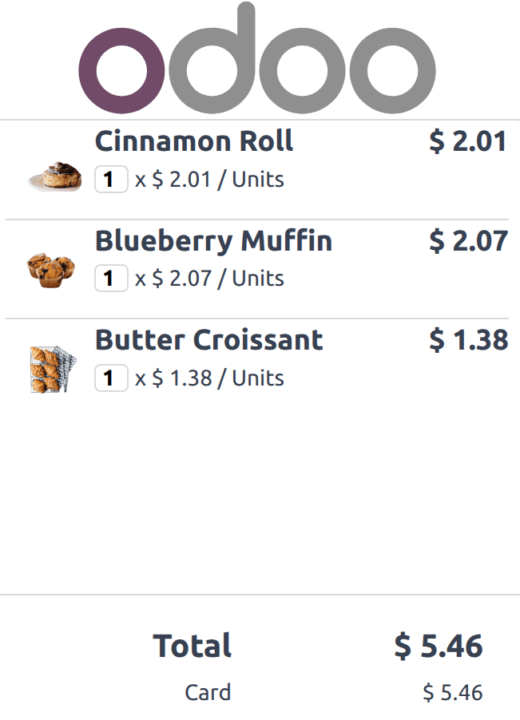

================
Customer display
================

The **customer display** feature provides real-time updates on a secondary screen for customers
during the checkout process. This screen shows the :ref:`items in the cart <pos/use/sell>`, the
subtotal as items are added, and details throughout the payment process. It also displays the total
amount, the selected :doc:`payment method <../payment_methods>`, and any change to be returned.

.. note::
   Both the customer and POS displays must have a minimum diagonal size of 6 inches. For optimal
   readability, larger screens are recommended.

.. _pos/hardware_network/display-configuration:

Configuration
=============

Depending on the POS setup, the feature can be displayed directly on a secondary screen connected
via USB-C or HDMI or on a screen connected through an IoT system.

The feature is activated by default, but its background image can still be configured. To do so,
navigate to the :ref:`POS settings <pos/use/settings>` and scroll down to the :guilabel:`Connected
Devices` section. Then, click :guilabel:`Upload your file` to set a background image.

For displays connected using an :doc:`IoT system </applications/general/iot>`:

#. Navigate to the :ref:`POS settings <pos/use/settings>`.
#. Enable the :guilabel:`IoT Box` option to activate the IoT system in POS.
#. Click :guilabel:`Save`, which activates the IoT app in Odoo.
#. :doc:`Connect and configure an IoT system </applications/general/iot/connect>` for a
   :doc:`display </applications/general/iot/devices/screen>`.
#. Return to the :ref:`POS settings <pos/use/settings>` and select an IoT-connected screen using the
   :guilabel:`Customer Display` field.

Opening the customer display
============================

To open the customer display, follow these steps:

#. :ref:`Access the POS register <pos/use/open-register>`.
#. Click the :icon:`fa-bars` (:guilabel:`hamburger menu`) icon.
#. Click the :icon:`fa-desktop` (:guilabel:`Customer Display`) icon, which opens the customer
   display either in a new window to drag onto the second screen or directly onto the IoT-connected
   screen.

.. note::
   For IoT-connected screens, both devices need to be connected to the same local network.

.. seealso::
   - :doc:`pos_iot`
   - :doc:`../../../general/iot`

For POS terminals running the
`Odoo <https://play.google.com/store/apps/details?id=com.odoo.mobile>`_ Android app with dual-screen
support, follow these steps:

#. :doc:`Activate the Point of Sale Mobile module <../../../general/apps_modules>` to enable the
   customer display.
#. :ref:`Access the POS register <pos/use/open-register>`.
#. Click the :icon:`fa-bars` (:guilabel:`hamburger menu`) icon.
#. Click the :icon:`fa-desktop` (:guilabel:`Customer Display`) icon, which opens the customer
   display on the terminal's secondary screen.
