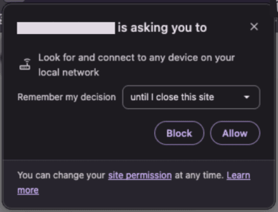

.. |LNA| replace:: :abbr:`LNA (Local Network Access)`

====================
Local Network Access
====================

`Local Network Access <https://developer.chrome.com/release-notes/142#local_network_access_restrictions>`_
is a security feature that limits a website's ability to send requests to servers on a local
network. Access requires explicit user permission, which makes it possible to grant network access
to a specific web page. Using |LNA|, Odoo Point of Sale can communicate with devices with local
access, such as :ref:`supported ePOS printers <pos/epos-printers/supported-printers>`, directly
from the browser and without requiring an :doc:`SSL certificate <epos_ssc>`.

.. note::
   Local Network Access is available in most browsers based on `Chromium version 142
   <https://developer.chrome.com/release-notes/142>`_ or higher, including Google Chrome, Brave,
   Microsoft Edge, Vivaldi, and Opera.

.. important::
   The ePOS printer must have a **static IP address**; otherwise, it may become unreachable. The
   static IP should be configured through the router.

Activation
==========

To activate |LNA| and ensure POS uses it over a secure connection, create a new system parameter
as follows:

#. :ref:`Enable the developer mode <developer-mode>`.
#. Go to :menuselection:`Settings --> Technical --> System Parameters`.
#. Click :guilabel:`New` and fill in the fields:

   - :guilabel:`Key`: `point_of_sale.use_lna`
   - :guilabel:`Value`: `True`

#. Click :guilabel:`Save`.

.. _pos/lna/browser-permission:

Browser permission
==================

Once |LNA| is activated in Odoo and a device with local access (such as an :ref:`ePOS printer
<pos/epos-printers/supported-printers>`) is configured in Google Chrome, the browser displays a
popup requesting permission to access devices on the local network.

If the popup does not appear in Google Chrome, follow the next steps to manually grant local
network access:

#. Access Google Chrome's settings.
#. Click :guilabel:`Privacy and security`, then :guilabel:`Site settings`.
#. Click :guilabel:`Additional permissions`, then :guilabel:`Local network`.
#. Grant local network access:

   - If the database URL appears under :guilabel:`Not allowed to access other devices on your
     local network`, click the :icon:`fa-ellipsis-v` (:guilabel:`ellipsis`) icon, then
     :guilabel:`Allow`.
   - If the database URL is not listed on the page, click :guilabel:`Add` next to :guilabel:`Allowed
     to access other devices on your local network`, enter the database URL, then click
     :guilabel:`Add`.

#. Refresh the database page.

.. note::
   - To manually grant local network access in browsers other than Google Chrome, refer to their
     respective documentation.
   - Some browsers may require enabling a flag to activate the feature:

     - Brave: `brave://flags/#local-network-access-check`
     - Google Chrome: `chrome://flags/#local-network-access-check`

Point of sale LNA status
========================

To view the point of sale's |LNA| status, :ref:`open <pos/use/open-register>` or access the
register, click the :icon:`fa-bars` (:guilabel:`hamburger menu`) icon in the top-right corner, then
click the :guilabel:`Local Network Access` button at the bottom of the menu. The current |LNA|
status details are then displayed in the :guilabel:`LNA Permission status` popup.
