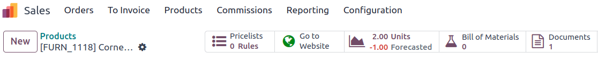
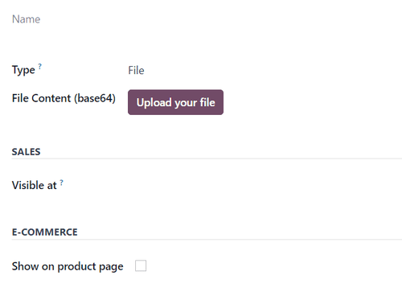
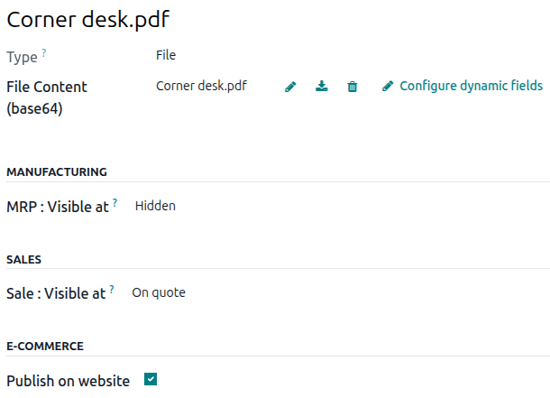

=====================
Add PDFs to a product
=====================

In Odoo *Sales*, it's also possible to add a custom PDF to a product form. When a PDF is added to a
product, and that product is used in a quotation, that PDF is also inserted in the final PDF.

To add a custom PDF to a product, start by navigating to :menuselection:`Sales app --> Products -->
Products`, and select the desired product to add a custom PDF to.

.. note::
   A document could also be added to a product variant, instead of a product. If there are documents
   on a product *and* on its variant, **only** the documents in the variant are shown.

   To add a custom document to a product variant, navigate to :menuselection:`Sales app -->
   Products --> Product Variants`. Select the desired variant, click the :guilabel:`Documents` smart
   button, and proceed to upload the custom document to the specific product variant.

On the product page, click the :guilabel:`Documents` smart button at the top of the page to navigate
to a :guilabel:`Documents` page for that product, where files related to that product can be
uploaded. From this page, either click :guilabel:`New` or :guilabel:`Upload`.

Clicking :guilabel:`Upload` opens the computer's local file directory. An uploaded document can be
further configured on the document card, or by clicking the :icon:`fa-ellipsis-v`
:guilabel:`(vertical ellipsis)` icon in the top-right corner of the document card, and then clicking
:guilabel:`Edit`.

Clicking :guilabel:`New` reveals a blank documents form, in which the desired PDF can be uploaded
via the :guilabel:`Upload your file` button on the form, located in the :guilabel:`File Content`
field.

PDF form configuration
======================

The first field on the documents form is for the :guilabel:`Name` of the document, and it is
grayed-out (not clickable) until a document is uploaded. Once a PDF has been uploaded, the
:guilabel:`Name` field is auto-populated with the name of the PDF, and it can then be edited.

Prior to uploading a document, there's the option to designate whether the document is a
:guilabel:`File` or :guilabel:`URL` from the :guilabel:`Type` drop-down field menu.

.. note::
    If a PDF is uploaded, the :guilabel:`Type` field is auto-populated to :guilabel:`File`, and it
    cannot be modified.

Then, in the :guilabel:`Sales` section, in the :guilabel:`Visible at` field, click the drop-down
menu, and select either: :guilabel:`On quotation`, :guilabel:`On confirmed order`, or
:guilabel:`Inside quote pdf`.

- :guilabel:`Quotation`: the document is sent to (and accessible by) customers at any time.

- :guilabel:`Confirmed order`: the document is sent to customers upon the confirmation of an order.
  This is best for user manuals and other supplemental documents.

- :guilabel:`Inside quote`: the document is included in the PDF of the quotation, between the header
  pages and the :guilabel:`Pricing` section of the quote.

.. example::
   When the :guilabel:`Inside quote` option for the :guilabel:`Visible at` field is chosen, and the
   custom PDF file, `Corner Desk.pdf` is uploaded, the PDF is visible on the quotation in the
   *customer portal* under the :guilabel:`Documents` field.

    .. image:: add_pdf_products/pdf-on-quote-sample.png
       :alt: Sample of an uploaded pdf with the on quote option chosen in Odoo Sales.

Beside the :guilabel:`File Content` field, you have the possibility to :guilabel:`Configure dynamic
fields`. When doing so, remember that the starting model is the :guilabel:`sale_order_line`, unlike
for headers and footers that start from the :guilabel:`sale_order`.

Lastly, in the :guilabel:`E-Commerce` section, decide whether or not to :guilabel:`Publish on
Website` so that the PDF appears on the product page in the online store.

.. example::
   When the :guilabel:`Publish on Website` option is enabled, a link to the uploaded document,
   `Corner Desk.pdf`, appears on the product's page in the online store.

   It appears beneath a :guilabel:`Documents` heading, with a link showcasing the name of the
   uploaded document.

    .. image:: add_pdf_products/show-product-page.png
       :alt: Showing a link to an uploaded document on a product page using Odoo Sales.
