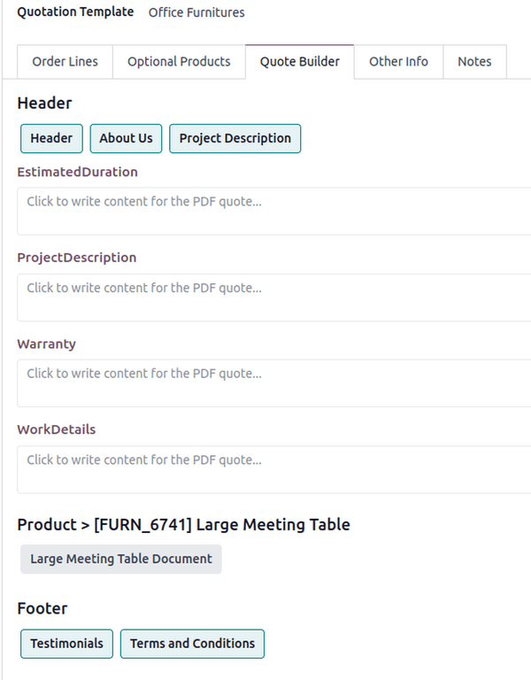
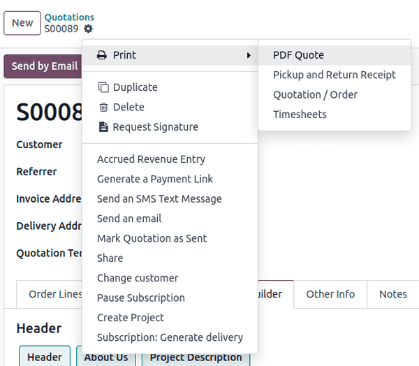

==================
Add PDFs to quotes
==================

On a sales order, in the :guilabel:`Quote Builder` tab, select additional documents to be merged
into the final PDF. If a selected document has custom fields, they appear as editable text boxes to
be filled in.

Once a quote with a pre-configured PDF has been confirmed, Odoo provides the option to print the
confirmed quote to check for errors, or to keep for records.

To print the PDF quote, navigate to the confirmed quote, and click the :guilabel:`⚙️ (gear)` icon to
reveal a drop-down menu. From this drop-down menu, select :guilabel:`Print`, then select
:guilabel:`PDF Quote`.

Doing so instantly downloads the PDF quote. When opened, the PDF quote, along with the configured
product PDF that was set to be visible inside the quote, can be viewed and printed.

.. note::
   Download these :download:`PDF quote builder examples
   <add_pdf_quotes/pdfquotebuilderexamples.zip>` or download :download:`sample quotation
   <add_pdf_quotes/sample_quotation.pdf>` for added reference.

.. seealso::
   - :doc:`../quote_template`

