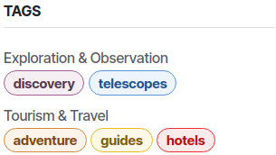

====
Blog
====

**Odoo Blog** lets you manage blog pages and posts, and customize them with the website builder.

.. tip::
   Install the :guilabel:`Blog` app by clicking :guilabel:`New` on the website builder, then
   selecting  :guilabel:`Blog Post`, and clicking :guilabel:`Install`.

.. seealso::
   `Odoo Tutorials: Blogs [video] <https://www.odoo.com/slides/slide/blogs-6935>`_

Blog posts
==========

To create a blog post, click :guilabel:`New` on the website builder and click :guilabel:`Blog Post`.
Select a :ref:`blog <blog/blog-pages>`, define a :guilabel:`Blog Post Title`, and click
:guilabel:`Save`. Write the post's content and customize it using the website builder.

To publish a post, toggle the :guilabel:`Unpublished` switch in the top-right corner of the page.

To delete a blog post, go to :menuselection:`Website --> Site --> Blog post`. Select the blog
post to delete, click :icon:`fa-cog` :guilabel:`Actions`, and :icon:`fa-trash-o` :guilabel:`Delete`.

Customize blog posts
--------------------

To customize the layout of all blog posts, open one and click :menuselection:`Edit --> Style`.
Under the :guilabel:`Blog page` section, different options can be used to customize the posts:

- :guilabel:`Layout`: display the title inside or above the cover.
- :guilabel:`Increase Readability`: adjust or not the posts' formatting for better reading comfort.
- :guilabel:`Sidebar`: display or hide a sidebar that can contain several elements:

  - :guilabel:`Archive`: allow visitors to view all posts from a specific month by selecting it.
  - :guilabel:`Author`: display the post author.
  - :guilabel:`Blog List`: display links to all :ref:`blog pages <blog/blog-pages>`.
  - :guilabel:`Share Links`: add clickable icons that link to your social network profiles and a
    subscription field for your newsletter.
  - :guilabel:`Tags`: create or select existing :ref:`tags <blog/tags>` and display them on the post.

- :guilabel:`Breadcrumb`: display the breadcrumb trail.
- :guilabel:`Bottom`: click the :guilabel:`Next Article` to hide or display the next post at the
  end of the page, and click :guilabel:`Comments` to enable or disable visitors' comments.

To add tags or customize the cover of a specific post, click the cover and use the following
settings under the :guilabel:`Blog Post Cover` section:

- :guilabel:`Tags`
- :guilabel:`Background`: add an image by clicking the :icon:`os-camera` :guilabel:`(camera)` icon,
  or use a background color by clicking the :icon:`fa-ban` (:guilabel:`None`) icon and selecting a
  color.

- :guilabel:`Size`: select the size of the cover (:guilabel:`Full screen`, :guilabel:`Half screen`,
  or :guilabel:`Fit text`).
- :guilabel:`Filter Intensity`: choose the cover filter's intensity
  (:guilabel:`Low`, :guilabel:`Medium`, :guilabel:`High`) or disable it by selecting
  :guilabel:`No filter`.

After applying the desired changes, click :guilabel:`Save`.

.. tip::
   - Illustrate your posts with copyright-free images from :doc:`Unsplash
     </applications/general/integrations/unsplash>`.
   - Use :ref:`Plausible <analytics/plausible>` to track traffic on your blog.
   - Customize blog building blocks through the website editor. For example, filter by the
     :guilabel:`Latest blog posts` or :guilabel:`Most viewed blog posts` and determine which blog
     to display in the building block.

.. seealso::
   - :doc:`Building block documentation <website/web_design/building_blocks>`
   - :doc:`Odoo rich-text editor documentation <../essentials/html_editor>`

.. _blog/tags:

Tags
~~~~

Tags let visitors filter blog posts that share a specific tag. They are displayed at the bottom of
each post.

To create a tag, go to :menuselection:`Website --> Configuration --> Tags` and click
:guilabel:`New`. Fill in the:

- :guilabel:`Name`
- :ref:`Category <blog/tag-category>`
- :guilabel:`Color`
- :guilabel:`Used in`: to apply tags to existing blog posts, click :guilabel:`Add a line`.

Add and create tags directly from posts by clicking :menuselection:`Edit --> Style` and
selecting the post's cover. Under :guilabel:`Tags`, click :guilabel:`Choose a record...`, and select
or create a tag by writing a new name.

.. _blog/tag-category:

Tag category
************

Tag categories let you organize tags displayed on the sidebar into groups.

To create tag categories, go to :menuselection:`Website --> Configuration --> Tag Categories`
and click :guilabel:`New`.

.. _blog/blog-pages:

Blog landing pages
==================

To create multiple blogs, go to :menuselection:`Website --> Configuration --> Blogs` and click
:guilabel:`New`. Next, enter the :guilabel:`Blog Name` and the :guilabel:`Blog Subtitle`.

The :guilabel:`Blog` menu gathers all the blogs and their posts.

.. note::
   With two or more blogs, the blog landing page (/blog) aggregates posts from all blogs and lets
   visitors choose which blog to view.

Customize blog landing pages
----------------------------

To customize the blog landing pages, go to :menuselection:`Edit --> Style` and use the available
options as desired.

.. note::
   If you use multiple blogs, settings configured on the main blog landing page or on a specific
   blog landing page will be applied to all other pages.

- :guilabel:`Top Banner`: display or hide the page's banner:

  - :guilabel:`Full-width`: make the banner use the page's full-width or display a condensed banner.
- :guilabel:`Layout`: display blog posts as a grid or as a list.
- :guilabel:`Cards`: display blog posts with or without the *card* effect.
- :guilabel:`Increase Readability`: enlarge or not the blog posts' size for better reading comfort .
- :guilabel:`Sidebar`: display or hide a sidebar that contains an *about us* section, and, depending
  on the options selected:

  - :guilabel:`Archives`: allow visitors to view all posts from a specific month by selecting it.
  - :guilabel:`Follow Us`: add clickable icons that link to your social network profiles and a
    subscription field for your newsletter.
  - :ref:`Tags List <blog/tags>`: allow visitors to view all blog posts that share a specific tag by
    selecting it.

- :guilabel:`Posts List`: select :guilabel:`Cover` to display the posts' covers or select
  :guilabel:`No Cover` to hide them.
- :guilabel:`Author`: display the posts' authors.
- :guilabel:`Comments/Views Stats`: display or hide the number of comments and views for each post.
- :guilabel:`Teaser & Tags`: display the posts' first sentences and tags.

After applying the desired changes, click :guilabel:`Save`.

.. note::
   Increase your blog's visibility in search engines, attract more visitors while
   improving the :doc:`SEO <../../../applications/websites/website/structure/seo>` by:

   - Updating the content of the website regularly.
   - Using meta tags and ensuring that both the content and metadata are translated.
   - Never having more than one :ref:`Heading 1 <website/elements/titles>` per page, so
     search engines can easily identify the page's main topic.
   - Use the :guilabel:`Blog` :ref:`building blocks <website/building_blocks/add>` anywhere on the
     website.
