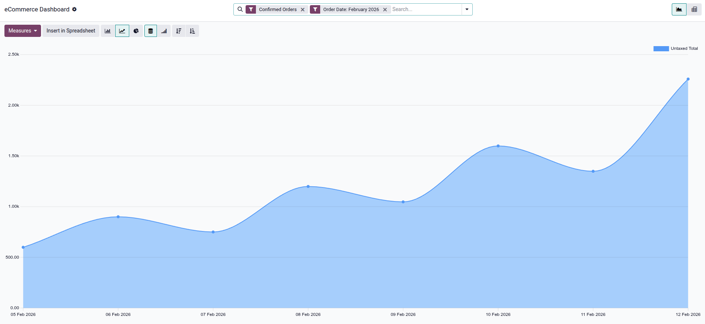

======================
Performance management
======================

Odoo provides robust tools to :ref:`monitor and analyze <ecommerce/performance/data-monitoring>`
your e-commerce's performance and :ref:`optimize <ecommerce/performance/email_queue>` the processing
of order confirmation emails during high-traffic periods.

.. seealso::
   - :ref:`analytics/plausible`
   - :ref:`analytics/google-analytics`
   - :doc:`../website/structure/seo`

.. _ecommerce/performance/data-monitoring:

Data monitoring
===============

The eCommerce reporting view allows you to monitor and analyze the performance of your online sales.
To access it, go to :menuselection:`Website --> Reporting --> eCommerce`. The :guilabel:`eCommerce
Dashboard` helps monitor everything related to the online shop, e.g., sales performance by product
or category. By default, the graph shows data for :guilabel:`Confirmed Orders` and the current
month.

Click the :guilabel:`Measures` :icon:`fa-caret-down` button to select the metric to analyze, such as
:guilabel:`Discount %`, :guilabel:`Qty Invoiced`, :guilabel:`Untaxed Total` (default), or
:guilabel:`Volume`. You can also switch between :ref:`pivot <studio/views/reporting/pivot>` and
:ref:`graph <studio/views/reporting/graph>` views, and create a spreadsheet by clicking
:guilabel:`Insert in Spreadsheet`.

.. seealso::
   - :doc:`/applications/productivity/dashboards`
   - :doc:`/applications/essentials/search`
   - :doc:`/applications/essentials/reporting`

.. _ecommerce/performance/email_queue:

Email queue optimization
========================

For websites handling flash sales (e.g., event ticket sales) or experiencing high traffic spikes,
order confirmation emails can become a performance bottleneck, potentially slowing down the checkout
process for other customers.

To improve performance, these emails can be queued and processed separately from the order
confirmation flow. This is managed by the :guilabel:`Sales: Send pending emails` scheduled action,
which sends queued emails as soon as possible.

To enable asynchronous email sending:

#. Enable the :ref:`developer-mode`.
#. Open the Settings app and go to :menuselection:`Settings --> Technical --> System Parameters`.
#. Search for the :guilabel:`sale.async_emails` system parameter, set its :guilabel:`Value` to
   `True`, and click :guilabel:`Save`.
#. Navigate to :menuselection:`Settings --> Technical --> Scheduled Actions`.
#. Select the :guilabel:`Sales: Send pending emails` scheduled action.
#. Ensure the :guilabel:`Active` switch is enabled.

.. caution::
   This configuration is recommended only for high-traffic websites, as it may introduce unnecessary
   delays for order confirmation and invoice emails on websites with moderate traffic.
