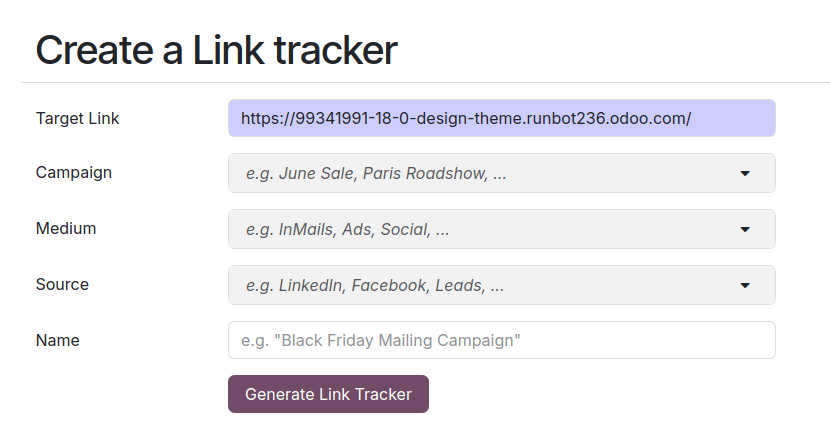
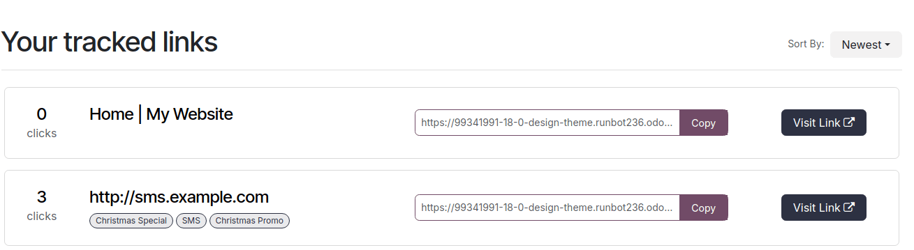

============
Link tracker
============

The link tracker is used to create tracked links to measure the effectiveness of marketing
campaigns, making it easier to identify which channels drive the most traffic and make more
informed decisions.

To create and manage tracked links, :ref:`install <general/install>` the :guilabel:`Link Tracker`
(`website links`) module.

Create traceable URLs
=====================

To create and manage tracked links, navigate to :menuselection:`Website --> Site --> Link Tracker`.
Fill in the following information and click :guilabel:`Generate tracked link` to create a tracking
URL.

#. :guilabel:`URL`: The URL that is the target of the campaign. It is automatically populated with
   the URL used to access the menu.
#. :guilabel:`Campaign`: The specific campaign the link should be associated with. This parameter is
   used to distinguish the different campaigns.
#. :guilabel:`Medium`: The medium describes the category or method through which the visitor arrives
   at your site, such as organic search, paid search, social media ad, email, etc.
#. :guilabel:`Source`: The source identifies the specific platform or website that referred the
   visitor, such as a search engine, newsletter, or website.

.. tip::
   The :guilabel:`Campaign`, :guilabel:`Medium`, and :guilabel:`Source` are :abbr:`UTM (Urchin
   Tracking Module)` parameters incorporated in the tracked URL. These can be used, for example,
   to customize the :ref:`visibility <website/visibility/conditions>` of website building blocks.

Tracked links overview
======================

To get an overview of your tracked links, go to :menuselection:`Website --> Site --> Link Tracker`
and scroll down to :guilabel:`Your tracked links` section.

Statistics
----------

To measure the performance of tracked links, click the track link and scroll down to the
:guilabel:`Statistics` section to get an overview of the number of clicks for the tracked link.
By default, the graph shows the total number of clicks. You can change the period to
:guilabel:`Last Month` or :guilabel:`Last Week` using the options on the right side of the heading.
