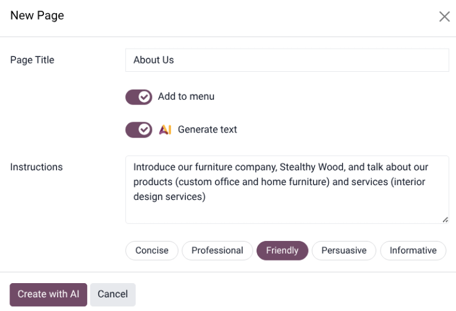
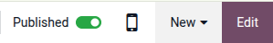

:show-content:

=====
Pages
=====

Odoo allows you to :ref:`create <website/pages/page_creation>` different kinds of webpages,
including with the help of :ref:`AI <website/pages/ai-generator>`, :ref:`publish
<website/pages/un-publish-page>` them, and define their structure and visibility by configuring
:ref:`page properties <website/pages/page_properties>`. Pages can be :ref:`duplicated
<website/pages/duplicate-page>`, :ref:`deleted <website/pages/delete-page>`, and :ref:`redirected
<website/pages/URL-redirection>`.

.. _website/pages/page_type:

.. admonition:: Page types

   **Static** pages, such as the homepage or :ref:`custom <website/pages/page_creation>` pages,
   contain fixed content that does not change dynamically. You can manually create these pages,
   define their URLs, and adapt their :ref:`properties <website/pages/page_properties>` as needed.

   **Dynamic** pages, on the other hand, display content that changes automatically based on the
   data in the database and user interaction (e.g., filtering). They are generated automatically by
   Odoo, for example, when installing an app or module (e.g., `/shop` or `/blog`) or publishing a
   new :doc:`product <../../ecommerce>` or :doc:`blog post <../../blog>`. Dynamic pages are managed
   differently from static pages.

.. _website/pages/page_creation:

Page creation
=============

Website pages can be created from the **frontend** and the **backend**.

  #. To create a new website page:

     - Either open the **Website** app, click :guilabel:`New` :icon:`fa-caret-down` in the top-right
       corner, then select :guilabel:`Page`;
     - Or go to :menuselection:`Website --> Site --> Pages` and click :guilabel:`New`.

  #. In the :guilabel:`New Page` pop-up, select a template. Templates are grouped by type:

     - :guilabel:`Basic`: Multi-purpose page. A blank page is also available to start from scratch.
     - :guilabel:`About`: Information about the brand and company.
     - :guilabel:`Landing Pages`: Summary of company content and information.
     - :guilabel:`Gallery`: Photos and media showcase.
     - :guilabel:`Services`: Overview of the services offered by the company.
     - :guilabel:`Pricing Plans`: Overview of the subscriptions and prices.
     - :guilabel:`Team`: The people behind the company.
     - :guilabel:`Custom`: Custom-created templates. To add a custom template, open the page you
       want to save as a template and :ref:`edit the page's properties
       <website/pages/page_properties>`.

  #. In the :guilabel:`New Page` pop-up:

     - Enter a :guilabel:`Page Title`. This title is used in the menu and the page's URL.
     - Disable :guilabel:`Add to menu` if the page should not appear in the menu.
     - Enable :guilabel:`Generate text` to use the :ref:`AI <website/pages/ai-generator>` tool to
       build the page.

  #. Click :guilabel:`Create`.
  #. If needed, :doc:`customize the page's content and appearance <../web_design>` using the website
     editor or :ref:`translate <translate/translate>` it, then click :guilabel:`Save`.
  #. :ref:`Publish <website/pages/un-publish-page>` the page.

.. _website/pages/ai-generator:

AI webpage generator
--------------------

To generate content using AI when :ref:`creating a new page <website/pages/page_creation>`, follow
these steps:

#. After choosing a template, in the :guilabel:`New Page` pop-up, toggle the :guilabel:`AI Generate
   Text` switch.
#. In the :guilabel:`Instructions` field, enter a short description of the page being created. This
   should include a few important keywords that define the page's focus and scope.
#. Select one of the tone options for the page, such as :guilabel:`Concise`,
   :guilabel:`Professional`, :guilabel:`Friendly`, :guilabel:`Persuasive`, or
   :guilabel:`Informative`.
#. Click :guilabel:`Create with AI`. It may take a few moments for the webpage to load.

.. note::
   - The AI application does **not** need to be installed on the database to use the webpage
     generator.
   - Content created by the AI generator can be customized using the :doc:`website editor
     <../web_design>`.
   - The AI webpage generator is not available for the *Blank* page type.
   - The webpage generator may create :ref:`buttons <website/elements/buttons>`. Before publishing
     the webpage, confirm that all buttons are linked to an active webpage.

.. seealso::
   - :doc:`Web design <../web_design>`
   - :doc:`/applications/productivity/ai`

.. _website/pages/un-publish-page:

Publishing/unpublishing pages
=============================

Pages need to be published to make them visible to website visitors. To publish or unpublish a
page, access it and toggle the switch in the upper-right corner from :guilabel:`Unpublished`
to :guilabel:`Published`, or vice versa.

.. note::
   It is also possible to:

    - Publish/unpublish a page from the :ref:`page properties <website/pages/page_properties>`.
    - Publish/unpublish several pages at once. To do so, go to :menuselection:`Website --> Site
      --> Pages`, select the pages, then click :icon:`fa-cog` :guilabel:`Actions` and select
      :icon:`fa-globe` :guilabel:`Publish` or :icon:`fa-chain-broken` :guilabel:`Unpublish`.

.. _website/pages/page_properties:

Page properties
===============

To modify a :ref:`static page's <website/pages/page_type>` properties, access the page you wish to
modify, then go to :menuselection:`Website --> Site --> Properties`, where the following properties
can be adapted:

 - :guilabel:`Page Title`: Modify the page's title.
 - :guilabel:`Page URL`: Modify the page URL in the field. In this case, you can redirect the
   old URL to the new one if needed. To do so, enable :guilabel:`Redirect Old URL`, then select the
   :guilabel:`Type` of :ref:`redirection <website/pages/URL-redirection>`:

    - :guilabel:`301 Moved permanently`: to redirect the page permanently.
    - :guilabel:`302 Moved temporarily`: to redirect the page temporarily.

 - :guilabel:`In Menu`: Disable if the page should not appear in the menu. Click the
   :icon:`fa-arrow-right` :guilabel:`Edit Menu` link to modify the menu.
 - :guilabel:`Is Homepage`: Enable if the *static* page should serve as the homepage of the website.
 - :guilabel:`Published`: Enable it to publish the page.
 - :guilabel:`Publishing Date`: To publish the page at a specific date and time, click the field,
   set the date and time, then press **Enter** or click :guilabel:`Apply` to validate the selection.
 - :guilabel:`Indexed`: Disable if the page should not appear in search engine results.
 - :guilabel:`Visibility`: Select who can access the page:

    - :guilabel:`Public`: Everyone can access the page.
    - :guilabel:`Signed In`: Only signed-in users can access the page.
    - :guilabel:`Restricted Group`: Select the :doc:`user access group(s)
      </applications/general/users/access_rights>` in the :guilabel:`Authorized Groups` field.
    - :guilabel:`With Password`: Type the password required to access the page in the
      :guilabel:`Password` field.

 - :guilabel:`Is a Template`: Toggle the switch to save the page as a template. It is now available
   in the :guilabel:`Custom` category when :ref:`creating a new page <website/pages/page_creation>`.

.. _website/pages/duplicate-page:

Duplicating pages
-----------------

To duplicate a page, access the page, then go to :menuselection:`Website --> Site --> Properties`,
and click :guilabel:`Duplicate Page`. In the :guilabel:`Confirmation` window, enter a
:guilabel:`Page Name`, then click :guilabel:`Ok`. By default, the new page is not published; it is
added after the originally duplicated page in the menu. Use the :doc:`menu editor <header_footer>`
to remove it from the menu or change its position.

.. tip::
   You can also duplicate one or several pages by going to :menuselection:`Website --> Site -->
   Pages`. Select the relevant page(s), click :icon:`fa-cog` :guilabel:`Actions`, and select
   :icon:`fa-files-o` :guilabel:`Duplicate`.

.. _website/pages/delete-page:

Deleting pages
--------------

To delete a page, proceed as follows:

#. Access the page, then go to :menuselection:`Website --> Site --> Properties` and click
   :guilabel:`Delete Page`.
#. The :guilabel:`Delete Page` pop-up shows all links referring to the page you want to delete,
   organized by category. To ensure website visitors do not land on an error page, update all links
   on the website that refer to the page. To do so, expand a category, then click on a
   link to open it in a new window. Alternatively, you can set up a :ref:`redirection
   <website/pages/URL-redirection>` for the deleted page.
#. Once you have updated the links (or set up a :ref:`redirect <website/pages/URL-redirection>`),
   tick the :guilabel:`I am sure about this.` checkbox, then click :guilabel:`Delete`.

.. tip::
   You can also delete one or several pages by going to :menuselection:`Website --> Site --> Pages`.
   Select the relevant page(s), click :icon:`fa-cog` :guilabel:`Actions`, and select
   :icon:`fa-trash` :guilabel:`Delete`.

.. _website/pages/URL-redirection:

URL redirect mapping
====================

URL redirect mapping involves sending visitors and search engines to a URL other than the one they
initially requested. This technique is used, for example, to prevent broken links when
:ref:`deleting a page <website/pages/delete-page>`, :ref:`modifying its URL
<website/pages/page_properties>`, or migrating the site from another platform to an Odoo
:doc:`domain <../configuration/domain_names>`. It can also be used to improve :doc:`seo`.

.. note::
   - A redirect record is added automatically every time you :ref:`modify a page's URL
     <website/pages/page_properties>` and enable :guilabel:`Redirect Old URL`.
   - Redirections can be configured for :ref:`static and dynamic pages <website/pages/page_type>`.

To access existing URL redirections and create new ones, :doc:`activate the developer mode
</applications/general/developer_mode>` and go to :menuselection:`Website --> Configuration -->
Redirects`. To create a redirection, click :guilabel:`New` in the :guilabel:`Rewrite` view, then
adapt the fields:

- :guilabel:`Name`: Enter a name to identify the redirect.
- :guilabel:`Action`: Select the type of redirection:

   - :guilabel:`404 Not found`: Visitors land on a 404 error page when they try to access an
     unpublished or deleted page.
   - :guilabel:`301 Moved permanently`: for permanent redirections of unpublished or deleted
     :ref:`static pages <website/pages/page_type>`. The new URL is shown in search engine results,
     and the redirect is cached by browsers.
   - :guilabel:`302 Moved temporarily`: for short-term redirections, for example, if you are
     redesigning or updating a page. The new URL is neither cached by browsers nor shown in search
     engine results.
   - :guilabel:`308 Redirect / Rewrite`: for permanent redirections where the original URL is
     rewritten (typically used for :ref:`dynamic pages <website/pages/page_type>`). The URL is
     renamed; the new name appears in search engine results and is cached by browsers. Use this
     redirect type to rename a dynamic page, for example, if you wish to rename `/shop` into
     `/market`.

- :guilabel:`URL from`: Enter the URL to be redirected (e.g., `/about-the-company`) or search for
  the desired :ref:`dynamic page <website/pages/page_type>` and select it from the list.
- :guilabel:`URL to`: For 301, 302, and 308 redirects, enter the URL to be redirected to. If you
  want to redirect to an external URL, include the protocol (e.g., `https://`).
- :guilabel:`Website`: Select a specific website.
- :guilabel:`Active`: Toggle the switch off to deactivate the redirection.
- :guilabel:`Sequence`: To define the order in which redirections are performed, e.g., in the case
  of redirect chains (i.e., a series of redirects where one URL is redirected to another one, which
  is itself further redirected to another URL).

.. important::
   301 and 302 redirects are commonly used to redirect traffic from :ref:`unpublished
   <website/pages/un-publish-page>` or :ref:`deleted <website/pages/delete-page>` *static* pages to
   new pages. The 308 redirect is typically used for permanent URL rewrites, especially for
   *dynamic* pages. A 404 status is used when a page no longer exists, and no redirection is
   configured.

.. seealso::
   - `Google documentation on redirects and search <https://developers.google.com/search/docs/crawling-indexing/301-redirects>`_
   - :doc:`seo`
