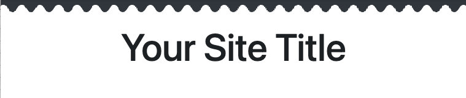
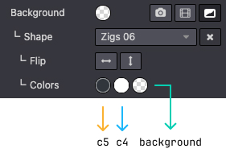
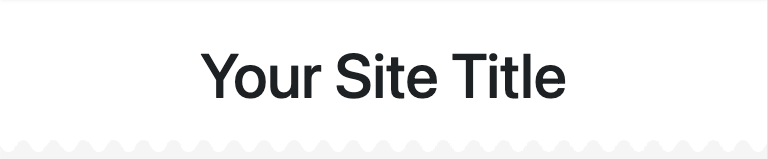
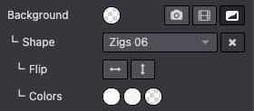
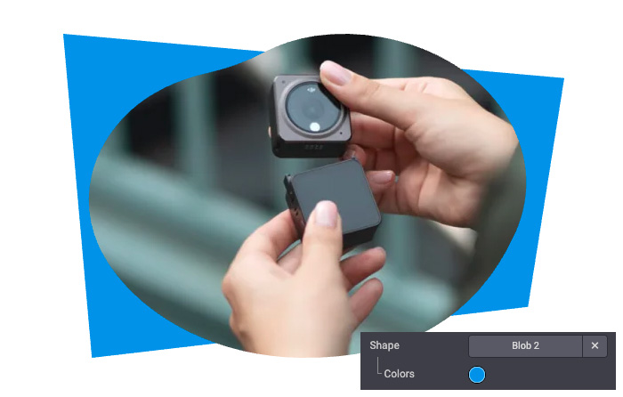
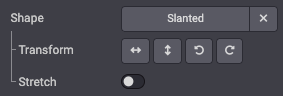
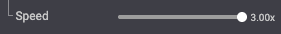
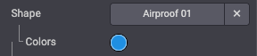
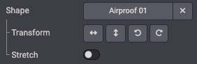

======
Shapes
======

Shapes are handy if you want to add personality to your website. In this chapter, you will learn
how to add standard and custom background/image shapes.

They are SVG files that you can add as a decorative background in your different
sections or directly on your images. Each shape has one or several customizable colors, and some of
them are animated.

.. warning::
   Odoo's default shapes use the `Odoo default colors palette <https://github.com/odoo/odoo/blob/b6628011e86f3c8469dea5452ecbce778ece0755/addons/html_editor/static/src/utils/color.js#L19>`_
   map as reference. This way, colors will be automatically adapted to a new
   :ref:`palette <theming/module/variables/colors>` everytime it changes:

   .. code-block:: scss

      default_palette = {
         '1': '#3AADAA',
         '2': '#7C6576',
         '3': '#F6F6F6',
         '4': '#FFFFFF',
         '5': '#383E45',
      }

.. _website_themes/shapes/bg:

Background shapes
=================

.. _website_themes/shapes/bg/standard:

Standard
--------

A large selection of default background shapes is available.

.. _website_themes/shapes/bg/standard/usage:

Usage
~~~~~

.. code-block:: xml

   <section data-oe-shape-data="{'shape':'html_builder/Zigs/06'}">
      

      

         <!-- Content -->
      

   </section>

`data-oe-shape-data` is a JSON object containing information about your shape like the location
of the SVG file, the repeat and flip options, etc.

For example, you can **flip the shape** horizontally or vertically by using the X or Y axis like
this:

.. code-block:: xml

   <section data-oe-shape-data="{'shape':'html_builder/Zigs/06','flip':['x','y']}">
      

      

          <!-- Content -->
      

   </section>

.. _website_themes/shapes/bg/standard/colors:

Colors mapping
~~~~~~~~~~~~~~

You can also change the default colors mapping of your shape either by switching colors in the
current map or by creating a alternate map without modifying the initial one.

.. _website_themes/shapes/bg/standard/colors/switch:

Switch colors mapping
*********************

First, we can use a shape like this:

.. code-block:: xml

   <svg xmlns="http://www.w3.org/2000/svg" xmlns:xlink="http://www.w3.org/1999/xlink" preserveAspectRatio="none" width="100%" height="100%">
      <defs>
         <svg id="zigs06_top" viewBox="0 0 30 30" preserveAspectRatio="xMinYMin meet" fill="#383E45" width="100%">
            <path d="M30,7.9C22.5,7.9,22.5,20,15,20S7.5,7.9,0,7.9V0h30V7.9z" />
         </svg>
         <svg id="zigs06_bottom" viewBox="0 0 30 30" preserveAspectRatio="xMinYMax meet" fill="#FFFFFF" width="100%">
            <path d="M0,22.1C7.5,22.1,7.5,10,15,10s7.5,12.1,15,12.1V30H0V22.1z" />
         </svg>
      </defs>
      <svg>
         <use xlink:href="#zigs06_top" />
         <use xlink:href="#zigs06_bottom" />
      </svg>
   </svg>

Here, we use `#383E45`  and `#FFFFFF` which corresponds to the 5th and 4th colors in the Odoo's
default color palette.

The shape is declared as follows in SCSS:

.. code-block:: sass
   :caption: ``/website_airproof/static/src/scss/primary_variables.scss``

   'Zigs/06': ('position': bottom, 'size': 30px 100%, 'colors': (4, 5), 'repeat-x': true),

The blackish color is used at the top (`c5`), the lightish (`c4`) at the bottom and in between,
the shape is simply transparent.

We are going to rewrite the `colors` map with some `key: value` couples:

**With color palette reference and custom color**

.. code-block:: scss
   :caption: ``/website_airproof/static/src/scss/primary_variables.scss``

    $o-bg-shapes: change-shape-colors-mapping('html_builder', 'Zigs/06', (4: 3, 5: rgb(187, 27, 152)))

**Or just with references**

.. code-block:: scss
   :caption: ``/website_airproof/static/src/scss/primary_variables.scss``

    $o-bg-shapes: change-shape-colors-mapping('html_builder', 'Zigs/06', (4: 3, 5: 1));

The `c4` (white) will be replaced by `c3` (whitish) and `c5` (black) by `c1` (white).

**Results**

.. _website_themes/shapes/bg/standard/colors/extra:

Add extra colors mapping
************************

Adding extra color mapping allows you to add a color variant to the template of a shape while
keeping the original.

.. code-block:: scss
   :caption: ``/website_airproof/static/src/scss/boostrap_overridden.scss``

   $o-bg-shapes: add-extra-shape-colors-mapping('html_builder', 'Zigs/06', 'second', (4: 3, 5: 1));

.. code-block:: xml

   <section data-oe-shape-data="{'shape':'html_builder/Zigs/06'}">
      

      

         <!-- Content -->
      

   </section>

.. _website_themes/shapes/bg/custom:

Custom
------

Sometimes, your design might require creating one or several custom shapes.

Firstly, you need to create an SVG file for your shape.

.. code-block:: xml
   :caption: ``/website_airproof/static/shapes/hexagons/01.svg``

   <svg version="1.1" xmlns="http://www.w3.org/2000/svg" width="86" height="100">
      <polygon points="0 25, 43 0, 86 25, 86 75, 43 100, 0 75" style="fill: #3AADAA;" />
   </svg>

.. important::
   Make sure to use colors from the default Odoo palette for your shape
   (as explained :ref:`above <website_themes/shapes/bg>`).

.. _website_themes/shapes/bg/custom/attachment:

Attachment
~~~~~~~~~~

Declare your shape file.

.. code-block:: xml
   :caption: ``/website_airproof/data/shapes.xml``

   <record id="shape_hexagon_01" model="ir.attachment">
      <field name="name">01.svg</field>
      <field name="datas" type="base64" file="website_airproof/static/shapes/hexagons/01.svg" />
      <field name="url">/html_editor/shape/illustration/hexagons/01.svg</field>
      <field name="public" eval="True" />
   </record>

.. list-table::
   :header-rows: 1
   :stub-columns: 1
   :widths: 20 80

   * - Field
     - Description
   * - name
     - Name of the shape
   * - datas
     - Path to the shape
   * - url
     - The location of your shape in the web editor. The file is automatically duplicated in
       `/html_editor/shape/illustration` by the Website Builder.
   * - public
     - Makes the shape available for later editing.

.. _website_themes/shapes/bg/custom/scss:

SCSS
~~~~

Define the styles of your shape.

.. code-block:: scss
   :caption: ``/website_airproof/static/src/scss/primary_variables.scss``

   $o-bg-shapes: map-merge($o-bg-shapes,
       (
           'illustration': map-merge(
               map-get($o-bg-shapes, 'illustration') or (),
               (
                   'hexagons/01': ('position': center center, 'size': auto 100%, 'colors': (1), 'repeat-x': true, 'repeat-y': true),
               ),
           ),
       )
   );

.. list-table::
   :header-rows: 1
   :stub-columns: 1
   :widths: 20 80

   * - Key
     - Description
   * - File location
     - `hexagons/01` corresponds to the location of your file in the `shapes` folder.
   * - position
     - Defines the position of your shape.
   * - size
     - Defines the size of your shape.
   * - colors
     - Defines the color c* you want it to have (this will override the color you specified in your
       SVG).
   * - repeat-x
     - Defines if the shape is repeated horizontally. This key is optional and only needs to be
       defined if set to `true`.
   * - repeat-y
     - Defines if the shape is repeated vertically. This key is optional and only needs to be
       defined if set to `true`.

.. _website_themes/shapes/bg/custom/option:

Add the option
~~~~~~~~~~~~~~

Lastly, add your shape to the list of shapes available on the Website Builder by extending the
`background_shape_groups_providers` resource.

.. code-block:: javascript
   :caption: ``/website_airproof/static/src/builder/background_shapes_option_plugin.js``

   import { Plugin } from "@html_editor/plugin";
   import { _t } from "@web/core/l10n/translation";
   import { registry } from "@web/core/registry";

   export class AirproofBackgroundShapesOptionPlugin extends Plugin {
      static id = "airproofBackgroundShapesOption";
      resources = {
         background_shape_groups_providers: () => ({
            airproof: {
               label: _t("Airproof"),
               subgroups: {
                  airproof: {
                     label: _t("Airproof"),
                     shapes: {
                        "website_airproof/waves/01": {
                           selectLabel: _t("Airproof 01"),
                        },
                     },
                  },
               },
            },
         }),
      };
   }

   registry.category("website-plugins").add(
      AirproofBackgroundShapesOptionPlugin.id,
      AirproofBackgroundShapesOptionPlugin
   );

.. note::
   Add the JavaScript file to the `website.website_builder_assets` bundle so the editor loads it.

.. _website_themes/shapes/bg/custom/use:

Use it into your pages
~~~~~~~~~~~~~~~~~~~~~~

In your XML pages, you can use your shape in the same way as the others.

.. code-block:: xml

   <section class="..." data-oe-shape-data="{'shape': 'illustration/airproof/01', 'colors': {'c4': '#8595A2', 'c5': 'rgba(0, 255, 0)'}}">
      

      

         <!-- Content -->
      

   </section>

You can also redefine colors using the `data-oe-shape-data` attribute, but this is optional.

.. _website_themes/shapes/img:

Image shapes
============

Image shapes are SVG files you can add as a clipping mask on your images. Some shapes have
customizable colors, and some are animated.

.. _website_themes/shapes/img/standard:

Standard
--------

A large selection of default image shapes is available.

.. _website_themes/shapes/img/standard/use:

Usage
~~~~~

A shape can only be applied on an image that has been previously declared in an `ir.attachment`
record as the Website Builder needs to re-process the image. To summarize, the system injects the
original image into a SVG file containing both the image and the shape.

.. code-block:: xml

   

Once the shape applied, the `img` includes different data attributes allowing the Website Builder
to re-process the image if it is edited again:

.. list-table::
   :header-rows: 1
   :stub-columns: 1
   :widths: 20 80

   * - Attribute
     - Description
   * - data-shape
     - Location of the shape
   * - data-shape-colors
     - Colors (5 max) applied to the shape (each value, even if empty, are separated by a semicolon)
   * - data-mimetype
     - Mimetype of the shaped image
   * - data-mimetype-before-conversion
     - Mimetype of the original image
   * - data-original-src
     - Path to the original image file
   * - data-file-name
     - Name of the file which is created after a shape modification (Always use `.svg` extension as
       the image shape is applied into an SVG file containing the shape and the original image).
   * - data-original-id
     - Identifier of the original `ir.attachment` (related to the uploaded image)
   * - data-attachment-id
     - Identifier of the `ir.attachment` related to the shaped image.

**Call the shape**

Insert a shaped image requires to call the processed attachment, not just the original image.
When a shape is manually applied with the Website Builder:

#. The original record is processed and the `src` attribute is updated with a `base64` image.
#. Once the page is saved, the base64 image is moved into the final SVG (specified in `data-file-name`).
#. Finally, the `src` attribute is updated with the following path structure:
   `/web/image/<attachment_id>-<attachment_checksum>/<finale_image>.svg`

But here are 2 issues:

#. Convert the final image into `base64` format is not that easy (as this is not really *human readable*).
#. The `checksum` computation of the final `ir.attachment` uses an algorithm.

In a way or another, an external tool would be required but the `html_editor` module provides a
controller with a useful route that can mix an image shape and an image file:

.. code-block:: python
   :emphasize-lines: 3

   @http.route([
      '/web_editor/image_shape/<string:img_key>/<module>/<path:filename>',
      '/html_editor/image_shape/<string:img_key>/<module>/<path:filename>'],
      type='http', auth="public", website=True)

.. seealso::
   `HTML Editor - Image shape route <https://github.com/odoo/odoo/blob/3e47cbf5a634a48ee22c223cc2c3c6a151ad350a/addons/html_editor/controllers/main.py#L583>`_

Focus on `/html_editor` path, which is the "new name" for the old Web Editor used
up to Odoo 18, and replace the placeholders with real data:

.. code-block:: xml
   :emphasize-lines: 2

   

.. important::
   Keep in mind that as long as the image is not saved manually with the Website Builder, it is not
   stored in the database as a record, **it is generated in real time for each visitor displaying
   the page**. So it can have an impact on the loading performances of the website.

.. _website_themes/shapes/img/standard/colors:

Colors
~~~~~~

The image shapes can include up to 5 colors. As the SVG file contains colors related to the Odoo
default colors palette, the system is able to map the colors existing in the file and match the ones
called in the `data-shape-colors` attribute of the image.

.. code-block:: xml
   :emphasize-lines: 6

   

In the example above, the color `#0B8EE6` is applied as the first color of the palette. Considering
the first color in the default palette is `#3AADAA`, the Website Builder replaces `#3AADAA` by
`#0B8EE6`.

.. _website_themes/shapes/img/standard/transform:

Transformations & Stretch
~~~~~~~~~~~~~~~~~~~~~~~~~

Some shapes can be adjusted with transformations (Flip, rotate):

.. code-block:: xml
   :emphasize-lines: 6-8

   

.. list-table::
   :header-rows: 1
   :stub-columns: 1
   :widths: 20 80

   * - Attribute
     - Description
   * - data-shape-flip
     - Flips the shape along the x-axis(`x`), y-axis(`y`) or both(`xy`).
   * - data-shape-rotate
     - Rotates the shape by 90 degrees (`90`, `180`, `270`).
   * - data-aspect-ratio
     - Stretch the shape to the image ratio: `1/1` (by default, the image fills the shape) or `0/0`
       (:guilabel:`Stretch` option is enabled and the shape fits the image aspect ratio)

.. _website_themes/shapes/img/standard/animation:

Animation
~~~~~~~~~

Some shapes are animated and their velocity can be adjusted:

.. code-block:: xml
   :emphasize-lines: 6

   

.. list-table::
   :header-rows: 1
   :stub-columns: 1
   :widths: 20 80

   * - Attribute
     - Description
   * - data-shape-animation-speed
     - Animation velocity (Range from `-2` to `2` with steps of `0.1`)

.. _website_themes/shapes/img/custom:

Custom
------

The creation of a custom image shape is quite simple and relies on 2 steps:
#. Create an SVG file with a specific structure
#. Add the custom shape to the list

.. _website_themes/shapes/img/custom/svg:

Create the SVG
~~~~~~~~~~~~~~

Firstly, create an SVG file for your image shape.

.. code-block:: xml
   :caption: ``/website_airproof/static/image_shapes/duo/01.svg``

   <svg xmlns="http://www.w3.org/2000/svg"
      xmlns:xlink="http://www.w3.org/1999/xlink"
      width="800"
      height="800">
      <defs>
         <!-- Mask -->
         <clipPath id="clip-path" clipPathUnits="objectBoundingBox">
            <use xlink:href="#filterPath" fill="none" />
         </clipPath>
         <!-- Vector used in the mask definition (Clip-path) -->
         <path id="filterPath" d="M0.325,0.75H0.125c-0.069,0-0.125-0.056-0.125-0.125V0.125C0,0.056,
         0.056,0,0.125,0h0.2c0.069,0,0.125,0.056,0.125,0.125v0.5c0,0.069-0.056,0.125-0.125,0.125ZM1,
         0.875v-0.5c0-0.069-0.056-0.125-0.125-0.125h-0.2c-0.069,0-0.125,0.056-0.125,0.125v0.5c0,
         0.069,0.056,0.125,0.125,0.125h0.2c0.069,0,0.125-0.056,0.125-0.125Z" />
      </defs>

      <!-- Other decorative element around (not used as a mask) -->
      <svg viewBox="0 0 1 1" preserveAspectRatio="none">
         <rect x="0.494"
            y="0.325"
            width="0.0125"
            height="0.35"
            rx="0.00625"
            ry="0.00625"
            fill="#7C6576" />
      </svg>

      <!-- Preview of the Path declared in the <defs> -->
      <svg viewBox="0 0 1 1" id="preview" preserveAspectRatio="none">
         <use xlink:href="#filterPath" fill="darkgrey" />
      </svg>

      <!-- Future image that on wich the mask is applied -->
      <image xlink:href="" clip-path="url(#clip-path)">
         <!-- Compatibility hack (Safari, Firefox) for non-animated shapes -->
         <animateMotion dur="1ms" repeatCount="indefinite" />
      </image>
   </svg>

The SVG file can be created in any vector editing software but requires some adaptations to work
properly with the Website Builder. Let's break down the example above.

**Main SVG**

The Image Shape is wrapped into a single main SVG object with explicit `width` and `height` attributes
in pixels:

.. code-block:: xml
   :emphasize-lines: 4-5

   <svg
      xmlns="http://www.w3.org/2000/svg"
      xmlns:xlink="http://www.w3.org/1999/xlink"
      width="800"
      height="800">
      ...
   </svg>

**Mask**

The mask is defined into a `<defs>` tag in order to be reusable (even if it's not). It's compound
by 2 elements : a `clip-path` and a vector (a `path` in our shape).At this step, what's set into
`defs` does not appear.

.. code-block:: xml

   <defs>
      <!-- Mask -->
      <clipPath id="clip-path" clipPathUnits="objectBoundingBox">
         <use xlink:href="#filterPath" fill="none" />
      </clipPath>
      <!-- Vector used in the mask definition (Clip-path) -->
      <path id="filterPath" d="M0.325,0.75H0.125c-0.069,0-0.125-0.056-0.125-0.125V0.125C0,0.056,
      0.056,0,0.125,0h0.2c0.069,0,0.125,0.056,0.125,0.125v0.5c0,0.069-0.056,0.125-0.125,0.125ZM1,
      0.875v-0.5c0-0.069-0.056-0.125-0.125-0.125h-0.2c-0.069,0-0.125,0.056-0.125,0.125v0.5c0,
      0.069,0.056,0.125,0.125,0.125h0.2c0.069,0,0.125-0.056,0.125-0.125Z" />
   </defs>

**Additional decorations**

If the shape contains any other decorative element, they are set into the main SVG but outside the
`defs`

.. code-block:: xml

   <svg viewBox="0 0 1 1" preserveAspectRatio="none">
      <rect
         x="0.494"
         y="0.325"
         width="0.0125"
         height="0.35"
         rx="0.00625"
         ry="0.00625"
         fill="#7C6576" />
   </svg>

.. tip::
   The main SVG has `width` and `height` attributes expressed in pixels (800 in this example) but
   the viewBox is always normalized to values between 0 and 1. As the SVG is a scalable format, it
   ensures the image to be sharp no matter its rendered size.

This decoration has a `fill` color that can be edited with the Website Builder:

.. important::

   Do not forget to use a color coming from the Odoo default colors palette to make it editable by
   the Website Builder (as explained :ref:`above <website_themes/shapes/bg>`).

**Preview**

Then render the mask in a "preview" by using a reference to the `ìd` set before (`filterPath`):

.. code-block:: xml

   <svg viewBox="0 0 1 1" id="preview" preserveAspectRatio="none">
      <use xlink:href="#filterPath" fill="darkgrey" />
   </svg>

**Image**

Finally, add an `image` tag with a `clip-path` reference. It will receive your future image (in
`base64` format).

.. code-block:: xml

   <image xlink:href="" clip-path="url(#clip-path)">
      <!-- Compatibility hack (Safari, Firefox) for non-animated shapes -->
      <animateMotion dur="1ms" repeatCount="indefinite" />
   </image>

.. tip::
   Feel free to `run this tool <{GITHUB_PATH}/addons/html_builder/static/image_shapes/convert-to-percentages.html>`_
   in your browser to convert your source SVG file into an image shape compatible file.

.. _website_themes/shapes/img/custom/option:

Add it to the list
~~~~~~~~~~~~~~~~~~

Finally, add the custom shape to the list:

.. code-block:: javascript
   :caption: ``/website_airproof/static/src/website_builder/image_shapes_option_plugin.js``

   import { Plugin } from "@html_editor/plugin";
   import { _t } from "@web/core/l10n/translation";
   import { registry } from "@web/core/registry";
   export class AirproofImageShapesOptionPlugin extends Plugin {
      static id = "airproofImageShapesOption";
      resources = {
         image_shape_groups_providers: () => ({
            airproof: {
               label: _t("Airproof"),
               subgroups: {
                  airproof_duo: {
                     label: _t("Duo"),
                     shapes: {
                        "website_airproof/duo/01": {
                           selectLabel: _t("Airproof 01"),
                           transform: true,
                           togglableRatio: true,
                        },
                     },
                  },
               },
            },
         }),
      };
   }

   registry.category("website-plugins").add(
      AirproofImageShapesOptionPlugin.id,
      AirproofImageShapesOptionPlugin
   );

.. list-table::
   :header-rows: 1
   :stub-columns: 1
   :widths: 20 80

   * - Property
     - Description
   * - selectLabel
     - Name of the shape displayed in the list
   * - transform
     - Show/hide the transformation option (vertical and horizontal mirror, left and right rotation).
   * - togglableRatio
     - Show/hide the stretch option.
   * - animated
     - Indicates if the shape contains some animations
   * - imgSize
     - Set the image ratio used for :guilabel:`Devices` (example: `0.46:1`)

   Transform and Stretch options

.. _website_themes/shapes/img/custom/use:

Use it into your pages
~~~~~~~~~~~~~~~~~~~~~~

Custom image shapes can be now applied on images, for example, in your static pages:

.. code-block:: xml

   
