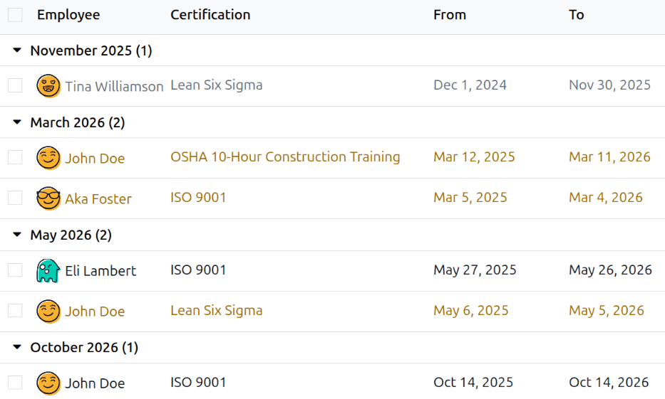

==============
Certifications
==============

When jobs require specific knowledge, training, or certifications, it is necessary to track
employees' certifications to ensure they are properly trained and that the necessary documentation
is in place.

When jobs require specific knowledge, track employee certifications (e.g., classes, tests, seminars)
to verify required skills. Odoo accepts any certification type without restriction.

.. important::
   To add certifications to an employee profile and to access the *Certifications* report, the
   **Surveys** app **must** be installed.

Create certifications
=====================

No certifications are preconfigured in Odoo's **Employees** app; therefore, all certifications must
be added to the database. To create a certification, navigate to the :menuselection:`Employees app
--> Configuration --> Skill Types`. Click the :guilabel:`New` button in the upper-left corner, and a
blank *Skill Types* form loads.

Enter the following information on the form:

- :guilabel:`Skill Type`: Enter the type of certification being added. This acts as the *category*,
  and individual certifications are nested beneath it.
- :guilabel:`Color`: Click on the existing color to view the available colors. Click the desired
  color to select it.
- :guilabel:`Certification`: Click the toggle to indicate the skill is a certification. The toggle
  turns green when it is active.
- :guilabel:`Skills`: Click :guilabel:`Add a line` and enter the :guilabel:`Name` for the specific
  certification.
- :guilabel:`Levels`: Click :guilabel:`Add a line`, and enter a :guilabel:`Name` and
  :guilabel:`Progress` percentage (`0`-`100`) for each level. Set a :guilabel:`Default Level` by
  clicking the toggle on the desired line (only one level can be selected).

.. example::
   A United States-based company requires its employees to complete various :abbr:`OSHA
   (Occupational Safety and Health Administration)` training and certify that the training is
   complete.

   The company creates a new skill type and enters :guilabel:`OSHA Training` in the :guilabel:`Skill
   Type` field.

   The various courses are entered in the *Skills* section, including :guilabel:`OSHA 3115 - Fall
   Protection`, :guilabel:`OSHA 3095 - Electrical Standards`, and more.

   There is only one level in the *Levels* section, :guilabel:`Certified`, which is set to
   :guilabel:`100%`.

   .. image:: certifications/osha.png
      :alt: The skill type form configured for various OSHA training courses.

View certifications
===================

To view a full list of all employee certifications, navigate to the :menuselection:`Employees app
--> Learning --> Certifications`.

All certifications appear in a list view, grouped by certification *type*. Each certification entry
displays the following:

- :guilabel:`Employee`: The employee's name, along with their avatar image.
- :guilabel:`Certification`: The name of the certification.
- :guilabel:`From`: When the employee received the certification.
- :guilabel:`To`: The date the certification expires. If the certification has no expiration date,
  :guilabel:`Indefinite` appears in this field.

.. image:: certifications/employee-certifications.png
   :alt: The list of employee certifications.

.. important::
   **Only** skill type records with the *Certification* toggle set to active appear on the
   :guilabel:`Certifications` report. All other certifications appear in the resume section of the
   :ref:`employee form <employees/resume>`.

View certifications by expiration status
----------------------------------------

When managing a large number of employees with a variety of certifications, it can be difficult to
determine which employees need to keep necessary certifications current in the default list view. In
this scenario, it is beneficial to view the certifications by expiration status.

To do so, navigate to the :menuselection:`Employees app --> Learning --> Certifications`. Next,
clear the default :icon:`oi-group` :guilabel:`Type` grouping in the search bar. Next, click the
:icon:`fa-caret-down` :guilabel:`(Toggle Search Panel)` icon, then click :guilabel:`Custom Group`
:icon:`fa-caret-down`, to reveal a drop-down menu. Click :guilabel:`Validity Stop`, then click away
from the drop-down menu to close it.

After doing so, all the certifications are grouped by expiration month, in descending order, with
the oldest at the top.

The entries are color-coded. Current certifications that are still valid appear in black, expired
certifications appear in gray, and certifications that are going to expire within the next 90 days
appear in orange.

.. tip::
   The time frame can be set to either :guilabel:`Year`, :guilabel:`Quarter`, :guilabel:`Week`, or
   :guilabel:`Day`. To change the presented time frame groups, click the search bar, then click
   :icon:`fa-check` :guilabel:`Validity Stop` :icon:`fa-caret-down`, and select the desired time
   frame.

.. _employees/certifications-form:

Log a certification
===================

To log a certification for an employee, navigate to the :menuselection:`Employees app --> Learning
--> Certifications`. Click :guilabel:`New` to load a blank certification form. Enter the following
information on the form:

- :guilabel:`Employee`: Select the employee who received the certification using the drop-down menu.
- :guilabel:`Category`: Click the *type* of certification received.
- :guilabel:`Skill`: Select the specific certification received. The presented options change if the
  :guilabel:`Category` is changed.
- :guilabel:`Skill Level`: If the selected certification has a set of *skill levels*, those levels
  appear in this section. Click on a level to select the level achieved from the certification.
- :guilabel:`Validity`: Set the validity start and end dates in the two fields. The current date is
  populated in the first field, and :guilabel:`indefinite` is populated in the :guilabel:`To` field,
  by default.

Once all the fields are configured, click the :guilabel:`Save` button. The certification is logged
for the employee, and appears on the *Certifications* report and the employee record.

.. image:: certifications/add-cert.png
   :alt: A certification form filled out for a 10-hour OSHA safety course.

Certifications Report
=====================

To view a report of all employee certifications, navigate to the :menuselection:`Employees app -->
Reporting --> Certifications`.

All certifications appear in a list view, grouped by employee. Each certification entry displays the
following:

- :guilabel:`Employee`: The employee's name, along with their avatar image.
- :guilabel:`Certification Type`: The *skill type* configured for the certification. This can be
  thought of as the certification *category*.
- :guilabel:`Certification`: The name of the certification.
- :guilabel:`Validity Start`: When the employee received the certification.
- :guilabel:`Certification Level`: The level the employee achieved for the certification. This is
  determined by the configured levels on the *skill type*.
- :guilabel:`Current Level`: The corresponding percentage for the :guilabel:`Certification Level`
  the employee achieved.

.. image:: certifications/certifications-list.png
   :alt: The list of employee certifications.

.. important::
   **Only** certification records with the *Display Type* set to *Certification* on their
   :ref:`certification form <employees/certifications-form>` appear on the :guilabel:`Employee
   Certifications` report. All other certifications appear in the resume section of the
   :ref:`employee form <employees/resume>`.
