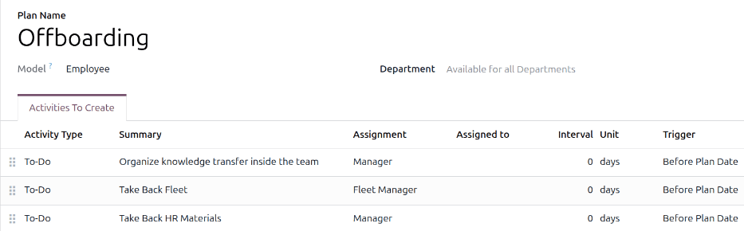
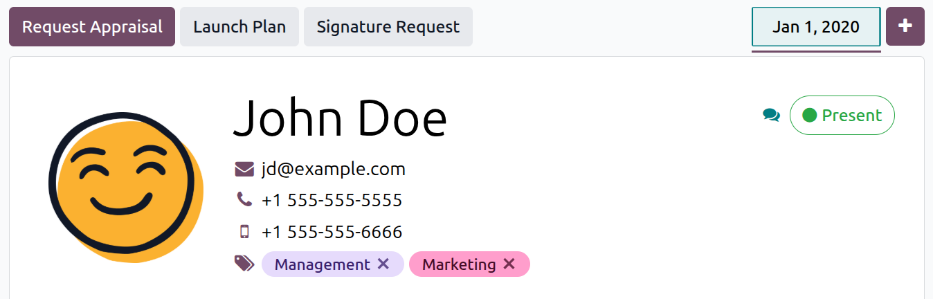

===========
Offboarding
===========

When an employee leaves the company, it is important to have an :ref:`offboarding plan
<employees/offboarding>` to ensure all necessary steps are followed, such as returning equipment,
revoking access to business systems, filling out HR forms, having an exit interview, and more.
Depending on the company, there could be several different offboarding plans, configured for
specific departments or divisions, that have different requirements and steps from the main
offboarding plan.

In addition to an offboarding plan, the employee record must be :ref:`updated to reflect their
departure <employees/archive>`, log the reason why they left, and close any open activities
associated with the employee.

.. _employees/offboarding:

View offboarding plan
=====================

Before offboarding can begin, it is recommended to check the default offboarding plan that comes
preconfigured with the **Employees** app. To view the current default plan, navigate to
:menuselection:`Employees app --> Configuration --> Onboarding / Offboarding`. Click
:guilabel:`Offboarding` to view the detailed offboarding plan form.

.. _employees/offb-plan-form:

Offboarding plan steps
----------------------

The default :guilabel:`Offboarding` plan is minimal, with two default steps (three if the **Fleet**
app is installed). All steps are *To-Do* activities, and are scheduled for the day the offboarding
plan is launched (:guilabel:`0 days Before Plan Date`). The default steps are:

- :guilabel:`Organize knowledge transfer inside the team`: The manager must ensure all knowledge the
  employee has relating to their job position is either documented or shared with colleagues so
  there is no knowledge gap.
- :guilabel:`Take Back Fleet`: The fleet manager ensures any vehicles assigned to the employee are
  either :ref:`unassigned (available for other employees) or the next driver is assigned
  <fleet/new_vehicle/new-driver>`. This step only appears if the **Fleet** app is installed.
- :guilabel:`Take Back HR Materials`: The manager must obtain any documents and materials the HR
  department requires. It is recommended to check with the HR department to ensure everything
  required for this step is completed.

Modify offboarding plan
=======================

The default offboarding plan is minimal, so that modifications can be made to accommodate any
company's offboarding needs. Every company has different requirements, therefore it is necessary to
add the required steps to the offboarding plan.

If the offboarding plan is universal, add or modify the default offboarding plan. If the offboarding
plan needed is only for a specific department, then :ref:`a new plan should be created
<employees/new-offboarding>`, specifically for that department.

To modify the default plan, first navigate to :menuselection:`Employees app --> Configuration -->
Onboarding / Offboarding`, then click on :guilabel:`Offboarding`.

To modify a step, click on the step and an *Open: Activities* pop-up window appears. Make any
desired modifications to the step, then click :guilabel:`Save` to accept the changes and close the
pop-up window.

To add a new step, click :guilabel:`Add a line` at the bottom of the listed activities in the
:guilabel:`Activities To Create` tab, and a blank :guilabel:`Create Activities` pop-up window
appears. Enter all the information in the pop-up window, then click :guilabel:`Save & Close` if
there are no other steps to add, or click :guilabel:`Save & New` if more steps are needed.

Configure all the desired steps for the offboarding plan.

.. _employees/new-offboarding:

Create offboarding plan
=======================

For some companies, specific offboarding plans may be necessary for some departments. For these
cases, a new department-specific offboarding plan may be needed.

To create a new onboarding plan, navigate to :menuselection:`Employees app --> Configuration -->
Onboarding / Offboarding`. Click the :guilabel:`New` button in the upper-left corner, and a blank
*Employee Plans* form loads.

Enter the :guilabel:`Plan Name`, and select the :guilabel:`Department` using the drop-down menu.
This creates a plan *exclusively* for that department.

Add the various offboarding activities by clicking :guilabel:`Add a line` in the *Activities To
Create* tab, and :ref:`configure each activity <employees/offb-plan-form>`.

Enter the following information on the form:

- :guilabel:`Plan Name`: The specific name for the plan.
- :guilabel:`Model`: This field specifies where this plan can be used. In this case, in the
  **Employees** app. This field is not able to be modified.
- :guilabel:`Department`: If left blank (the default setting) the plan is available for all
  departments. To make the plan department-specific, select a department using the drop-down menu.

Next, add the various steps for the plan by clicking :guilabel:`Add a line` at the bottom of the
listed activities in the *Activities To Create* tab, and a blank *Create Activities* pop-up window
appears.

Enter the following information in the pop-up window:

- :guilabel:`Activity Type`: Using the drop-down menu, select the specific activity to be scheduled.
  The default options are :guilabel:`To-Do`, :guilabel:`Email`, :guilabel:`Call`,
  :guilabel:`Meeting`, :guilabel:`Document`, or :guilabel:`Certifications`. If the **Sign** app is
  installed, a :guilabel:`Signature` option is available.
- :guilabel:`Summary`: Enter a short description for the step.
- :guilabel:`Assignment`: Using the drop-down menu, select the person assigned to perform the
  activity. The default options are: :guilabel:`Ask at launch`, :guilabel:`Default user`,
  :guilabel:`Coach`, :guilabel:`Manager`, and :guilabel:`Employee`. If the **Fleet** app is
  installed, a :guilabel:`Fleet Manager` option is available.

  .. note::
     The selection for the :guilabel:`Assignment` role is in relation to the employee. If
     :guilabel:`Coach` is selected, the employee's coach is assigned to the activity.

     If :guilabel:`Default user` is selected, an :guilabel:`Assigned to` field appears. Using the
     drop-down menu, select the user who will always be assigned this activity.

- :guilabel:`Interval`: Configure the fields in this line to determine the due date of the activity.
  Enter a number in the first field, then, using the drop-down menus in the following two fields,
  configure when the due date should be created; (`#`) of :guilabel:`days`, :guilabel:`weeks`, or
  :guilabel:`months`, either :guilabel:`Before Plan Date` or :guilabel:`After Plan Date`.

When the :guilabel:`Create Activities` form is completed, click :guilabel:`Save & Close` if there
are no other steps to add, or click :guilabel:`Save & New` to add more steps, as needed.

.. example::
   A company specializing in after-school art programs has two separate offboarding plans, one for
   the teachers working in the field, and one for office workers.

   The offboarding plan for the teachers is set for the :guilabel:`Art Program Teachers` department,
   and includes specialized tasks relating to those jobs. These include ensuring all art supplies
   are catalogued and returned, all student feedback forms are turned in, and all access badges and
   keys for the various locations are returned.

   .. image:: offboarding/offboarding-teachers.png
      :alt: An offboarding plan configured for art teachers.

Launch offboarding plan
=======================

After an employee has given notice (typically two weeks) or once the company has decided to
terminate the working relationship with the employee, the offboarding plan should be launched.
Navigate to the :menuselection:`Employees app` and click on the departing employee profile. Click
the :guilabel:`Launch Plan` button, and a blank *Launch Plan* pop-up window loads.

The top of the screen displays a button for each available plan, as well as a button for the various
available activities. Click the desired offboarding plan to select it. Then, using the calendar
selector, set a date in the :guilabel:`Due Date` field. This is typically the employee's last day,
but any date can be selected.

The *Plan Summary* section of the *Launch Plan* pop-up window displays all the steps in the selected
plan, along with the user icon for the person assigned to each activity.

Click the :guilabel:`Schedule` button, and Odoo schedules everything in the plan, according to their
respective due dates.

.. _employees/archive:

Archive an employee
===================

In Odoo, when an employee leaves the company they must be *archived*. This step should be done
*after* the employee has been fully offboarded. To archive an employee, first navigate to the
:menuselection:`Employees app`. From here, locate the employee who is leaving the company, and click
on their employee card.

The employee form loads, displaying all their information. Click the :icon:`fa-gear`
:guilabel:`(gear)` icon in the top-left corner, and a drop-down menu appears. Click
:icon:`oi-archive` :guilabel:`Archive`, and an *Employee Termination* pop-up window appears.

Fill out the following fields on the form:

- :guilabel:`Employees`: The selected employee populates this field by default. Multiple employees
  can be archived at once by adding the additional employees to archive in this field.
- :guilabel:`Departure Reason`: Select a reason the employee is leaving from the drop-down menu. The
  default options are:

  - :guilabel:`Fired`: Select this option when an employee is being let go, and the company has
    given notice.
  - :guilabel:`Resigned`: Select this option when the employee no longer wishes to be employed, and
    the employee has given notice.
  - :guilabel:`Retired`: Select this option when the employee is retiring.

  .. note::
     If a new departure reason is needed, a new one can be created. Close the *Employee Termination*
     pop-up window, and navigate to :menuselection:`Employees app --> Configuration --> Departure
     Reasons`. Click the :guilabel:`New` button, and a blank line appears at the bottom of the list.
     Enter the new reason, and click :guilabel:`Save`.

- :guilabel:`Contract End Date`: Using the calendar selector, select the last day the employee is
  working for the company.
- :guilabel:`Detailed Reason`: Enter a short description for the employee's departure in this field.
- :guilabel:`Close Activities`: Click the checkbox next to each type of activity to close or delete
  any open activities associated with it. It is recommended to click **all** checkboxes that are
  applicable. The available options are:

  - :guilabel:`Contract`: Applies an end date for the current contract.
  - :guilabel:`Company Car`: Removes the employee as the driver for their current company car, and
    :ref:`assigns the next driver <fleet/new_vehicle/new-driver>`, if applicable.
  - :guilabel:`Equipment`: Unassigns the employee from any assigned equipment.
  - :guilabel:`Appraisals`: Cancels all appraisals scheduled after the contract end date.

When the form is complete, click :guilabel:`Apply`. The employee record is archived, and a red
:guilabel:`Archived` banner appears in the top-right corner of the employee form. The chatter logs
the various details, including the :guilabel:`Departure Date`, :guilabel:`Departure Reason`,
:guilabel:`Contract End Date`, the dates for the last work entries, and the employee version that
was archived.

.. image:: offboarding/termination.png
   :alt: The employee termination form with all fields filled out.

.. note::
   If any issues exist that prevent Odoo from archiving the employee, the detailed reasons appear in
   a red warning box in the *Employee Termination* pop-up window. The warning states `The plan
   "(Plan Name)" cannot be launched`, then lists the various steps that must be done before
   archiving the employee.
