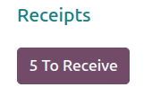
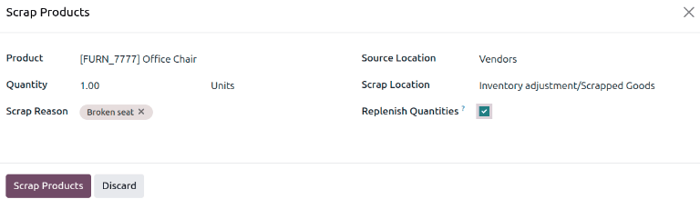

===============
Scrap inventory
===============

.. |SP| replace:: :abbr:`SP (Scrap Order)`
.. |SPs| replace:: :abbr:`SPs (Scrap Orders)`

Sometimes, products in a company's warehouse stock might be found to be damaged or defective, past
the point of being reparable. If it is not possible to repair the product, or return the product to
a vendor, it can be scrapped.

Odoo *Inventory* allows users to scrap inventory, designating goods or materials that are no longer
usable or sellable for disposal (or recycling).

Scrapping inventory in a database helps stock counts remain accurate by removing scrapped products
from physical inventory and placing them in a virtual *Inventory Loss* location.

.. note::
   *Virtual locations* in Odoo are **not** real, physical spaces in a warehouse. Rather, they are
   designated locations in a database that provide tracking of items that shouldn't be counted in a
   physical inventory.

   For more information about virtual locations, see the documentation about the different types of
   :ref:`location types <inventory/warehouses_storage/location-type>`.

Create a scrap location
=======================

By default, scrap operations are recorded in the :guilabel:`Inventory adjustment` virtual location.
However, if the scrapped products need to be recorded in the *Profit and Loss* accounting report, it
is possible to create an :guilabel:`Inventory Loss` location specifically for tracking scrapped
goods. If scrapped goods don't need to be tracked for reporting purposes, :ref:`create a scrap order
from stock <inventory/scrap-from-stock>`.

To create a new :guilabel:`Inventory Loss` location specifically for scrapped goods, first, open
:menuselection:`Inventory app --> Configuration --> Settings`. In the :guilabel:`Warehouse` section,
enable :guilabel:`Storage Locations`. Be sure to click :guilabel:`Save`.

To create a new scrap location, open :menuselection:`Inventory app --> Configuration --> Locations`.
By default, this list is filtered by :guilabel:`Internal` locations. To see all locations, remove
the :guilabel:`Internal` filter. Click the :guilabel:`New` button to create a new location.

The location form opens. Specify a :guilabel:`Location Name` and :guilabel:`Parent Location`. Update
the :guilabel:`Location Type` to :guilabel:`Inventory Loss`. If working in a multi-company database,
specify a :guilabel:`Company`. Optionally, specify a :guilabel:`Loss Account` to ensure that
products scrapped to this location show up in the *Profit and Loss* accounting report.

.. example::
   A company creates a new `Scrapped Goods` location, with the parent location being `Inventory
   adjustment`. The :guilabel:`Location Type` is set to :guilabel:`Inventory Loss`. To ensure the
   scrapped products show up in the *Profit and Loss* accounting report, they specify `600000
   Expenses` as the :guilabel:`Loss Account`.

   .. image:: scrap_inventory/new-scrap-location.png
      :alt: Optionally create a Scrapped Goods inventory loss location.

.. seealso::
   :doc:`../../inventory_valuation/scrapped_inventory_valuation`

.. _inventory/scrap-from-stock:

Scrap from stock
================

To create a new scrap order (SP) for an in-stock product, navigate to :menuselection:`Inventory app
--> Operations --> Scrap`, and click :guilabel:`New`. This opens a new |SP| form.

Click the drop-down menu in the :guilabel:`Product` field, and select the product that should be
scrapped from inventory. In the :guilabel:`Quantity` field, change the value to the quantity of the
product that should be scrapped (by default, this value is set to `1.00`).

The :guilabel:`Source Location` defaults to the location where the product is currently stored. The
:guilabel:`Scrap Location` defaults to :guilabel:`Inventory adjustment`. Either of these locations
can be changed by selecting a different location from their respective drop-down menus.

If the scrapping is tied to a specific existing operation, specify the operation in the
:guilabel:`Source Document` field.

The :guilabel:`Company` field displays the company whose warehouse this product belongs to. If a
replenishment rule is set up for the product being scrapped, and if the product should be
replenished, select the checkbox for :guilabel:`Replenish Quantities`.

Optionally specify a :guilabel:`Scrap Reason`.

Once ready, click :guilabel:`Validate` to complete the new |SP|.

.. image:: scrap_inventory/scrap-inventory-new-scrap-order.png
   :alt: Filled out new scrap order form with product details.

Once validated, a :icon:`fa-exchange` :guilabel:`Product Moves` smart button appears at the top of
the form. Click the smart button to view the details of the scrap operation.

.. tip::
   To view the all-time total quantities of scrapped items, navigate to :menuselection:`Inventory
   app --> Operations --> Scrap Orders`. A list of all scrapped products, and their quantities, is
   displayed.

   .. image:: scrap_inventory/scrap-inventory-current-stock.png
      :alt: List of all scrapped products in inventory.

Scrap from an existing operation
================================

Scrap orders (SPs) can *also* be created from existing operations, such as receipts, delivery
orders, and internal transfers, before they are entered into, or removed from, stock for an
operation.

To scrap a product during an operation, navigate to the :menuselection:`Inventory app`. From the
:guilabel:`Inventory Overview`, click the :guilabel:`# To Process` button on an operation's task
card (i.e. the :guilabel:`Receipts` task card).

Then, select an operation to process from the resulting list of existing orders. Doing so opens that
operation's form.

Click the :icon:`fa-cog` :guilabel:`(Actions)` icon, and select :guilabel:`Scrap` from the resulting
drop-down menu. This opens a :guilabel:`Scrap Products` pop-up window.

From this pop-up window, click the drop-down menu in the :guilabel:`Product` field, and select the
products from the operation that should be scrapped. Adjust the value in the :guilabel:`Quantity`
field, if necessary. Optionally specify a :guilabel:`Scrap Reason`.

If the :guilabel:`Product` selected is tracked using a lot or serial number, a
:guilabel:`Lot/Serial` field appears. Specify the tracking number in that field.

The :guilabel:`Source Location` and :guilabel:`Scrap Location` can be changed, if needed. If a
replenishment rule is set up for the product being scrapped, and if the product should be
replenished, select the checkbox for :guilabel:`Replenish Quantities`.

Once ready, click :guilabel:`Scrap Products`.

After products have been scrapped from an operation, a :icon:`oi-arrows-v` :guilabel:`Scraps` smart
button appears at the top of the operation form. Click this smart button to view the details of all
scrap orders created from this specific operation.
