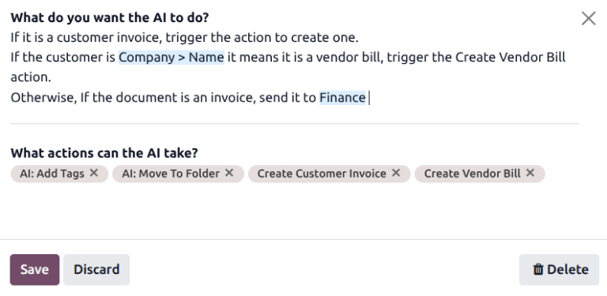

================
AI document sort
================

.. |AI| replace:: :abbr:`AI (artificial intelligence)`

Odoo |AI| Document Automation enables automated classification, routing, and processing of documents
using artificial intelligence. It reduces manual handling of documents such as invoices, contracts,
:abbr:`NDAs (Non-Disclosure Agreements)`, and insurance files by automatically sorting them into
folders, extracting key information, and triggering business actions.

This feature is designed for high-volume, repetitive document workflows where speed, accuracy, and
traceability are critical, while still allowing human intervention when required.

Configuration
=============

To use the |AI| document automation, ensure the following requirements are met:

- The **Documents** application is installed, and the correct permissions are applied.
- The relevant applications are installed. This can include **Accounting**, **Purchase**, **Sales**,
  etc. The applications installed impact the prompts that are applied to the documents.

.. note::
   The **AI** app does not need to be installed to utilize the documentation automation. However,
   the types of |AI| automation actions available are dependent on the other apps installed in the
   database. For example, to create an invoice, the **Accounting** app must be installed.

Documents app overview
======================

The **Documents** application functions as a centralized document management system similar to a
shared drive. It is organized into the following workspaces at a minimum, though additional
workspaces can be created:

- :guilabel:`All`: displays all folders and files the user has access to.
- :icon:`fa-building` :guilabel:`Company`: contains folders and files shared across the company.
  Access is determined by the :ref:`access rights <documents/access-rights>` defined for the folder
  and file.
- :icon:`fa-hdd-o` :guilabel:`My Drive`: the user's personal workspace for organizing and accessing
  files and folders they own or have uploaded.
- :icon:`fa-users` :guilabel:`Shared with me`: includes files that have been shared with the user,
  but are not part of any parent folder they have access to.

Documents typically follow a workflow from the Inbox into structured folders, where |AI| automation
and business actions are applied.

AI auto sort overview
=====================

|AI| Auto-Sort operates at the folder level. Each folder in the **Documents** app can contain its
own automation logic, allowing you to design document flows that reflect your internal processes.
Instead of applying a single global rule, automation is structured progressively: documents enter a
folder, |AI| evaluates them according to the folder's prompt, and then performs the corresponding
action.

Configuring prompts
-------------------

To configure a prompt for a folder, navigate to the :menuselection:`Documents app` and select a
folder from the tree on the left. Then, click the :icon:`fa-cog` :guilabel:`Actions` icon at the top
of the page. Use the drop-down menu to select :guilabel:`AI Auto-sort`.

.. image:: document_sort/actions-menu.png
   :alt: The actions menu in a folder within the Documents app.

On the *What do you want the AI to do?* pop-up, craft a :ref:`prompt <ai/agents/prompts-in-odoo>`
that explains how documents should be interpreted and what should happen next.

.. note::
   Type `/` to utilize either :guilabel:`Field Selector` and :guilabel:`Records Selector` to insert
   fields or records to enhance the prompt.

Below the prompt, click the :guilabel:`What actions can the AI take?` field, and select one or more
actions from the drop-down menu. The available actions will vary based on the applications
installed.

Based on these instructions, |AI| can move documents to another folder, add tags, trigger
activities, or create business records such as invoices or vendor bills. This makes each folder both
a storage location and a decision point in the workflow.

When configuring the primary prompt, folders can include instructions to handle exceptions or
validation steps before the primary logic is executed. For example, a folder may first verify
whether a required value exists in the document before proceeding with automation.

.. example::
   A user wants to identify any PDFs that contain multiple pages, and would need to be manually
   split. They add the following instructions to the beginning their *Inbox* auto-sort prompt.

   `First, check the file to see if it contains a single document or if several documents are
   collated together. For this, use this field: Is considered multipage. If it is true, add the tag
   "To Split" and stop there. This way, we'll know we first need to manually split it into different
   files. If it is false, continue with the normal process`

   :guilabel:`Is considered multipage` is selected via :guilabel:`Field Selector`. Under the
   :guilabel:`What actions can the AI take?` field, :guilabel:`AI: Add Tags` is selected.

   This action does **not** perform the document split, but it adds a tag indicating which documents
   need to be split. Adding this step to the beginning of the prompt ensures it is the |AI|'s first
   action.

.. seealso::
   :doc:`Documents App <../documents>`
