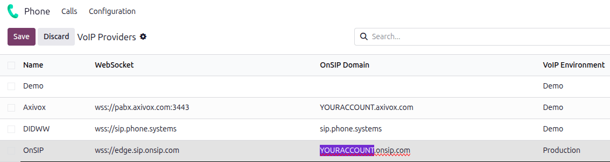

.. |VOIP| replace:: :abbr:`VoIP (Voice over Internet Protocol)`

=====================
Odoo Phone with OnSIP
=====================

`OnSIP <https://info.onsip.com/odoo/>`__ is a |VoIP| provider that can be set up to work with *Odoo
Phone*. An OnSIP account is required to use this service.

.. important::
   Before setting up an account with OnSIP, verify the following requirements:

   - The business phone numbers are portable to OnSIP. Some providers may be unable to release the
     phone number due to local or regional guidelines.
   - The locations of the company and its call recipients are covered by OnSIP services.

   OnSIP |VOIP| services are available in the United States (US) only. A :abbr:`US (United States)`
   billing address and :abbr:`US (United States)` credit card are required to use the service.
   Pricing may vary in Alaska or Hawaii.

Configure OnSIP in Odoo
=======================

To configure OnSIP services in the Odoo database, first :ref:`install <general/install>` the *Phone*
app.

.. _productivity/voip/view-onsip-credentials:

View credentials in OnSIP
-------------------------

To view the necessary OnSIP credentials, navigate to `OnSIP <https://www.onsip.com/>`__ and log in,
then click the :guilabel:`Administrators` link in the top-right corner of the page.

Next, in the menu on the left-hand side, click :guilabel:`Users` and select the user to be
configured. The :guilabel:`USER INFO` tab opens to the right.

Click on the :guilabel:`Phone Settings` tab to view OnSIP configuration credentials.

.. image:: onsip/domain-setting.png
   :align: center
   :alt: Domain setting revealed (highlighted) on administrative panel of OnSIP management
         console.

Add OnSIP credentials
---------------------

After :ref:`installing <general/install>` the *Phone - OnSIP* module, go to the
:menuselection:`Phone app --> Configuration --> Providers`. Locate the *OnSIP* provider entry, and
enter the following information:

- :guilabel:`OnSIP Domain`: the domain that was assigned when creating an account on `OnSIP
  <https://www.onsip.com/>`__. Replace `YOURACCOUNT` with the company account name.
- :guilabel:`VoIP Environment`: select :guilabel:`Production`.

Configure user settings
-----------------------

Next, each user's OnSIP credentials must be configured in Odoo. Navigate to :menuselection:`Settings
app --> Users & Companies --> Users` select the user, and click the *VoIP* tab.

Add the following :ref:`OnSIP credentials <productivity/voip/view-onsip-credentials>` for the user:

- :guilabel:`Provider`: select :guilabel:`OnSIP`.
- :guilabel:`Username`: the user's :guilabel:`OnSIP username`.
- :guilabel:`OnSIP Auth Username`: the user's :guilabel:`Auth Username`.
- :guilabel:`Secret`: the user's :guilabel:`SIP Password`.

Once the OnSIP credentials have been saved, the user can make calls with Odoo **Phone** by clicking
the :icon:`oi-voip` :guilabel:`(Phone)` icon in the top-right corner of Odoo.

.. seealso::
   For additional setup and troubleshooting steps, see `OnSIP's knowledge base
   <https://support.onsip.com/hc/en-us>`__.

Handle incoming calls
=====================

Incoming calls appear in the :doc:`*Phone* widget <voip_widget>`. Click the green :guilabel:`📞
(phone)` icon to answer the call, or click the red :guilabel:`📞 (phone)` icon to ignore the call.

.. image:: onsip/incoming-call.png
   :align: center
   :alt: Incoming call in the Odoo **Phone** widget.

Troubleshooting
===============

Missing parameters
------------------

If a *Missing Parameters* message appears in the Odoo **Phone** widget, refresh the browser and try
again.

.. image:: onsip/onsip04.png
   :alt: Missing parameter message in the *Odoo Phone* widget.

Incorrect number
----------------

If an *Incorrect Number* message appears in the Odoo **Phone** widget, make sure to include the
phone number's international country code. For example: in the phone number `16505555555`, `1` is
the international country code for the United States.

.. image:: onsip/onsip05.png
   :alt: Incorrect number message in the Odoo **Phone** widget.

.. seealso::
   For a list of comprehensive country codes, visit: `https://countrycode.org
   <https://countrycode.org>`_.

OnSIP smartphone app
====================

To make and receive phone calls outside of Odoo, users can use any SIP softphone app in parallel
with Odoo **Phone**. The OnSIP softphone app is available on Windows, macOS, Linux, iOS, and
Android.

.. seealso::
   - :doc:`devices_integrations`
   - `OnSIP app download <https://www.onsip.com/app/download>`_
